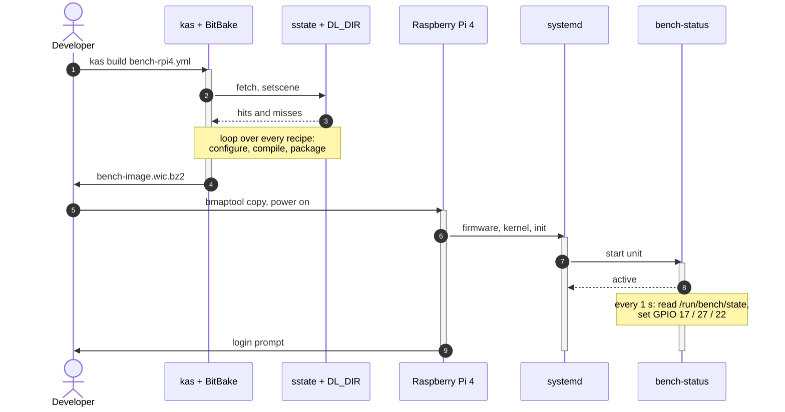
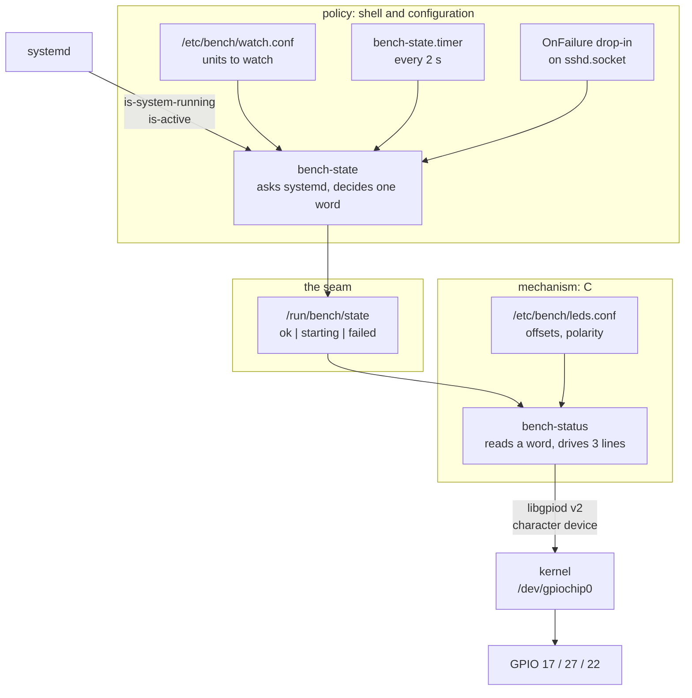

# Design, Project 01

The four figures the book specifies for this project, plus the two software
diagrams behind them. This is the methodology: what the components are and
how they connect. What actually happened while building it is the
[journal](../JOURNAL.md); why each choice was made is
[DECISIONS](../../../walkthrough/DECISIONS.md).

Drawn as text on purpose. Diagrams here survive a diff, can be grepped, and
need no build step. The book renders the same four figures as TikZ and
circuitikz, in `figures/p01_{arch,schematic,bench,uml}.tex` of the
EmbeddedLinux_Top20 sources.

---

## Figure 1: System architecture

Layer stack on the left, build flow on the right. Your layer sits on top;
everything below it is pinned to a release branch by one kas file.

```
   LAYER STACK                          BUILD FLOW
  +----------------------------+
  | meta-bench                 |       +------------------------+
  |  bench-image               |       | fetch + unpack         |
  |  bench-status              |       |   DL_DIR, ~10 GB       |
  |  bench-provision           |       +-----------+------------+
  |  kernel fragment           |                   |
  +----------------------------+                   v
  | meta-raspberrypi           |       +------------------------+
  |  machine, firmware         |--...->| configure, compile,    |
  |  downstream kernel fork    |recipes|  package               |
  +----------------------------+       |   sstate cache         |
  | meta-openembedded/meta-oe  |       +--+--------+------------+
  |  libgpiod, i2c-tools       |          |        |
  +----------------------------+          |        | populate_sdk
  | poky: meta, meta-poky      |          v        v
  |  toolchain, glibc, systemd |   +-----------+  +----------------------+
  +----------------------------+   | rootfs    |  | SDK installer        |
                                   | assembly  |  |  cross toolchain     |
  +----------------------------+   |IMAGE_     |  |  + target sysroot    |
  | BitBake + kas              |   |  INSTALL  |  +----------+-----------+
  |  pinned in bench-rpi4.yml  |   +-----+-----+             |
  +-------------+--------------+         |                   v
                |                        v         +--------------------+
                |  drives          +-----------+   | host cross builds  |
                +----------------->| .wic.bz2  |   | Projects 5,10,11,12|
                                   | boot+root |   +--------------------+
                                   +-----+-----+
                                         | bmaptool
                                         v
                                   +-----------+
                                   | RPi 4     |
                                   | microSD   |
                                   +-----------+
```

**The two outputs that matter are on the right.** The `.wic.bz2` is this
project's visible result; the SDK is the one nineteen later projects
consume. Both come out of the same compile step, which is why
`populate_sdk` is fast once an image has been built.

---

## Figure 2: Schematic

Three status LEDs on the 40-pin header, and the serial console. Each LED
gets its own series resistor; a GPIO pin sources at most 16 mA.

```
   Raspberry Pi 4
   40-pin header
  +---------------+
  |               |
  | pin 11 GPIO17 o---[ 330R ]---->|---+        green
  |               |                 LED |
  | pin 13 GPIO27 o---[ 330R ]---->|---+        yellow
  |               |                 LED |
  | pin 15 GPIO22 o---[ 330R ]---->|---+        red
  |               |                 LED |
  |  pin 9   GND  o---------------------+---+
  |               |                         |
  +---------------+                        ===  ground rail
                                            -

   USB/TTL cable                 crossed on purpose:
  +----------------+             the cable listens to what the Pi says
  | green : TX     o------------> pin 10  GPIO15 RXD
  | white : RX     o------------> pin  8  GPIO14 TXD
  | black : GND    o------------> pin  6  GND
  | red   : 5 V    x  LEFT OPEN
  +----------------+
```

**The red lead stays disconnected.** The Pi runs from its own USB-C supply,
and two supplies contending for one rail is how a board and a cable are lost
together.

**Anode to the resistor, cathode to ground**, which makes the line active
high. That is the daemon's default and needs no configuration.

### As built, this bench differs

The bench LED parts are Joy-IT LinkerKit LK-LED10 modules, not bare LEDs.
They carry their own resistor and a four-pin 2.0 mm socket that 2.54 mm
jumper wires cannot mate with, so the LED output is **deferred**. Their
pinout, for whenever an LK-Cable arrives:

```
  +----------------------+
  | LK-LED10 module      |
  |                      |
  |  S1 o--- signal      |----> GPIO17 / 27 / 22
  |  S2 o--- unused      |
  |  U  o--- supply      |----> pin 1, 3V3.  NEVER pin 2 or 4 (5 V)
  |  G  o--- ground      |----> pin 9
  +----------------------+
```

`U` must be 3V3. If the module puts its LED between supply and `S1`, then
`S1` floats at the supply voltage whenever the GPIO is not driving, and 5 V
on a 3.3 V input damages the pin. Which way round the LED sits is not
printed on the board, which is why polarity is configuration rather than a
constant; see `/etc/bench/leds.conf`.

---

## Figure 3: Bench layout

The Pi is powered by its own USB-C supply. The USB/TTL cable carries TX, RX
and ground only.

```
                                 breadboard
                        +--------------------------+
                        |  (G)   (Y)   (R)         |
                        |  330R  330R  330R        |
                        +---+-----+-----+----+-----+
                            |     |     |    |
       GPIO17 ______________|     |     |    |
       GPIO27 ____________________|     |    |
       GPIO22 __________________________|    |
       GND    _______________________________|
              |
   +----------+--------------------------+
   |  o o o o o o o o o o o o o  header  |
   |  o o o o o o o o o o o o o          |
   |                                     |
   | [microSD]              [USB] [USB]  |
   |                                     |
   |   [SoC]                             |
   |                                     |
   +----+--------------------------------+
        |  USB-C 5 V supply
        |
        |  USB/TTL: TX, RX, GND only
        v
   +---------------------------+
   | Host PC                   |
   |  picocom -b 115200        |
   +---------------------------+
```

On this bench the host PC is a laptop running WSL2, and the console is the
7 inch DSI panel rather than the serial cable. See
[BRINGUP.md](BRINGUP.md) for why.

---

## Figure 4: UML, one build-and-boot cycle

The shared-state cache is what makes every run after the first take minutes
instead of hours.



Measured on this bench: 194 minutes for the first pass, **21 seconds** for
the second with nothing changed, 8.33 seconds from power to login prompt.

---

## Software components

The status daemon is deliberately two programs. Policy lives where it is
cheap to change; mechanism lives where it is fast and precise.



**Two writers, one file, and no contradiction.** The timer polls every two
seconds; the `OnFailure` drop-in latches `failed` immediately rather than
waiting for the next tick. They cannot disagree, because the following poll
reaches the same verdict independently: the unit that triggered the drop-in
is no longer active.

**The seam is the file.** That is what makes the decision logic testable
with a fake `systemctl` on `PATH`, in under a second, on any machine, with
no hardware and no image.

---

## Data flow, host to target

```
  host                                     target (RPi 4)
  +-----------------------------+          +----------------------------+
  | kas build bench-rpi4.yml    |          | boot: firmware -> kernel   |
  |   |                         |          |   -> systemd               |
  |   v                         | bmaptool |      |                     |
  | bitbake bench-image --------+--------> |      v                     |
  |   |   ^                     | .wic.bz2 |  bench-status.service      |
  |   |   | sstate + downloads  |          |   reads /run/bench/state   |
  |   v   |  (cached, ~13 GB)   |          |      |                     |
  | populate_sdk                |          |      v                     |
  |   |                         |   scp    |  libgpiod v2               |
  |   v                         +--------> |  GPIO17 / 27 / 22          |
  | /opt/poky/5.0.20            | binaries |   green  yellow  red       |
  +-----------------------------+          +----------------------------+
```

The two arrows crossing the gap are the whole project. One carries an image
built entirely from source; the other carries binaries compiled against
that image's own sysroot, which is what the SDK exists to make possible.
