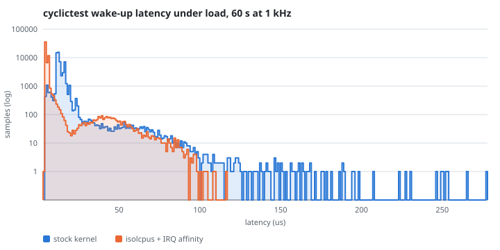
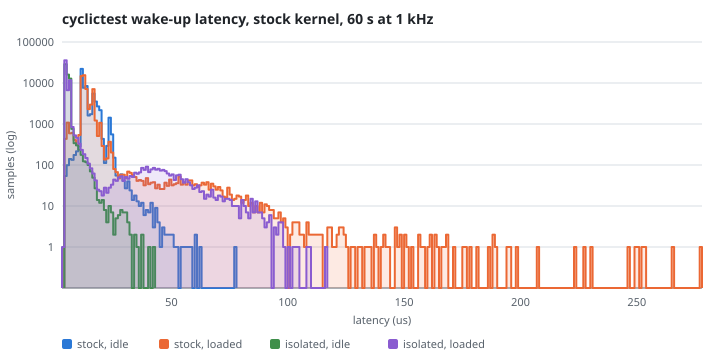

# Project 8: a PREEMPT_RT latency lab with the MCC 118 as the instrument

**Boards:** Raspberry Pi 4 Model B, and a Pi 3 Model B v1.2 as the second board (see below). **Theme:** real-time kernel,
cyclictest, IRQ affinity, jitter measurement.

Real-time Linux is usually argued about with cyclictest numbers, and
cyclictest measures the kernel from inside the task the kernel is
scheduling, on the kernel's own clock. That is a useful number and it is
not the number an actuator experiences. This project adds a second
instrument that shares nothing with the first except a wire: an MCC 118 DAQ
HAT samples the pin that the real-time task toggles, at 100 kS/s, on its own
crystal.

Comparing the two is the lesson, and the comparison is not the one it
first appears to be. The instrument measures the *interval* between edges,
so a constant cost between waking up and moving the pin appears in both
ends of that interval and cancels. What the wire sees is the **variation**
in the whole output path, which arrives as an excess over a factor of
sqrt(2) that comes out of the algebra rather than out of the hardware.
[docs/DESIGN.md](docs/DESIGN.md) derives it and `rt-compare` computes it.

That is a smaller claim than "the external number includes the system
call", which is what this project's own design notes said until the algebra
was done. It is also the useful one: it does not tell you what a GPIO write
costs, it tells you whether that cost is steady, which is the property a
control loop actually depends on.

The knobs are the ones an embedded interview asks about: the preemption
model, CPU isolation, interrupt affinity, the frequency governor and load.
Each is switched on alone and in combination, and each produces a
histogram rather than a single worst case.

Project 1 built the layer, the image and the cross SDK. This project is the
first to change the kernel itself.

## State

**Half the matrix is measured, and the control it was measured against is
wrong.** On 17 September 2026 the Pi 4 ran the generic image with the
MCC 118 on the header and produced the eight rows in
[results/results.csv](results/results.csv). They are sound measurements of
the stock Raspberry Pi kernel and they are not yet the comparison this
project exists to make, because `kas/bench-rt-generic.yml` omits the whole
kernel fragment rather than one symbol of it. The board said so on its
serial console and nothing else could have: journal 57, decision 88.

So the next cycle rebuilds both kernels with the fragment split, and the
sixteen row matrix restarts. The eight rows stay, because a superseded
measurement is still a measurement and deleting it is how a table comes to
agree with its conclusion.

The headline that survives either way: **under load, isolating the
measured core takes worst-case wake-up from 277 to 488 us down to 99 to
125 us**, and that is with `isolcpus` alone, because the kernel rejected
`nohz_full` and `rcu_nocbs` for want of the config symbols that the
omitted fragment would have supplied.

`bench-rt-image` was built on 16 September 2026, 78 MB compressed, with
`CONFIG_PREEMPT_RT=y` verified in the `.config` before the compile began.
That settles everything a build host can settle, including the four things
that had never executed until then: the vendor library's `do_install`, the
`-tools` package split, `python3-daqhats` through `setuptools3`, and the
image assembly, which is where a missing `RDEPENDS` would have surfaced.

What changed on 16 September 2026 is the riskiest part of the project, and
it was settled before the compile rather than after it: the 6.12 kernel is
in place, every line of both fragments names a real symbol, and every one
of them reached the `.config` that kconfig produced, `CONFIG_PREEMPT_RT=y`
included. That is criterion 7, and it took minutes because
`bitbake -c kernel_configme` merges the fragments without building
anything.

What is proven today, on a laptop and in CI:

| Proven | How |
|---|---|
| `rt-toggle` compiles clean with `-Wall -Wextra -Werror` against libgpiod v2 | `./go check` and CI |
| `rt-analyze` recovers a known jitter from a synthesised waveform to 0.3 us | `tests/rt-analyze-test.sh`, 21 assertions |
| An unresolved edge is detected and reported rather than silently trusted | the same test, both regimes |
| The run protocol keeps its order and refuses every invalid claim | `tests/rt-run-test.sh`, 51 assertions against stubs |
| Movable and kernel-owned interrupts are distinguished correctly | `tests/rt-irq-affinity-test.sh`, 14 assertions |
| The relationship between the two instruments is the one the algebra predicts | `tests/rt-compare-test.sh`, 22 assertions against a simulation whose answer is known first |
| `PREEMPT_RT` is selectable on this kernel at all | read out of `kernel/Kconfig.preempt` and `arch/arm64/Kconfig` in `rpi-6.12.y`, see below |
| The fragment check catches a kernel built without it | `./go kconfig -f rt` against a deliberately broken config |
| Every symbol in `rt.cfg` and `bench.cfg` is real, and two are promptless | `./go ksym -f rt` against the unpacked 6.12.93 tree, 21484 declarations indexed |
| The version pin took: the tree is 6.12.93, not the BSP default 6.6 | the kernel's own `Makefile`, read after `kernel_configme` |
| **Every option of both fragments reached the `.config`, `CONFIG_PREEMPT_RT=y` included** | `./go kconfig -f rt`, evidence for [the Pi 4](docs/evidence/kconfig-check-raspberrypi4-64.txt) and [the Pi 3B](docs/evidence/kconfig-check-raspberrypi3-64.txt) |
| The image builds: 6258 tasks, all succeeded, 78 MB | `./go rt`, 16 Sep 2026 |
| The vendor library cross-compiles, packages and installs | the same build, after three defects only building could find |

What that does not prove is any latency number whatsoever. See
[Acceptance criteria](#acceptance-criteria) for which rows are evidence and
which are still plans, and the [journal](JOURNAL.md) for the decisions and
the places where this departs from the original scope on purpose.

## What this project adds to the repository

| Path | What |
|---|---|
| `meta-bench/recipes-kernel/linux/files/rt.cfg` | The opt-in kernel fragment: `PREEMPT_RT`, `NO_HZ_FULL`, `RCU_NOCB_CPU`, and the debug options that have to be off |
| `kas/bench-rt.yml` | The fragment switch, the kernel version that can honour it, SPI, `meta-python` |
| `meta-bench/recipes-core/images/bench-rt-image.bb` | `bench-image` plus both instruments and the load generator |
| `meta-bench/recipes-bench/bench-rt/` | `rt-toggle`, `rt-capture`, `rt-analyze`, `rt-compare`, `rt-run`, `rt-irq-affinity` and their configuration |
| `meta-bench/recipes-bench/daqhats/` | The vendor library and its Python bindings, pinned to a commit, cross-compiled |
| `scripts/rt-kernel-install.sh` | Puts the RT kernel on a card beside the generic one, with a one-line way back |
| `scripts/check-kernel-config.sh` | Extended: `-f rt` checks the real-time fragment too |
| `scripts/check-kernel-symbols.sh` | The check that runs before a build: is each fragment line a symbol the kernel can receive |
| `tests/rt-analyze-test.sh` and two more | What can be proven without the instrument |

## What a clone gives you

**No image is published.** `bench-rt-image` was built here on 16 September
2026, 78 MB compressed, and it is not downloadable from this repository:
`.gitignore` excludes `*.wic*` on purpose.

**What the board produced is published.** The generic half of the matrix
ran on 17 September 2026 and its eight rows, twenty-four histograms,
figures and provenance are in
[results/2026-09-17_5ec99fd-dirty/](results/2026-09-17_5ec99fd-dirty).
The figures regenerate from those histograms with `./go plot`, so nothing
in them has to be taken on trust.

**If the software and the method are what interest you, no HAT is
required.** Three test suites and two static checks run on any machine, and
are listed under
[what is tested without hardware](#what-is-tested-without-hardware).
[docs/DESIGN.md](docs/DESIGN.md) derives the relationship between the two
instruments, which is the part of this project most worth reading and needs
no hardware at all: the external instrument measures an interval between
two edges, so a constant output cost cancels and what survives is its
variation. [docs/METHOD.md](docs/METHOD.md) is what each instrument can and
cannot resolve, including the place where the usual recipe flatters the
result.

**If you want to boot it, this is not a small addition to Project 1.** It
compiles its own kernel, and a different one: `CONFIG_PREEMPT_RT` needs
`ARCH_SUPPORTS_RT`, which arm64 gained in 6.12, so this image is on 6.12
where the rest of the bench is on 6.6. None of that kernel can come from
Project 1's shared state. The wall clock for this build was not recorded,
so no figure is given here; from the fact that it is a full kernel compile
plus a vendor library, expect it to behave like a first build rather than a
warm one. `./go rt-kernel install` exists so that you can put the RT kernel
on a card beside the generic one, with a one-line way back, rather than
committing a board to it.

**Hardware, specifically.** A Raspberry Pi 4 Model B, with a Pi 3 Model B
v1.2 as a second board, and an adapter so the MCC 118 stacks on either.
The comparison this project makes needs the DAQ HAT: without it
the internal instrument still runs and the external one has nothing to
measure, which is half the point missing. `./go ksym -f rt` before the
kernel compiles is the check that catches a fragment line the kernel cannot
receive, and it is worth running even if you never flash anything.

## Running it

```sh
./go check                   # about 2 minutes, no board and no HAT
./go ksym -f rt              # after the kernel unpacks, before it compiles
./go rt                      # bench-rt-image, with the PREEMPT_RT kernel
./go flash /dev/sdX          # or install beside the generic kernel:
./go rt-kernel install /mnt/boot /mnt/root
```

On the board, one configuration per invocation:

```sh
rt-run -i -a -g performance -L        # RT, isolated, affinity, load
cat /var/lib/bench/rt/results.csv
```

[docs/DESIGN.md](docs/DESIGN.md) is the methodology: architecture,
schematic, bench layout, the activity diagram of one run, the data flow and
the sequence that shows where the two instruments diverge. Read it first.

[docs/METHOD.md](docs/METHOD.md) is what the instruments can and cannot
resolve, including the one place where the usual recipe is wrong in a way
that flatters the result.

[docs/BRINGUP.md](docs/BRINGUP.md) is the board work in order, from the
first `daqhats_list_boards` to the sixteenth row.

## Two boards, and which one the thresholds belong to

This settled in three moves, and the journal has the account in entries 32
to 37. Scoped for a Pi 4. Moved to a Pi 3B v1.2 when the MCC 118 would not
stack on the Pi 4 with the parts to hand. Moved back when an adapter
arrived, because keeping the absolute thresholds honest was worth more than
the rebuild.

**The Pi 4 is the primary board.** `machine: raspberrypi4-64` in
`kas/bench-rt.yml`, and it is the board the acceptance thresholds were
written for, so a number measured there is a criterion rather than a
criterion with an asterisk.

**The Pi 3B is the second board, not the fallback.** Its image is built,
verified and archived. `raspberrypi3-64` covers the 3B and the 3B+ alike,
because meta-raspberrypi names the whole BCM2837 family that way, and the
64 bit build is what `ARCH_SUPPORTS_RT` requires. To build for it, change
one line.

Nothing in the design objects to either. Both are quad-core arm64, so
`ARCH_SUPPORTS_RT` and `isolcpus=3` mean the same thing on each, the pin
numbers in the wiring table are header positions rather than board
properties, and `rt-toggle` opens `/dev/gpiochip0` by path without ever
matching the SoC label.

What differs is what the numbers will say:

| | Pi 4 Model B | Pi 3B v1.2 |
|---|---|---|
| Core | Cortex-A72, 1.5 GHz | Cortex-A53, 1.2 GHz |
| Memory | 2 to 8 GB | 1 GB |
| Ethernet and USB | separate buses | 100 Mbit Ethernet behind the same USB hub, so more interrupt traffic on one controller |
| GPIO label | `pinctrl-bcm2711` | `pinctrl-bcm2835` |
| Thermal headroom | more | less, so the throttle gate fires sooner under `stress-ng` |

The 3B is the harder real-time target, which makes it the more interesting
half rather than the weaker one: if the preemption model shows up anywhere
it shows up where the machine is under pressure.

**The thresholds do not move with the board.** A 99.9th percentile below
50 us and a maximum below 150 us were written for the Pi 4 and stay as
written. If the 3B misses them that is a measurement, and every results row
records which board it was taken on. A threshold chosen after seeing the
hardware is not a threshold, it is a description.

The relative criterion is the one that carries the argument anyway: the
generic kernel several times worse than the real-time one, under the same
load, on the same hardware, with the same userspace. That is a property of
the preemption model and it holds on either board.

## The one thing to check before building anything

`PREEMPT_RT` is not selectable on the kernel this repository has been using.

```
kernel/Kconfig.preempt      config PREEMPT_RT
                              depends on EXPERT && ARCH_SUPPORTS_RT
arch/arm64/Kconfig          select ARCH_SUPPORTS_RT      (in 6.12, not 6.6)
meta-raspberrypi scarthgap  PREFERRED_VERSION_linux-raspberrypi ??= "6.6.%"
```

So a fragment containing `CONFIG_PREEMPT_RT=y` on the default BSP kernel
asks for a symbol that has no prompt. kconfig drops it without a word, the
build succeeds, and the board boots a kernel that is not preemptible. That
is why `kas/bench-rt.yml` sets the kernel version as well as the switch,
and why `uname -v` and `./go kconfig -f rt` are both in the acceptance
list rather than one of them.

## What is in the image beyond Project 1, and why

| Package | Why it is there | What breaks without it |
|---|---|---|
| `rt-tests` | cyclictest, the reference instrument everybody quotes | no internal reference to compare the wire against |
| `stress-ng` | the load. CPU, memory and disk at once, which is what makes a generic kernel's tail appear | a latency lab that only measures an idle board, which is the easy case |
| `util-linux-taskset` | confines the load and the capture to the housekeeping cores | they land on the isolated core and the run measures itself |
| `python3-numpy` | 6 million samples per run, and the analysis runs on the board | a feedback loop that goes through an SD card reader |
| `libdaqhats` | the vendor library; there is no in-kernel IIO driver for this HAT | no instrument |
| `python3-daqhats` | the ctypes wrapper the capture script uses | the same |
| `kernel-module-spidev` | `bench.cfg` builds spidev as a module, and `core-image-minimal` installs no modules at all | the HAT is present, the EEPROM is read, and every scan fails. This repository has paid for this exact mistake once already, with `brcmfmac` |
| `libgpiod`, `libgpiod-tools` | already in `bench-image`; `gpioset` is how the wiring is confirmed by hand before any run | nothing, but the bring-up gets much harder |

`vcgencmd` is a recommendation rather than a dependency. It reports the
throttle state, and the scripts record "unknown" without it, which is the
right behaviour when the same lab is repeated on hardware that is not a Pi.

## Acceptance criteria

The criteria this project is held to, what would count as evidence for
each, and where that stands today.

| # | Criterion | Evidence | State |
|---|---|---|---|
| 1 | `/sys/kernel/realtime` reads 1 on the RT kernel and is absent on the generic one | the `realtime` column of every row, and `uname -v` beside it | **not started**, needs a board |
| 2 | A 60 s capture at 100 kS/s with zero overruns, and 30000 +/- 1 rising edges | `ext_edges` in the row; `rt-capture` voids the run on any overrun | **not started** |
| 3 | The external histogram reproduces the internal one in shape: spread a factor of sqrt(2) larger, maxima agreeing, and any excess reported as write-path variation | `rt-compare` per run, which `rt-run` calls at the end of one | **not started** on a board; the arithmetic is proven against a simulation in `tests/rt-compare-test.sh` |
| 4 | RT, isolated, affinity, under load: external p99.9 below 50 us and maximum below 150 us; the generic kernel at least five times worse | two rows of `results.csv` | **not started** |
| 5 | cyclictest agrees with the toggler's own histogram, and both agree with the wire by the sqrt(2) relationship | the `cyc_*`, `int_*` and `ext_*` columns of one row, and `rt-compare`'s ratio | **not started**. The original wording, "agrees to within the system-call cost", was not measurable: that cost cancels in an interval measurement |
| 6 | Every row names kernel, isolation, affinity, governor, load and the throttle status before and after | the CSV header has 27 columns and `rt-run` fills all of them | **met in the code**, proven by `tests/rt-run-test.sh`, unproven on a board |
| 7 | The kernel fragment actually reached the kernel | `./go kconfig -f rt` against the `.config` kconfig produced, and later against `/proc/config.gz` from the running board | **met on the build host for both machines**, 16 Sep 2026: all 31 options of both fragments present in the 6.12.93 `.config`, `CONFIG_PREEMPT_RT=y` among them and the other three members of its choice block excluded. Evidence for [`raspberrypi4-64`](docs/evidence/kconfig-check-raspberrypi4-64.txt) and [`raspberrypi3-64`](docs/evidence/kconfig-check-raspberrypi3-64.txt), each named for the machine it was captured on. Not yet confirmed against a running kernel |
| 8 | Every fragment line is a symbol this kernel has | `./go ksym -f rt` | **met**, against the real `rpi-6.12.y` Kconfig text: 31 symbols, all declared, 2 promptless and recorded as such |

Criterion 4 is the one with a caveat attached, and it is in
[METHOD.md](docs/METHOD.md): a 150 us threshold measured through an
unresolved edge carries 10 us of quantisation, which is fine, and the same
method cannot support a claim about the few microseconds of system-call
cost, which is criterion 5. Criterion 5 needs the series RC.

## Results

Eight of the sixteen rows are measured. The generic half was taken on
17 September 2026 and lives in
[results/results.csv](results/results.csv), with its histograms, figures
and a full provenance note in
[results/2026-09-17_5ec99fd-dirty/](results/2026-09-17_5ec99fd-dirty).

**Read that provenance file before quoting any number from this half.** It
records three things that qualify every row: the board ran a hand-patched
`rt-capture`, the control kernel is not one symbol away from the real-time
one, and the isolated rows carry `isolcpus` only because the kernel
rejected `nohz_full` and `rcu_nocbs`. These are measurements of the stock
Raspberry Pi kernel, which is a real baseline, and not yet the controlled
comparison the matrix is for.

### Isolation is the whole story on this board



Two 60 second runs at 1 kHz, `stress-ng --cpu 3 --vm 2 --vm-bytes 128M
--hdd 1` on the housekeeping cores in both. The count axis is logarithmic
because 99 percent of the samples sit in the first few bins and the
argument is entirely in the tail.

| | `cyc_avg_us` | `cyc_max_us` | `int_max_us` |
|---|---|---|---|
| stock, loaded | 14 | 277 | 324 |
| `isolcpus` + IRQ affinity, loaded | 6 | **116** | 151 |

The four configurations together, idle and loaded:



The worst case across the eight rows, in order taken:

| Row | Isolation | Affinity | Governor | Load | `cyc_max_us` |
|---|---|---|---|---|---|
| 1 | no | no | ondemand | no | 77 |
| 2 | no | no | ondemand | yes | 277 |
| 3 | no | no | performance | yes | 488 |
| 4 | no | yes | performance | yes | 483 |
| 5 | **yes** | no | performance | yes | 99 |
| 6 | **yes** | yes | performance | no | **42** |
| 7 | **yes** | yes | performance | yes | 116 |
| 8 | **yes** | yes | force_turbo | yes | 125 |

Under load, 277 to 488 us without isolation and 99 to 125 us with it.
Governor and IRQ affinity move nothing outside the run-to-run spread, and
that spread is itself larger than the effect: rows 2, 3 and 4 differ only
in settings that should not matter and their `int_max_us` reads 324, 277
and 514. A maximum is a single observation of a rare event, so the rows
that matter need repeats before any of them is quoted as a figure.

### Regenerating the figures

```
./go plot -o FIG.svg -t TITLE FILE[:LABEL] ...
```

They are generated from the instrument's own histogram files and never
drawn by hand, so a figure can always be traced back to the capture that
produced it. See decision 86.

### The schema

The schema is documented in [results/README.md](results/README.md), and
the file on the board lives at `/var/lib/bench/rt/results.csv`; copying it
here is the last step of a campaign.

The sixteen rows the matrix is made of:

| Kernel | Isolation | Affinity | Governor | Load |
|---|---|---|---|---|
| generic | no | no | ondemand | no |
| generic | no | no | ondemand | yes |
| generic | no | no | performance | yes |
| generic | no | yes | performance | yes |
| generic | yes | no | performance | yes |
| generic | yes | yes | performance | no |
| generic | yes | yes | performance | yes |
| generic | yes | yes | fixed (force_turbo) | yes |
| rt | no | no | ondemand | no |
| rt | no | no | ondemand | yes |
| rt | no | no | performance | yes |
| rt | no | yes | performance | yes |
| rt | yes | no | performance | yes |
| rt | yes | yes | performance | no |
| rt | yes | yes | performance | yes |
| rt | yes | yes | fixed (force_turbo) | yes |

Isolation changes need a reboot, so the order that minimises reboots is
the one grouped by kernel and then by isolation, which is the order above.

## What is tested without hardware

| Check | Command | Covers |
|---|---|---|
| Edge timing arithmetic | `sh tests/rt-analyze-test.sh` | Period recovery against a synthesised wave with known edges, both edge regimes, the clock offset, a single late edge, the no-edges error |
| The run protocol | `sh tests/rt-run-test.sh` | Ordering, core confinement, both directions of the isolation claim, the throttle gate, an overrun voiding the run, and every column of the row |
| Interrupt affinity | `sh tests/rt-irq-affinity-test.sh` | Movable against kernel-owned interrupts, ranges in a CPU list, the failure that matters |
| Host compile | `./go check` | `rt-toggle` with `-Werror` against host libgpiod v2 |
| Fragment symbols | `./go ksym -f rt` | That every line names a real Kconfig symbol, and that a promptless one is declared as a consequence rather than presented as a request |
| The fragment | `./go kconfig -f rt CONFIG` | Every line of `rt.cfg`, including the ones that ask for an option to stay off |
| Instrument comparison | `sh tests/rt-compare-test.sh` | That a constant write cost is invisible, that 2 us of write jitter is recovered as 2 us, that correlated latencies are refused rather than interpreted, and that all three file formats parse |
| The symbol checker itself | `sh tests/kernel-symbols-test.sh` | All five Kconfig declaration shapes against a six-file kernel, including the two that the checker got wrong first |

Not covered, and only a board can cover it: that a PREEMPT_RT kernel boots
on this hardware, that the HAT enumerates, that the vendor library
cross-compiles, that a 100 kS/s scan sustains without overrunning, and
every number in the results table.

## Departures from the original scope

| # | As originally scoped | Here | Why |
|---|---|---|---|
| 1 | Build the kernel by hand from a git clone, with `merge_config.sh` | A Yocto fragment and a kas file | It is the same fragment mechanism Project 1 already uses, and it keeps the rootfs identical between the two kernel rows, which is what the comparison needs |
| 2 | `kernel=kernel8-rt.img` in `config.txt` | The same, plus `device_tree=` and `overlay_prefix=` pointing at the RT build's own dtbs | A 6.12 kernel with the 6.6 BSP's overlays is a combination nobody has tested, and a device tree mismatch does not announce itself |
| 3 | Interpolation works because the edge is fast | Interpolation works because the edge is slow; both regimes are supported and measured | Arithmetic, in [METHOD.md](docs/METHOD.md). A fast edge makes the interpolated fraction a constant |
| 4 | No resistor or capacitor in the parts list | A 1 kohm and a 10 nF are recommended for the rows that need sub-sample resolution, and are **not on this bench**, so the matrix runs at 10 us per-edge resolution | The same reason. Measured rather than assumed: the first hardware run reported `subsample_fraction=0.150` and `sample_us=10.000`, so `sd`, `p99.9` and `max` carry that quantisation while the mean and the clock offset do not. The comparison survives, because both kernels are quantised identically; absolute claims finer than 10 us do not. See [BRINGUP step 4](docs/BRINGUP.md) |
| 5 | `daqhats/install.sh` on the board | Two Yocto recipes, pinned to a commit | The image has no compiler, no git and no pip. Also, the vendor makefile hardcodes `gcc` and `-I/usr/include`, which in a cross build silently takes host headers |
| 6 | `rt_toggle` takes positional arguments | `rt-toggle` takes options, writes a self-describing header, and handles signals | It is driven by a script that has to record what it ran, and a run interrupted by hand should still release the line |
| 7 | The matrix script sets the knobs | `rt-run` sets them and then verifies the kernel agrees | `isolcpus=3` in a file is not isolation, and a row labelled wrongly makes the whole table unusable |

## Pitfalls, and what guards each one

| Pitfall | Guard |
|---|---|
| The capture or the load runs on the isolated core | `rt-run` starts both under `taskset -c $RT_HOUSEKEEPING`; the test asserts it |
| The scan overruns silently and the run has a gap | `rt-capture` checks both overrun flags per chunk and exits non-zero; `rt-run` then voids the run and writes no row |
| Thermal throttling changes the clock mid-run | `vcgencmd get_throttled` before and after, both in the row; a throttling board refuses to start |
| `isolcpus` without `nohz_full` and `rcu_nocbs` | the refusal message names all three, and `rt.cfg` carries the reason |
| Interrupts that cannot be moved are reported as failures | `rt-irq-affinity check` writes an interrupt's own affinity back to it: succeeding means it was movable and is a real finding, failing means the kernel owns it |
| The SD card is written by the stressor and the capture at once | the capture goes to `/dev/shm`, and only the histogram is kept |
| `CONFIG_PREEMPT_RT` is silently dropped | the kernel version is pinned in the kas file, and `./go kconfig -f rt` checks the built config |
| The 10 us sample period is mistaken for the resolution | `subsample_fraction` is measured, warned about and recorded in every row |

---

[Journal](JOURNAL.md) | [Design](docs/DESIGN.md) |
[Method](docs/METHOD.md) | [Bring-up](docs/BRINGUP.md) |
[Results](results/README.md)
