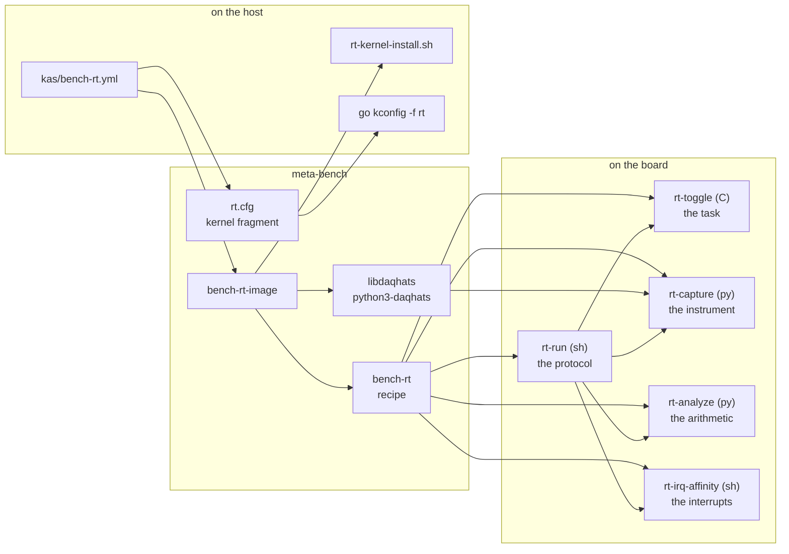

# Project 8: design

The drawings before the results. Everything here is the plan the code was
written against, so a reader can disagree with the design without first
reverse engineering it from four scripts.

Five views, each answering a different question:

| View | Question |
|---|---|
| [Architecture](#architecture) | What runs where, and what does it touch |
| [Schematic](#schematic) | Which pin goes to which terminal, and why that pin |
| [Bench layout](#bench-layout) | What does it look like on the table |
| [Activity](#one-run-as-an-activity-diagram) | What happens during one run, in what order |
| [Data flow](#data-flow) | What turns into what, from a wake-up to a table row |

## Architecture

Two paths that share exactly one thing: the pin. That is the whole idea.
The real-time task drives the pin from inside the system under test; the
instrument watches it from outside, on its own clock. Any disagreement
between them is information rather than an error.

```
                      SYSTEM UNDER TEST (Raspberry Pi 4 / 3B)
  +----------------------------+  +------------------------------------+
  | isolated CPU3              |  | CPUs 0 to 2, normal priority       |
  |                            |  |                                    |
  |  rt-toggle                 |  |  rt-capture      stress-ng         |
  |   SCHED_FIFO 80            |  |   daqhats        (optional load)   |
  |   mlockall + prefault      |  |   100 kS/s       taskset -c 0-2    |
  |   clock_nanosleep ABSTIME  |  |   chunked reads                    |
  |   own latency histogram    |  |                  cyclictest        |
  |                            |  |                  (after, never     |
  |                            |  |                   alongside)       |
  +-------------+--------------+  +------------------+-----------------+
                | user space                         | user space
  = = = = = = = | = = = = = = = = = = = = = = = = = = | = = = = = = = = =
                v kernel                             v kernel
  +----------------------------+  +------------------------------------+
  | PREEMPT_RT scheduler       |  | spi-bcm2835 + spidev               |
  |  isolcpus=3 nohz_full=3    |  |  /dev/spidev0.0                    |
  |  rcu_nocbs=3               |  |                                    |
  |         |                  |  | IRQ affinity                       |
  |         v                  |  |  /proc/irq/*/smp_affinity_list     |
  | GPIO chardev /dev/gpiochip0|  |  every movable one on 0 to 2       |
  +-------------+--------------+  +------------------+-----------------+
                | ioctl                              | SPI0 CE0
                v                                    ^
  +-------------+--------------+                     |
  | GPIO20, header pin 38      |                     |
  +-------------+--------------+                     |
                |                                    |
                |  jumper, pin 38 -> CH0             |
                |  jumper, pin 39 -> AGND            |
                v                                    |
  +-----------------------------------------+--------+
  | MCC 118 DAQ HAT                         |
  |  CH0, 12 bit, +/-10 V single ended      |
  |  its own sample clock, 100 kS/s         |   <-- the independent bit
  +-----------------------------------------+
```

The dashed line is the user space and kernel boundary. The important thing
about the picture is what is **not** shared: the DAQ has its own crystal, so
a Pi whose clock drifts, throttles or lies cannot make its own numbers look
better. The cost is that the two clocks differ by tens of parts per
million, which appears as a constant offset and is reported separately from
the jitter. See [METHOD.md](METHOD.md).

### Why the capture is not a kernel module

The obvious alternative is a driver: an IIO driver for the MCC 118, sampling
in kernel space with timestamps from the same clock as the scheduler. It
would be more elegant and it would destroy the experiment. The point of an
external instrument is that it does not depend on the kernel being
measured. A driver inside that kernel is subject to the same scheduling
delays it is trying to detect.

The vendor library over spidev is enough, and its shortcomings are the
right kind: it runs at normal priority on another core, its stalls show up
as buffer overruns rather than as wrong numbers, and an overrun voids the
run rather than quietly shortening it.

## Schematic

```
   Raspberry Pi (40 pin header)                MCC 118 DAQ HAT
  +------------------------------+           +------------------------+
  |                              |           |                        |
  | pin 38  GPIO20  o------------+---[R]--+--+-o CH0   (+/-10 V, SE)  |
  |                              |        |  |                        |
  |                              |       ===C|                        |
  |                              |        |  |                        |
  | pin 39  GND     o------------+--------+--+-o AGND                 |
  |                              |           |                        |
  | pin 19  MOSI    o============+===========+=o                      |
  | pin 21  MISO    o============+===========+=o  used by the HAT,    |
  | pin 23  SCLK    o============+===========+=o  do not touch        |
  | pin 24  CE0     o============+===========+=o                      |
  | pins 32 33 37   o============+===========+=o  A0 A1 A2, address 0 |
  | pins 27 28      o============+===========+=o  ID_SD, ID_SC EEPROM |
  | pin 40  GPIO21  o            |           |   HAT interrupt: free  |
  |                              |           |                        |
  | pin 8   TXD     o--> USB/TTL |           +------------------------+
  | pin 10  RXD     o--> USB/TTL |
  | pin 6   GND     o--> USB/TTL |
  +------------------------------+

  R and C are optional and are not in the original parts list:
  R = 1 kohm in series, C = 10 nF to ground, giving about 10 us of
  rise time. Without them the edge is faster than one sample and the
  external per-edge resolution is exactly one sample period. With them
  the edge spans two or three samples and interpolation recovers
  sub-sample timing. METHOD.md has the arithmetic and the measurement
  that tells you which regime you are in.
```

### Why GPIO20 and not any free pin

| Constraint | Consequence |
|---|---|
| The HAT owns SPI0: MOSI, MISO, SCLK, CE0 | pins 19, 21, 23, 24 are gone |
| The HAT reads its address from A0, A1, A2 | pins 32, 33, 37 are gone |
| The firmware reads the HAT ID EEPROM at boot | pins 27, 28 are gone |
| The vendor documentation names GPIO21 as the DAQ HAT interrupt line | pin 40 is left alone even though nothing here uses it |
| The console is a USB/TTL cable on GPIO14 and GPIO15 | pins 8, 10, 6 are gone |
| A jumper to a screw terminal should be short, and its ground should be next to it | GPIO20 on pin 38 sits directly beside GND on pin 39 |

GPIO20 is what is left once the HAT, the interrupt line and the console
have taken what they need, and it happens to be the one with a ground
beside it. That is the whole derivation.

## Bench layout

```
          +-------------------------------------------+
          |  MCC 118 DAQ HAT                          |
          |  +-------------------------------------+  |
          |  | CH0 CH1 CH2 ... CH7  AGND  (screws) |  |
          |  +--^-------------------^--------------+  |
          |     | orange               | black        |
          |     |                      |              |
          |  [stacking header, pins 38 and 39 at this end]
          +-----|----------------------|--------------+
                |                      |
                |   short jumpers      |
                |                      |
          +-----|----------------------|--------------+
          |  [40 pin header]                          |
          |                                           |
          |  Raspberry Pi                      [ETH]  |
          |                                    [USB]--+---> USB/TTL ---> host PC
          |  [microSD]                                |     115200 8N1
          |  [USB-C 5 V]                              |
          +-------------------------------------------+
                        ^
                        |
                heatsink or fan: a bare Pi under stress-ng
                starts throttling inside a 60 s run, and a clock
                that changes mid-measurement changes the histogram
                without saying so
```

The serial console rather than ssh, deliberately. The load runs on the same
cores the network stack runs on, so under `stress-ng` an ssh session is the
first thing to stall. A console that survives the test is not a
convenience here, it is the only way to see what happened during the run
that went wrong.

## One run as an activity diagram

```mermaid
flowchart TD
    start([rt-run]) --> cfg[apply the configuration<br/>governor, IRQ affinity]
    cfg --> verify{does the kernel<br/>agree with the claim?}
    verify -->|no| refuse[refuse, name the missing<br/>cmdline parameter]
    verify -->|yes| thr{vcgencmd<br/>get_throttled = 0x0?}
    thr -->|no| cool[refuse, let the board cool]
    thr -->|yes| fork[ ]

    fork --> load[stress-ng on CPUs 0 to 2<br/>duration + 10 s]
    fork --> arm[arm the MCC 118 scan<br/>duration + 3 s]

    arm --> toggle[rt-toggle on CPU3<br/>SCHED_FIFO 80, duration]
    toggle --> cyc[cyclictest on CPU3<br/>same period, same duration]
    cyc --> join[ ]
    load --> join

    join --> thr2[read get_throttled again]
    thr2 --> ana[rt-analyze:<br/>edges, periods, histogram]
    ana --> row[append one row to results.csv<br/>with every setting named]
    row --> more{another<br/>configuration?}
    more -->|yes, same boot| cfg
    more -->|yes, other kernel| reboot[rt-kernel-install select,<br/>edit cmdline.txt, reboot]
    more -->|no| done([done])

    style refuse fill:#fdd,stroke:#900
    style cool fill:#fdd,stroke:#900
    style fork fill:#333,stroke:#333
    style join fill:#333,stroke:#333
```



Three things in that diagram are load bearing:

**The verify step.** `isolcpus=3` in a text file is not isolation. The
kernel having accepted it is, and the kernel says so in
`/sys/devices/system/cpu/isolated`. A row labelled isolated that was not is
worse than a missing row, because one wrong row makes the whole table
unusable and nothing in the output admits it.

**The order of the fork.** The scan is armed before the toggler starts, so
the first edges are inside the capture rather than in the gap before it. It
runs three seconds longer than the toggler for the same reason at the other
end.

**cyclictest after, never alongside.** Two SCHED_FIFO tasks at priority 80
on one core take turns. Both histograms would then be measuring the sharing.

## Data flow

```
  CPU3, isolated, SCHED_FIFO 80         CPUs 0 to 2, normal priority
  +---------------------------+         +-----------------------------+
  | rt-toggle                 |         | rt-capture                  |
  |                           | GPIO20  |                             |
  |  clock_nanosleep -------->|---------| mcc118 scan, 100 kS/s       |
  |  gpiod set_value          |  (wire) |   chunk of 10000 samples    |
  |  measure own lateness     |         |   overrun? -> void the run  |
  |                           |         |   float64 -> float32        |
  +------------+--------------+         +--------------+--------------+
               |                                       |
               v                                       v
     label-toggle.txt                         /dev/shm/label.npy
     internal histogram                       24 MB for 60 s
     min, mean, max, p99.9                            |
               |                                      v
               |                            +---------------------+
               |                            | rt-analyze          |
               |                            |  threshold crossing |
               |                            |  interpolate        |
               |                            |  diff -> periods    |
               |                            |  deviation from the |
               |                            |    mean, not the    |
               |                            |    nominal          |
               |                            +----------+----------+
               |                                       |
               |                            label-external-hist.txt
               |                            key=value on stdout
               |                                       |
  +------------+---------------------------------------+-------------+
  |                        rt-run                                    |
  |  one row: kernel, realtime, isolated, affinity, governor, load,  |
  |  external mean/sd/p99.9/max/ppm/subsample, internal min/mean/    |
  |  max/p99.9, cyclictest min/avg/max, throttled before and after   |
  +------------------------------+-----------------------------------+
                                 v
                        results/results.csv
```

Three instruments, one row, and the row names the configuration rather than
describing it in a filename that gets lost.

## Components, and why each one exists



| Component | Why it is separate |
|---|---|
| `rt.cfg` | Opt in, so `bench-image` stays comparable to stock. A kernel-wide change to the locking primitives has no business in an image that other projects measure boot time and size on |
| `rt-toggle` | C, because it is the thing being measured. Its loop allocates nothing, prints nothing and calls nothing it does not have to |
| `rt-capture` | Python, because it is bound by the vendor library and by the SD card, not by the language. It runs at normal priority and its job is to not fall behind |
| `rt-analyze` | Separate from the capture so that a run can be re-analysed with a different threshold without repeating it, and so that the arithmetic can be tested against a synthesised waveform |
| `rt-irq-affinity` | Separate because it is useful alone, during bring-up, and because the question "which interrupts cannot be moved" deserves an answer you can read |
| `rt-run` | The protocol, in one place. Every rule that is easy to break under time pressure lives here as a refusal rather than as a sentence in a README |

## The measurement, as a sequence

```mermaid
sequenceDiagram
    participant K as kernel (CPU3)
    participant T as rt-toggle
    participant P as GPIO20
    participant D as MCC 118
    participant A as rt-analyze

    T->>K: clock_nanosleep(ABSTIME, t_n)
    Note over K: the scheduler owes<br/>a wake-up at t_n
    K-->>T: wakes at t_n + L
    Note over T,K: L is the internal latency,<br/>the same quantity cyclictest reports
    T->>P: ioctl set_value
    Note over T,P: costs S, the system call,<br/>which cyclictest never sees
    P-->>D: the level changes at t_n + L + S
    D->>D: samples on its own clock, 10 us apart
    T->>T: clock_gettime, bin L
    D->>A: 100 kS/s of CH0
    A->>A: threshold crossing, interpolate
    Note over A: the external period carries<br/>L and S; the internal one carries L
```

**This paragraph originally said that the difference between the two
instruments is `S`, the cost of the GPIO ioctl. That is wrong, and the
algebra is worth following because the wrong version is the intuitive one.**

The external instrument does not measure an edge time, it measures the
interval between two of them. Edge `i` leaves the pin at
`i*T + L_i + S_i`, so the interval is

```
  P_i = T + (L_i+1 - L_i) + (S_i+1 - S_i)
```

A constant `S` appears in both edges and subtracts out exactly. **The wire
cannot see the cost of the GPIO write at all, only its variation.** A
simulation with a 6 us constant write cost reports a mean period of
2000.000 us, unchanged to three decimals when that cost is removed
entirely.

What the wire does see:

| Quantity | Relationship | Why |
|---|---|---|
| mean period | exactly `T` | both latency and a constant write cost cancel |
| spread | `sd(P) = sqrt(2) * sd(L)` | a period carries the difference of two latencies |
| in general | `var(P) = 2 var(L) + 2 var(S)` | the two contributions add |
| maximum | tracks `max(L)` above its mean | one late wake-up makes one period long and the next short |

So the number worth reporting is the **excess over sqrt(2)**, which gives
`sd(S) = sqrt((var_ext - 2 var_int) / 2)`: the variation in everything
between waking up and the voltage moving. That is the quantity no internal
instrument can produce, because it happens after the task has already been
scheduled, and it is what makes the second instrument worth its wiring.

One caveat the tool prints rather than leaves to memory: the sqrt(2)
assumes consecutive latencies are independent. Under load they arrive in
bursts and the ratio falls below sqrt(2), so a low ratio is a statement
about correlation and only a high one supports a claim about the write
path. `rt-compare` does this arithmetic and refuses the interpretation when
the ratio is low.

---

Next: [METHOD.md](METHOD.md) for what these instruments can and cannot
resolve, or the [project README](../README.md) for how to run it.
