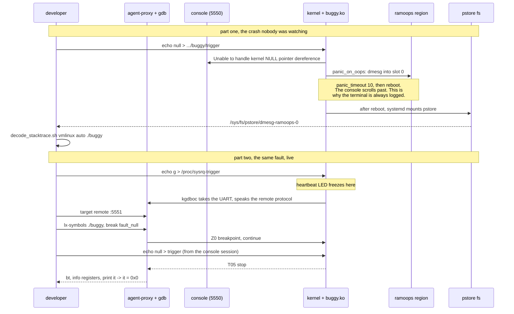
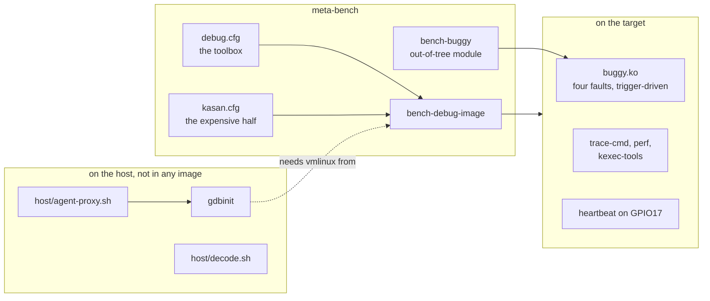

# Project 9: design

The drawings before the code. This project is unlike the other nineteen in
one way that shapes everything below: **it produces no product.** No
service, no driver, no image anyone would ship. It produces a toolbox and
a notebook, and the thing being designed is a set of deliberate faults and
the path from each fault to the tool that exposes it.

| View | Question |
|---|---|
| [Architecture](#architecture) | What is on the target, what is on the host, and what the one cable carries |
| [Ownership](#ownership) | Who owns the UART, and the three other things two programs both want |
| [Fault matrix](#the-fault-matrix) | Which tool finds which fault, and what each one is blind to |
| [Schematic](#schematic) | Two wires and an LED that means something |
| [Bench layout](#bench-layout) | What is on the table |
| [Sequence](#a-crash-captured-twice) | A crash through ramoops, then the same fault live under gdb |
| [Decision tree](#which-tool-when) | Given a symptom, what to reach for |

Every drawing here is also a TikZ source in [figures/](figures), which
renders with `make` and needs no part of the build.

## Architecture

One serial line, two consumers, and that is the whole problem the host
side exists to solve.

```
  TARGET: Raspberry Pi 3B+                        HOST
  +------------------------------------+          +--------------------------+
  |  echo null > .../buggy/trigger     |          |  picocom  <-- tcp 5550   |
  |            |                       |          |     (console, logged)    |
  |            v                       |          |                          |
  |  buggy.ko   null | lock | uaf | leak|         |  gdb-multiarch vmlinux   |
  |            |                       |          |     <-- tcp 5551         |
  |            v                       |          |            |             |
  |  kernel core                       |          |            v             |
  |    oops, panic, lockdep, KASAN     |          |  agent-proxy owns        |
  |            |          |            |          |     /dev/ttyUSB0         |
  |            |          +--> ramoops |          +------------+-------------+
  |            |               reserved|                       ^
  |            v               RAM     |   UART0, 115200       |
  |  kgdboc  <-> gdb remote protocol   |<======================+
  |            |                       |
  |            v                       |   ftrace and perf never touch the
  |  PL011 ttyAMA0, polled mode        |   cable: their output is a file,
  |                                    |   copied over Ethernet.
  |  ftrace ring buffer -> trace.dat --+---- scp ---->  trace-cmd report
  |  perf.data ----------------------- +---- scp ---->  perf report
  |                                    |
  |  heartbeat LED, GPIO17             |   the only instrument that works
  |    beating / frozen / dark         |   when everything else has stopped
  +------------------------------------+
```

Three things in that picture are worth saying out loud.

**The debugger and the console are the same wire.** When the kernel enters
kgdb it takes the UART over in polled mode, which is why the driver needs
`poll_get_char` and `poll_put_char`. Nothing else can be holding the device
at that moment, which is what `agent-proxy` is for: it owns
`/dev/ttyUSB0` and offers two TCP ports, so the terminal and gdb each talk
to a socket instead of fighting over a character device.

**ftrace and perf are deliberately not on that path.** Their output is
megabytes and the cable is 115200 baud, which is about 11 kB/s. A trace
copied over the console would take minutes and would perturb the thing
being traced. They write to `/dev/shm` and leave over Ethernet.

**The LED is an instrument, not decoration.** It is driven by the kernel's
own heartbeat trigger, so it says something no software on the target can
say once the target has stopped:

| LED | Means |
|---|---|
| beating | the kernel is scheduling |
| frozen | stopped in kgdb, or a CPU is wedged with interrupts off |
| dark | panicked, or the board is in reset |

During the `lock` fault it keeps beating, because the timer that drives it
runs on another CPU. That is itself a lesson and it is in the notebook.

## Ownership

Two managers on one resource is the bug this table exists to prevent, and
this project has four candidates rather than the usual one.

| Resource | Owned by | Never touched by | What happens when that is broken |
|---|---|---|---|
| `/dev/ttyUSB0` on the host | `agent-proxy`, exclusively | picocom, gdb, minicom, screen | A terminal holding the device makes agent-proxy fail to open it, and the failure reads as a dead cable |
| TCP 5550 | the terminal program | gdb | Console text arrives in gdb's packet parser as garbage |
| TCP 5551 | gdb | the terminal | Remote protocol packets print as mojibake on the console |
| `ttyAMA0` on the target | the console driver, until the kernel enters the debugger; `kgdboc` in polled mode after that | anything else | Two console users interleave bytes and the gdb packets are corrupted |
| GPIO14 and GPIO15 | the PL011, **only after `dtoverlay=disable-bt`** | the mini UART, which owns them by default | kgdboc attaches to a UART that is not on the header and silently debugs nothing |
| The ramoops RAM region | the pstore driver, reserved by a device-tree node | the page allocator, which must never see it | The region is reused across a reboot and the crash record is whatever was there |
| `vmlinux` on the host | the build that produced the running kernel | any other build | Addresses resolve to the wrong symbols, confidently and silently |
| `/sys/kernel/debug/buggy/trigger` | the buggy module | nothing else writes it | none; it is write-only and trigger-driven on purpose |

The `vmlinux` row is the one that bites hardest, because the failure is
not an error. A `vmlinux` from a different build of the same source gives
a backtrace that looks right and names the wrong lines. This is why the
project keeps `vmlinux`, `System.map` and `buggy.ko` together and why
`nokaslr` is on the kernel command line.

## The fault matrix

Four faults, and the point of the project is that each needs a different
tool. The interesting column is the last one.

| Fault | What the kernel does | Found by | Blind without it |
|---|---|---|---|
| `null` | Oops, then panic with `panic_on_oops` | The console, `decode_stacktrace.sh`, then pstore after the reboot, then kgdb live | Nothing: this one announces itself. It is the easy case and it is first for that reason |
| `lock` | Nothing at all. A spinlock held with interrupts off for 3 s | `irqsoff` tracer for how long and where; `function_graph` for what ran; the soft lockup detector for the complaint | **Completely silent.** No oops, no dmesg, no crash. The system is just late |
| `uaf` | Nothing, usually. Freed memory is often still readable | KASAN, which reports the allocation site and the free site with stacks | **Silent and non-deterministic.** Without KASAN it reads the right value most times and garbage occasionally |
| `leak` | Nothing, ever. 64 objects of 256 bytes disappear per trigger | kmemleak, after a scan | **Silent for weeks.** Visible only as a box that runs out of memory in a month |

Three of the four produce no symptom at the moment they happen. That is
the argument for the whole project: the tools have to be in place and
understood *before* the fault, because afterwards there is nothing to look
at.

## Which tool when

Given a symptom rather than a known fault, which is the real situation.

```
  the board is dead or rebooting
  |
  +-- console shows an oops or panic?
  |   |
  |   +-- yes --> decode_stacktrace.sh against the matching vmlinux
  |   |          then: did it reboot before you could read it?
  |   |                --> pstore, /sys/fs/pstore/dmesg-ramoops-0
  |   |          then: want the registers and locals live?
  |   |                --> kgdb, break on the function, reproduce
  |   |
  |   +-- no, console is silent and the LED is dark
  |              --> the crash happened before the console came up, or
  |                  hung with interrupts off. pstore is the only witness.
  |
  the board is alive but slow or stuttering
  |
  +-- is it one long stall or many short ones?
      |
      +-- one long stall  --> irqsoff / preemptoff tracer: it keeps the
      |                       longest section and its stack
      +-- many short ones --> perf record -g, then perf report: it tells
      |                       you where the time goes, not where it stopped
      +-- want the call sequence rather than the duration?
                          --> trace-cmd record -p function_graph
  |
  the board is fine and something is wrong anyway
  |
  +-- memory grows without bound      --> kmemleak, then scan
  +-- occasional impossible values    --> KASAN, on the KASAN kernel
  +-- a lock is taken in a bad order  --> lockdep, which needs no trigger
  +-- "it only happens in production" --> KFENCE, which samples cheaply
                                          enough to leave enabled
```

The split down the middle is the thing to take away. **A debugger answers
"what is the state now". A tracer answers "what happened before now".**
They are not substitutes, and reaching for gdb when the question is "why
was there a 3 second gap" wastes an evening.

## Schematic

```
   Raspberry Pi 3B+ (40-pin header)
  +----------------------------------+
  |                                  |
  | pin 8   GPIO14  o--- TXD --------------> USB/TTL white (RX)
  | pin 10  GPIO15  o--- RXD <-------------- USB/TTL green (TX)
  | pin 6   GND     o----------------------- USB/TTL black
  |                                  |       ( red lead left open )
  |                                  |
  | pin 11  GPIO17  o---[ 330R ]---->|--+    green: kernel heartbeat
  |                                  |  |
  | pin 9   GND     o-------------------+
  |                                  |
  +----------------------------------+

  GPIO14 and GPIO15 carry the PL011 (ttyAMA0) only after
  dtoverlay=disable-bt. By default they carry the mini UART (ttyS0),
  whose baud rate follows the core clock and whose FIFO is small.
  A debugger channel wants the PL011.
```

| Signal | Pin | GPIO | Note |
|---|---|---|---|
| Console TXD | 8 | GPIO14 | PL011 after `disable-bt` |
| Console RXD | 10 | GPIO15 | |
| Console GND | 6 | GND | |
| Heartbeat LED via 330 ohm | 11 | GPIO17 | `ledtrig-heartbeat` |
| LED cathode | 9 | GND | |

The cable's red 5 V lead stays open. The board is powered by its own
supply, and a second source on the same rail is how a USB/TTL adapter
gets destroyed.

## Bench layout

```
      breadboard                  Raspberry Pi 3B+
    +--------------+            +--------------------------+
    |     (G)      |            |  [ 40-pin header ]       |
    |      |       |<===========|  GPIO17 + GND            |
    |     330      |            |                          |
    |      |_______|            |  [BCM2837]        [USB]  |
    |   ground rail|            |                   [ETH]--+---> network,
    +--------------+            |  [microSD] [micro-USB]   |     for scp of
                                +------------+-------------+     trace files
                                             |
                                USB/TTL: TX, RX, GND
                                             |
                                             v
    +-------------------------------------------------------------+
    |  Host                                                       |
    |                                                             |
    |  agent-proxy /dev/ttyUSB0  --+-- tcp 5550 --> picocom, logged|
    |                              +-- tcp 5551 --> gdb-multiarch  |
    |                                                             |
    |  vmlinux, System.map, buggy.ko   from the same build         |
    |  trace-cmd report, perf report, decode_stacktrace.sh         |
    +-------------------------------------------------------------+
```

**Two paths to the board, on purpose.** The serial line is the one that
works when the kernel is stopped, wedged or panicking. Ethernet is the one
that can move a 20 MB trace file. Neither replaces the other, and the
project needs both at once.

## A crash captured twice

The same fault, recorded after the fact and then caught live. The second
half is what a debugger is for and the first half is what you get when
nobody was watching.



The two halves answer different questions and the notebook keeps them
separate. Pstore says *that* it happened and roughly where. kgdb says what
the registers held when it did.

## Components, and what is new here



Two things here are firsts for this repository.

**`bench-buggy` is the layer's first out-of-tree kernel module recipe.**
Everything else in `recipes-bench/` builds userspace. A module inherits the
`module` class, builds against the kernel's staging directory, and its
package is named `kernel-module-buggy` rather than by the recipe name,
which matters because the image has to install the package rather than the
recipe.

**The host tools are not in any image.** `agent-proxy`, `gdb-multiarch` and
`decode_stacktrace.sh` run on the developer's machine, so they live under
`projects/09-kernel-debug/host/` rather than in a recipe. That is the
first time this repository has shipped something that is not for the
board, and it is worth naming because the instinct is to package
everything.

---

Next: [the configuration rationale](CONFIG-RATIONALE.md), which is what the
acceptance criteria actually ask for, or the
[bring-up notes](BRINGUP.md). Back to the
[project README](../README.md).
