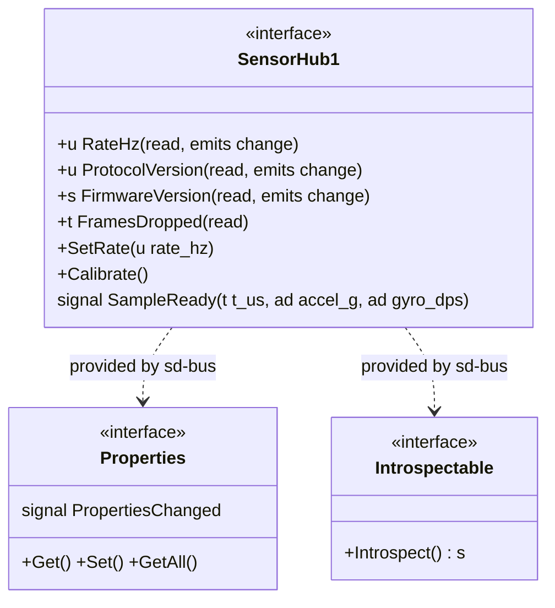
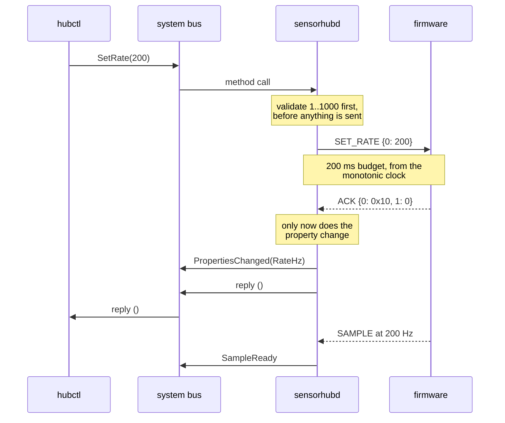
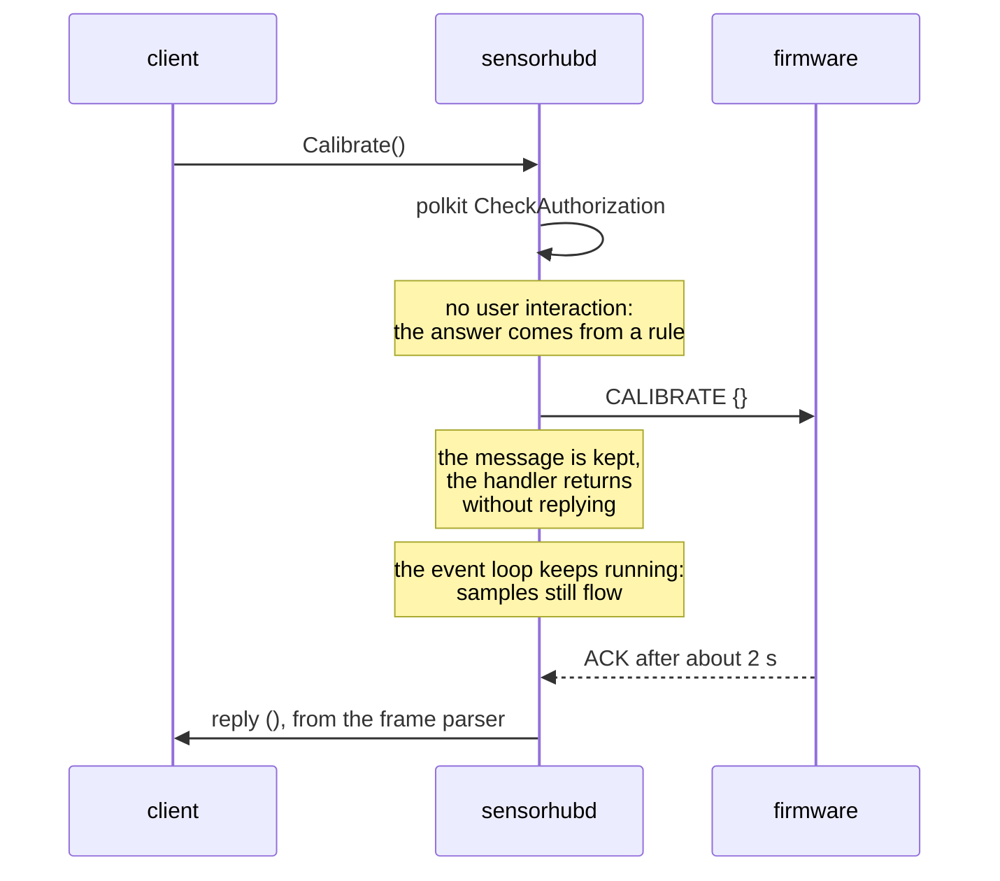
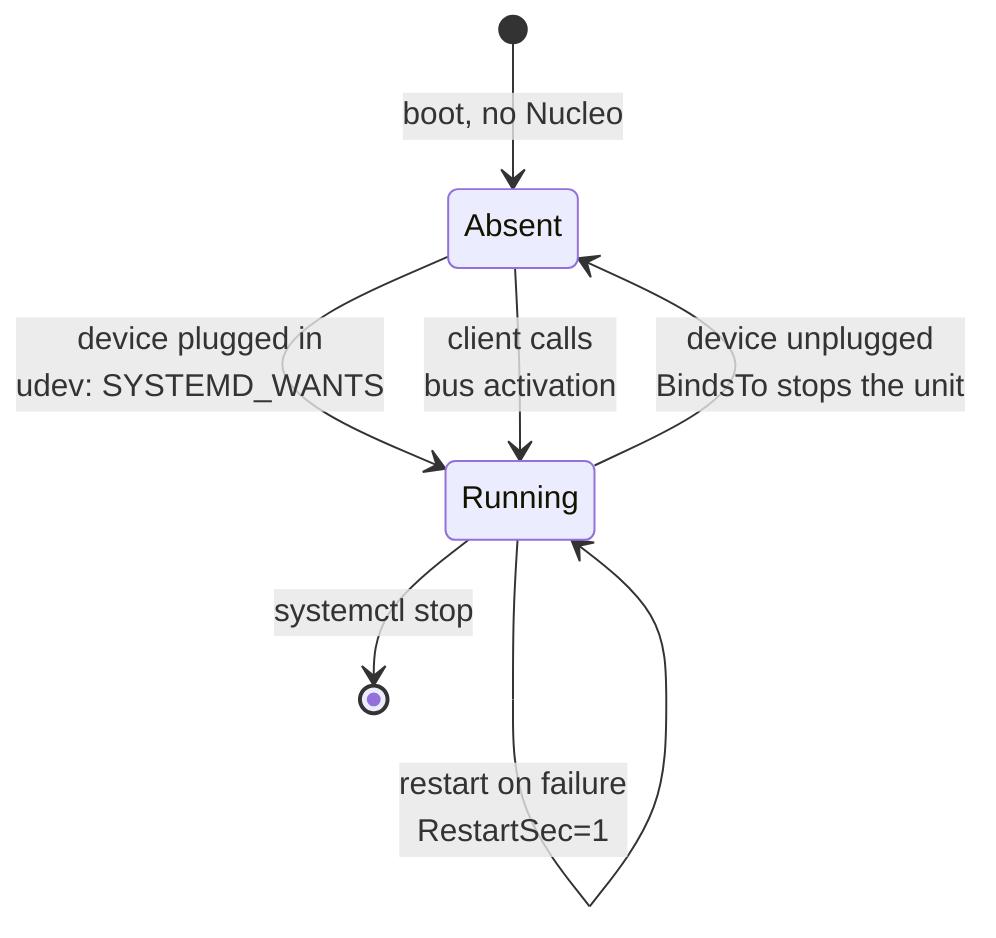

# Project 12: design

Two boundaries and everything else is detail. The framed CBOR protocol
between the microcontroller and Linux, and the D-Bus interface between a
privileged daemon and unprivileged clients. Both need a versioning story,
both have to fail loudly, and neither is visible in the other.

| View | Question |
|---|---|
| [Architecture](#architecture) | What runs where, and what crosses which boundary |
| [Schematic](#schematic) | What is wired to what, which is almost nothing |
| [Bench layout](#bench-layout) | What it looks like on the table |
| [The interface](#the-interface-as-a-class) | What a client sees |
| [SetRate](#setrate-as-a-sequence) | Why a property changes late |
| [Activation](#two-ways-to-start-and-one-way-to-stop) | Why nothing is enabled at boot |
| [Data flow](#data-flow) | What turns into what |

## Architecture

```
  NUCLEO-H7A3ZI-Q                          Raspberry Pi 4
  +--------------------------+             +----------------------------------+
  | X-NUCLEO-IKS5A1          |             |                                  |
  |  LSM6DSV32X, LSM6DSO16IS |             |  clients                         |
  |          | I2C1 400 kHz  |             |   busctl   hubctl   HMI (P13)    |
  |          v               |             |          |                       |
  |  lsm6dsv32x_reg          |             |          v                       |
  |          |               |             |  +---------------------------+   |
  |          v               |             |  | system bus                |   |
  |  proto.c: CBOR + frame   |             |  |  org.bench.SensorHub1     |   |
  |   SOF ver type len CRC   |             |  +-------------+-------------+   |
  |          |               |             |       ^        |  activate       |
  |          v               |             |       |        v                 |
  |  USART3 DMA, 921600      |             |       |   +---------+            |
  |          |               |             |       |   | systemd |            |
  |          v               |             |       |   +----+----+            |
  |  ST-LINK V3E             |             |       |        | starts          |
  |   USB CDC ACM + SWD      |             |       |        v                 |
  +----------+---------------+             |  +----+----------------------+   |
             |                             |  | sensorhubd                |   |
             |          USB                |  |  sd-event loop            |   |
             +-----------------------------+->|  proto.c: same parser     |   |
                                           |  |  libcbor: decode          |   |
                                           |  |  polkit: may you?         |   |
                                           |  +-------------+-------------+   |
                                           |                | termios         |
                                           |  +-------------+-------------+   |
                                           |  | kernel: cdc_acm           |   |
                                           |  |  /dev/ttyACM0             |   |
                                           |  |  udev -> /dev/sensorhub   |   |
                                           |  +---------------------------+   |
                                           |                                  |
                                           |  openocd ---- SWD, same cable    |
                                           +----------------------------------+
```

Three things in that picture are the design rather than the plumbing.

**`proto.c` appears twice.** The same file is compiled into the firmware
and into the daemon. A protocol described once and implemented twice
drifts; implemented once and described once, it cannot.

**Clients never see a tty.** They see a bus name. The serial link, the
baud rate, the CRC and the framing are all implementation, and replacing
the whole lower half with SPI or a socket would change no client.

**OpenOCD shares the cable.** The same USB connection carries the virtual
COM port and SWD, so the board that reads the sensor can also reflash the
thing producing it. That is the update path a product would have, rather
than a debugger permanently on a desk.

## Schematic

```
      NUCLEO-H7A3ZI-Q (MB1363)                    X-NUCLEO-IKS5A1
     +---------------------------+              +--------------------+
     |                           |              |                    |
     |  PB9  I2C1_SDA  o---------+--- D14 ------+-o SDA              |
     |  PB8  I2C1_SCL  o---------+--- D15 ------+-o SCL              |
     |       3V3       o---------+--------------+-o VDD              |
     |       GND       o---------+--------------+-o GND              |
     |                           |              |                    |
     |                           |              | pull-ups are here  |
     |  PD8  USART3_TX o--+      |              +--------------------+
     |  PD9  USART3_RX o--+      |                 (Arduino headers)
     |                    |      |
     |          solder bridges   |
     |                    |      |
     |  +-----------------v---+  |
     |  | ST-LINK V3E         |  |
     |  |  VCP + SWD          o--+--- CN1 micro-USB ===> Pi USB-A
     |  +---------------------+  |
     +---------------------------+

   Optional, for firmware trace while the VCP is busy carrying frames:
     a second USART on the Zio connector to the USB/TTL cable
       white -> TX, green -> RX, black -> GND, red NOT CONNECTED
```

**The only cable is USB.** Power, the frame stream and the debug port all
come down it. That is unusual for this bench and it is the reason this
project has almost no wiring table: everything interesting happens in
firmware and in software.

| Signal | Nucleo | MCU | Note |
|---|---|---|---|
| I2C SDA | Arduino D14 | PB9 | pull-ups on the shield |
| I2C SCL | Arduino D15 | PB8 | 400 kHz |
| 3V3, GND | Arduino power | | from the Nucleo regulator |
| VCP TX | internal | PD8 | default solder bridges to the ST-LINK |
| VCP RX | internal | PD9 | the same |
| USB | CN1 | | to a USB-A port of the Pi |

**The red lead of the USB/TTL cable is never connected.** The Nucleo is
already powered from USB, and feeding 5 V back into a powered board is how
a regulator dies.

## Bench layout

```
                      +--------------------------------+
                      |  X-NUCLEO-IKS5A1 (shield)      |
                      |   IMU, on the Arduino headers  |
                      +----------------+---------------+
                                       | plugged on
                      +----------------+---------------+
                      |  NUCLEO-H7A3ZI-Q               |
                      |                                |
                      |  [CN1 micro-USB] ------------\ |
                      +--------------------------------+
                                                      |
                                        one USB cable |  power + VCP + SWD
                                                      |
                      +--------------------------------+
                      |  [USB-A]                       |
                      |                                |
                      |  Raspberry Pi 4                |
                      |   sensorhubd, dbus, polkit     |
                      |   openocd                      |
                      |                                |
                      |  [USB-C 5 V]   [ETH] ----------+---> network, ssh
                      +--------------------------------+

   The PC is not on the bench. It reaches the Pi over ssh, and the Pi
   reaches the Nucleo. That is the topology a deployed system has, and
   it is why the flashing step runs on the Pi rather than on a laptop.
```

## The interface as a class



Served at `/org/bench/SensorHub1` on the system bus. The two standard
interfaces are free: sd-bus generates the introspection XML from the
vtable and implements `org.freedesktop.DBus.Properties` itself, which is
the main reason to declare an interface as a table rather than to write
message handlers.

### Why RateHz is read-only next to a SetRate method

A writable property is an assignment. It either works or it does not, and
there is nowhere to put "the hub refused that rate" or "the hub did not
answer in 200 ms", which are the two things that actually happen. A method
returns a typed error, so a client can tell those apart and retry the one
that is worth retrying.

The property is still there, and it still emits changes, because a
dashboard wants to display the rate without calling anything.

### Why each property emits a change signal

A client that cannot subscribe has to poll, and a polling client on a bus
is a client that is either too slow or too expensive. Every property here
either emits `PropertiesChanged` or would be declared constant. None is
left as a silent readable, which is the default and the wrong default.

## SetRate as a sequence



The property changes after the acknowledgement, not before. A client that
reads `RateHz` immediately after a successful `SetRate` therefore sees the
rate the hub confirmed, which makes the property a description of the
hardware rather than a record of the last request somebody made.

If the ACK does not arrive, the call fails with
`org.bench.SensorHub1.Error.NoAck` and the property does not move. Nothing
in the system then claims a rate that is not running.

### The other reply strategy, and why there are two



`SetRate` blocks the event loop for at most 200 ms because that is simple
and the hub answers in microseconds. `Calibrate` takes about two seconds,
which is eight times longer, so it keeps the message and replies later.

The rule behind the split: **a handler may block only for as long as
nobody would notice.** The bus default timeout is 25 seconds, and a
handler that approaches it makes every client of the daemon hang, not just
the one that called.

## Two ways to start, and one way to stop



Nothing is enabled at boot, and that is the design rather than an omission.
A unit enabled at boot on a board with no Nucleo attached starts, fails to
open the device, and spends its restart budget before anybody plugs
anything in.

| Path | Mechanism | Covers |
|---|---|---|
| Device appears | `TAG+="systemd"` and `ENV{SYSTEMD_WANTS}` in the udev rule | The board was booted, then the hub was plugged in |
| Client calls | `org.bench.SensorHub1.service` names `SystemdService=` | The hub was already there and something wants to talk to it |
| Device leaves | `BindsTo=dev-sensorhub.device` | Unplugging stops the unit rather than leaving it holding a name it cannot serve |

The third row is the one people leave out. A daemon that keeps its bus
name after its device has gone answers calls with stale data, and a client
has no way to tell.

## The two authorisation layers

```
   a process on the bus
            |
            v
   +--------------------------+   "may this connection talk to that name?"
   |  bus policy              |   org.bench.SensorHub1.conf
   |  /usr/share/dbus-1/      |   a connection question, answered by dbus
   |    system.d/             |   before the daemon sees a byte
   +-----------+--------------+
               | allowed
               v
   +--------------------------+   the message arrives at sensorhubd
   |  sd-bus vtable           |   SD_BUS_VTABLE_UNPRIVILEGED, or sd-bus
   |                          |   itself demands CAP_SYS_ADMIN first
   +-----------+--------------+
               |
               v  only for Calibrate
   +--------------------------+   "may this *user* do this *action*?"
   |  polkit                  |   org.bench.sensorhub.calibrate
   |  CheckAuthorization      |   a user question, answered by a rule
   +--------------------------+   50-sensorhub.rules: group bench
```

Two questions that look alike and are not. The bus knows about
connections; polkit knows about users, sessions and actions. Trying to
express "only the bench group may calibrate" in the bus policy is
impossible, because the bus has no notion of an action; trying to express
"nobody outside this system may own this name" in polkit is equally
impossible.

The failure mode worth remembering is the third box's precondition:
without `SD_BUS_VTABLE_UNPRIVILEGED` on the method, sd-bus requires
`CAP_SYS_ADMIN` from the caller before the handler runs, so polkit is
never asked and no rule can fix it.

## Data flow

```
  firmware                          sensorhubd                      clients
  --------                          ----------                      -------
  sensor registers
      | I2C
      v
  float ax, ay, az, gx, gy, gz
      |
      v  proto_encode_sample()
  CBOR map, 45 bytes
      |
      v  proto_frame()
  frame, 52 bytes  ---- USART3 ---- USB ---- /dev/sensorhub
                                                  |
                                                  v  read()
                                          proto_parser_push()
                                                  |
                                       +----------+----------+
                                       | CRC ok            CRC bad
                                       v                     v
                                   cbor_load()        frames_bad++
                                       |                     |
                            +----------+-------+             v
                            |          |       |      FramesDropped
                         SAMPLE     HELLO     ACK        property
                            |          |       |
                            v          v       v
                     SampleReady   Firmware  SetRate returns,
                      signal       Version   Calibrate replies
                            |
                            v
                     ----------------------------------> subscribers
```

Every arrow that can fail is counted rather than logged: `FramesDropped`
is a property, so a client can watch the link quality without reading the
journal, and a slow rise in it is visible on a dashboard long before
anything breaks.

---

Next: [PROTOCOL.md](PROTOCOL.md) for the wire format, or
[BRINGUP.md](BRINGUP.md) for the board work. Back to the
[project README](../README.md).
