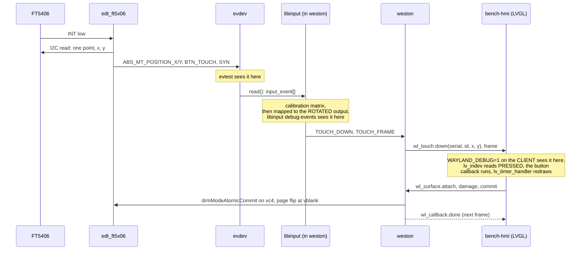
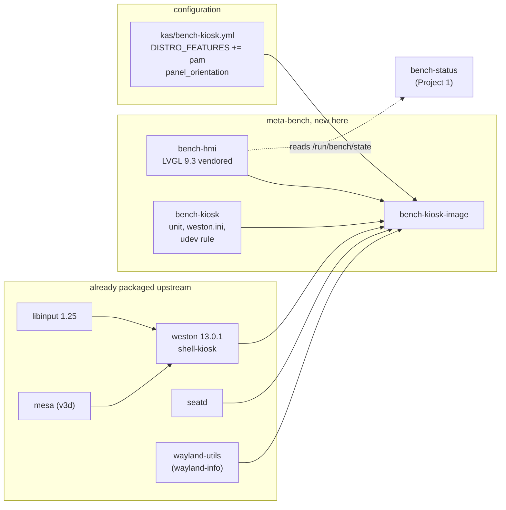

# Project 13: design

The drawings before the code. This project climbs the graphics stack that
Project 7 only touched the bottom of: a real GPU, a compositor that owns
the display and the input devices, and a toolkit drawing into a Wayland
surface.

The dashboard is the excuse. **The deliverable is knowing which tool shows
which layer**, because every integration problem here (black screen, no
touch, wrong rotation, twenty second boot) is a question of which layer is
misconfigured, and each layer has exactly one tool that answers it.

| View | Question |
|---|---|
| [Three deviations](#three-deviations-from-the-specification) | What is not available, and what replaces it |
| [Architecture](#architecture) | Panel to widget, and who opens what |
| [Ownership](#ownership) | The five contested resources, one of which is already taken |
| [Layer and tool](#which-tool-shows-which-layer) | The table the project exists to produce |
| [Schematic](#schematic) | Two wires, one ribbon, and a power budget |
| [Bench layout](#bench-layout) | What is on the desk |
| [One touch](#one-touch-end-to-end) | Finger to widget callback, across six processes |
| [Boot budget](#the-ten-second-budget) | Where ten seconds goes |

Every drawing is also a TikZ source in [figures/](figures), rendered with
`make` and needed by no part of the build.

## Three deviations from the specification

All three are forced by what exists in the layers this bench uses, all
three were verified against upstream before anything was written, and all
three change what gets built. They are first because the rest of the
document assumes them.

### 1. The compositor is weston, not cage

The specification's teaching vehicle is `cage`, with weston named as "the
alternative for the case where you need output configuration in a file".
The alternative is now the primary, because:

| Recipe | oe-core scarthgap | meta-oe scarthgap | meta-raspberrypi | elsewhere |
|---|---|---|---|---|
| `cage` | no | no | no | **`meta-wayland`**, `recipes-wlroots/cage/` |
| `wlroots` | no | no | no | **`meta-wayland`**, 0.16, 0.17 and git |
| `weston` | **yes**, 13.0.1 | | | |
| `seatd` | **yes**, `meta/recipes-core/seatd` | | | |
| `libinput` | **yes**, 1.25.0 | | | |
| `wayland-utils` | **yes**, 1.2.0 (`wayland-info`) | | | |

Directory listings, not guesses: `meta/recipes-graphics/wayland/` holds
weston, libinput, wayland-protocols and wayland-utils, and `seatd` is in
`meta/recipes-core/`.

**A correction, recorded because the first version of this document got
it wrong.** The last column was found after the decision was made. The
first draft said cage and wlroots were "in no layer", which was true only
of the three layers this bench uses, and then reasoned from that to "a
week of packaging". That second step was wrong:
[meta-wayland](https://codeberg.org/flk/meta-wayland) has a **scarthgap**
branch carrying `cage-0.1.5.bb` and `wlroots-0.17.bb`. Using cage would
mean **adding one layer to the kas file**, exactly the way
`kas/bench-tee.yml` adds meta-arm for Project 20. That is an afternoon,
not a week.

So the honest statement of the trade is not "cage is unavailable". It is:

| | weston | cage |
|---|---|---|
| Layers to add | none | one, third party |
| Configuration | a unit plus a nine line ini | a unit |
| Provenance | Yocto Project, oe-core | a personal layer on codeberg |
| Kiosk behaviour | `shell-kiosk`, already in the default `PACKAGECONFIG` | the compositor's only mode |
| Maintenance | tracks the release this bench already pins | tracks a layer nobody here watches |

Weston was chosen on that table, and it still holds: the deciding factor
is provenance and maintenance, not availability. Every other layer this
repository depends on comes from the Yocto Project or OpenEmbedded, and
adding a personal layer to a portfolio repository is a supply chain
decision worth making deliberately rather than to save a configuration
file.

What is lost: cage's smallness as a teaching object, and the argument
that a kiosk needs no configuration file. The [project
README](../README.md) carries meta-wayland under what to try next, with
the layer named so the work is an afternoon for whoever wants it.

### 2. LVGL needs a newer version than meta-oe pins

meta-oe carries `lvgl_9.1.0.bb`, and **LVGL 9.1.0 has no Wayland driver at
all.** Its `src/drivers/` contains display, evdev, libinput, nuttx, sdl,
windows and x11. There is no `wayland` directory, and `lv_conf_template.h`
at that revision has no `LV_USE_WAYLAND` line.

That matters more than a missing feature, because of how meta-oe
configures LVGL. `lv-conf.inc` sets options by running `sed` over
`lv_conf.h`:

```
  -e "s|^([[:space:]]*#define LV_USE_LINUX_DRM[[:space:]]).*|\1${...}|"
```

A `sed` whose pattern matches nothing changes nothing and reports success.
So adding `LV_USE_WAYLAND` to a bbappend would produce **no error, no
warning and no effect**: exactly the failure Project 9 found in promptless
Kconfig symbols, in a different tool. The build would succeed and the
binary would have no Wayland support.

The Wayland driver appears in LVGL **9.2.0** and is present in 9.3.

So `bench-hmi` vendors its own pinned LVGL as a second git source, the way
oe-core's own `lvgl-demo-fb` recipe already does (it fetches
`lv_port_linux_frame_buffer` and `lvgl` as two repositories). meta-oe's
`lvgl` recipe is left alone: it is pinned, patched three times against
9.1.0, and bumping it from a bbappend would break its patches for every
other consumer.

### 3. The distro needs `pam`, which poky does not provide

Weston's `required-distro-features.inc`:

```
REQUIRED_DISTRO_FEATURES = "wayland opengl \
    ${@oe.utils.conditional('VIRTUAL-RUNTIME_init_manager', 'systemd', 'pam', '', d)}"
```

The bench sets `INIT_MANAGER = "systemd"`, so `pam` is required. Poky
gives:

```
  DISTRO_FEATURES_DEFAULT   acl alsa bluetooth debuginfod ext2 ipv4 ipv6
                            pcmcia usbgadget usbhost wifi xattr nfs
                            zeroconf pci 3g nfc x11 vfat seccomp
  POKY_DEFAULT_...          opengl ptest multiarch wayland vulkan
```

`wayland` yes, `opengl` yes, **`pam` no**. Without it the build stops at
parse time in `features_check` with a message about weston, which reads
like a broken recipe rather than a missing distro feature.

`kas/bench-kiosk.yml` appends it. This is a distro-wide change and it
rebuilds a great deal, which is the reason it is in the kiosk
configuration and not in the shared base.

## Architecture

```
  HARDWARE                        KERNEL                         USER SPACE
  +--------------------+   +--------------------------+   +----------------------------+
  | 7 inch DSI panel   |<--| vc4 DRM/KMS              |<--| weston (kiosk shell)       |
  | 800x480            |   |   DSI-1, CRTC, planes    |   |   DRM MASTER on card1      |
  | backlight via      |   |   panel-raspberrypi-     |   |   libinput, xkbcommon      |
  | on-board MCU (I2C) |   |     touchscreen          |   |   EGL/GBM through Mesa     |
  +--------------------+   +--------------------------+   +----------------------------+
                                                                  ^        |
  +--------------------+   +--------------------------+           |        | wl_surface
  | FT5406 touch       |-->| edt_ft5x06 -> evdev      |---------->|        v
  | (I2C in the ribbon)|   |   /dev/input/eventN      |   seatd   |  +----------------------+
  +--------------------+   +--------------------------+   hands   |  | bench-hmi (LVGL 9.3) |
                                                           the    |  |  xdg_toplevel        |
  +--------------------+   +--------------------------+   fds     |  |  wl_touch/wl_keyboard|
  | Pi keyboard (USB)  |-->| usbhid -> evdev          |-----------+  |  500 ms metrics timer|
  +--------------------+   |   /dev/input/eventM      |              +----------------------+
                           +--------------------------+                   |  reads
  +--------------------+   +--------------------------+                   v
  | VideoCore VI       |<->| v3d render node          |<--- Mesa    /proc/loadavg
  |   HVS, DSI encoder |   |   /dev/dri/renderD128    |             /sys/.../thermal_zone0
  |   V3D core         |   |   (NO connectors)        |             /run/bench/state
  +--------------------+   +--------------------------+                (Project 1)
```

**The single most useful fact in this drawing:** there are two DRM cards.
`vc4` has the connectors and is the one a compositor must open; `v3d` is a
render node with no connectors at all. A compositor that opens the wrong
one reports "no outputs" and nothing else. `drm_info` resolves it in
seconds, and the card numbering is **not stable across kernel versions**,
which is why nothing here hardcodes `card1` without a check.

**The second:** only the compositor opens DRM and evdev. The application
opens neither. It has no permission to and no reason to: it receives
`wl_touch` and `wl_keyboard` events over a Unix socket. If the application
is reading `/dev/input` directly, the design has gone wrong.

## Ownership

Two managers on one resource is the bug this table prevents, and this
project has five candidates. One of them is **already taken by the bench's
own base image**, which is the finding that came out of writing it.

| Resource | Owned by | Never touched by | What breaks otherwise |
|---|---|---|---|
| **tty1** | the kiosk unit, via `Conflicts=getty@tty1.service` | `getty@tty1` | Two programs own the VT. Switching fails silently and the panel shows a login prompt over, or instead of, the dashboard |
| **`/dev/dri/card*` with connectors** (vc4) | weston, as DRM master | the application, and anything else | A second DRM master is refused; a compositor on the v3d node reports "no outputs" |
| **`/dev/dri/renderD128`** (v3d) | Mesa, per process | never opened as a KMS device | Rendering silently falls back to software, at a frame rate that looks like a hung board |
| **`/dev/input/event*`** | the **seat broker**, which hands fds to weston: `logind` here, not a `seatd` daemon (see below) | the application; and nothing runs as root to get them | "could not connect to seat" in the journal, which is **not** a permission error on the device node |
| **panel orientation** | the DRM kernel command line, once | the toolkit, the firmware `lcd_rotate`, the compositor config | Rotation applied twice, or rotation applied to the picture but not the touch coordinates |
| **`/run/bench/state`** | `bench-status` (Project 1) writes | `bench-hmi` only ever reads | A dashboard that writes its own status would be reporting on itself |
| **the DSI panel** | vc4 KMS through `vc4-kms-dsi-7inch` | Project 7's SPI panel is a **different device** on a different bus | none; they can coexist, and saying so stops the next reader from assuming a conflict |

### The seat is brokered by logind, not by a seatd daemon

The specification's Debian recipe is `systemctl enable --now seatd` plus
`LIBSEAT_BACKEND=seatd`. That is not how this image works, and the
difference is worth knowing before reading a journal.

oe-core's `seatd` recipe **ships no systemd unit**: it `inherit`s
`update-rc.d` for sysvinit and sets no `SYSTEMD_SERVICE`. What it
provides here is `libseat`, which weston's `kms` PACKAGECONFIG depends
on. Meanwhile `weston-init`'s unit opens a real login session
(`PAMName=weston-autologin`), so **logind** has a seat to hand out.

So on this image the chain is:

```
  weston.service  --PAMName-->  logind session on a VT
                                      |
                                      v
                          libseat (logind backend)
                                      |
                                      v
                     weston gets /dev/dri and /dev/input fds
```

**Inferred, not yet seen on this board:** that `libseat` in this build
has logind support compiled in and will choose it. If it does not, the
fallback is to run `seatd` and set `LIBSEAT_BACKEND=seatd`, which is the
specification's path. `docs/BRINGUP.md` carries this as a check, because
the journal says which backend was chosen and that one line settles it.

### The row that was already taken

`kas/bench-rpi4.yml` already contains:

```
  RPI_EXTRA_CONFIG = "dtoverlay=vc4-kms-dsi-7inch"
```

with a comment saying the panel is the bench console and that `CMDLINE`
appends `console=tty1` so the panel shows kernel messages and a login
prompt. **Every bench image already drives this panel, and a getty already
owns tty1 on it.**

So Project 13 is not adding a display to a headless board. It is taking a
display away from a getty, and the `Conflicts=` line is not boilerplate
copied from a manual: it is the one line that resolves an existing,
committed claim on the same resource.

## Which tool shows which layer

The deliverable, in one table. Each row is a layer, the tool that shows
it, and what a healthy answer looks like.

| Layer | Tool | What it proves |
|---|---|---|
| Firmware found the panel | `dmesg \| grep -iE 'vc4\|rpi_touchscreen'` | The overlay loaded and the panel MCU answered on I2C |
| KMS sees a connected output | `drm_info`, `cat /sys/class/drm/card*-DSI-1/status` | `DSI-1` connected at 800x480, and **which card** carries it |
| The pipeline is composited | `cat /sys/kernel/debug/dri/N/state` | One active plane holding the client's buffer |
| Raw touch reaches the kernel | `evtest /dev/input/eventN` | `ABS_MT_POSITION_X/Y`, `BTN_TOUCH`, `SYN` |
| Touch is mapped to the output | `libinput debug-events --verbose` | `TOUCH_DOWN` at the corner you actually touched |
| The compositor started and chose a backend | `journalctl -u bench-kiosk.service -b` | Backend selection, seat acquisition, output name |
| The compositor offers what a client needs | `wayland-info` | `xdg_wm_base`, and `wl_seat` **with touch capability** |
| The client speaks the protocol | `WAYLAND_DEBUG=1` on the **client** | `wl_touch.down`, `frame`, `wl_surface.commit` |
| The widget layer reacted | LVGL log at `LV_LOG_LEVEL_WARN` | The button callback ran |

**`WAYLAND_DEBUG=1` goes on the client, never on the compositor.** On the
compositor it floods the journal with every frame of every client, which
on a 500 ms dashboard is a great deal of output and makes the journal
useless for the thing you were actually debugging.

### Reading it as a decision tree

```
  nothing on the panel
  |
  +-- is the backlight on?
  |   |
  |   +-- no  --> power. 450 mA at 5 V from header pins 2 and 6, and
  |   |          check dmesg for "Undervoltage detected". A brown-out
  |   |          during boot looks exactly like a KMS failure.
  |   |
  |   +-- yes, black --> drm_info
  |         |
  |         +-- DSI-1 missing or disconnected --> the overlay did not
  |         |     load. Firmware and config.txt layer.
  |         |
  |         +-- DSI-1 connected --> journalctl on the unit
  |               |
  |               +-- "no outputs"  --> the compositor opened the v3d
  |               |                     card. Wrong DRM node.
  |               +-- "could not connect to seat" --> seatd. NOT a
  |                                     permission problem on /dev/dri.
  |
  picture is there, touch does nothing
  |
  +-- evtest shows events?
      |
      +-- no  --> kernel layer: edt_ft5x06 bound? IRQ arriving?
      +-- yes --> libinput debug-events
            |
            +-- coordinates wrong corner --> calibration matrix in udev,
            |                                NOT in the application
            +-- coordinates right --> WAYLAND_DEBUG=1 on the client
                  |
                  +-- no wl_touch.down --> wl_seat has no touch
                  |                        capability; wayland-info
                  +-- events arrive    --> the toolkit. LVGL log.
```

## Schematic

```
   Raspberry Pi 4                          7 inch DSI panel
  +--------------------------+            +------------------------+
  |                          |            |  adapter board on back |
  | DISPLAY connector  [===]===== 15-way ===[===]                  |
  |                          |   FPC       |   DSI video + touch    |
  |                          |   ribbon    |   I2C in the SAME      |
  |                          |             |   ribbon on the Pi 4   |
  | pin 2   5V      o------------ red -------> 5V    (about 450 mA) |
  | pin 6   GND     o------------ black ------> GND                 |
  |                          |            +------------------------+
  | pin 8   GPIO14  o--- TXD -----> USB/TTL white   (boot timing
  | pin 10  GPIO15  o--- RXD <----- USB/TTL green    measurements
  | pin 9   GND     o-------------- USB/TTL black    only)
  |                          |
  | USB-A           [====]<------ official Pi keyboard (USB HID,
  |                          |     and a three port hub)
  | USB-C power     [==]<--------- 3 A supply
  +--------------------------+
```

| Signal | Pi header pin | Note |
|---|---|---|
| 5 V for panel and backlight | 2 | about 450 mA |
| Ground | 6 | |
| DSI video and touch I2C | DISPLAY connector | one ribbon, contacts the same way at both ends |
| Keyboard | USB-A | either port |
| Console TXD / RXD / GND | 8 / 10 / 9 | only for boot-time work, red lead open |

**Two things that are easy to get wrong.**

Power the panel from **header pins 2 and 6**, not from a USB port. The
panel itself works either way; the touch controller's power sequencing
does not, on some revisions.

On the **Raspberry Pi 4** the touch I2C travels inside the DSI ribbon.
The SDA and SCL jumper wires in older wiring guides are for earlier
boards and are not needed here. Adding them is not harmless: it puts a
second driver on the same bus.

## Bench layout

```
     +---------------------------+
     |   7 inch panel, 800x480   |   ribbon at the TOP in its natural
     |                           |   orientation, which is upside down
     |   [ the dashboard ]       |   on a normal stand: hence
     |                           |   panel_orientation=upside_down
     +------------+--------------+
          ribbon  |  + 2 jumpers to pins 2 and 6
                  v
     +---------------------------+
     |   Raspberry Pi 4          |----- USB-C, 3 A supply
     |   [BCM2711]  [USB][ETH]   |----- Ethernet (ssh, and scp of plots)
     +------+--------------+-----+
            |              |
      USB/TTL to host   USB-A to the Pi keyboard
      (boot timestamps)
                  |
     +------------v--------------+
     |  Host: picocom with       |   the serial line is the ONLY way to
     |  timestamps on, for the   |   see the firmware and kernel part of
     |  pre-userspace boot time  |   the boot budget
     +---------------------------+
```

The keyboard matters more than it looks. Acceptance asks that Tab and
Enter operate the buttons **with the touch driver unloaded**, which is
what proves the two input paths are independent rather than one path with
two names.

## One touch, end to end



Six boundaries, and **each one has a different tool**. That is the whole
project: a touch that does nothing has failed at exactly one of those
arrows, and the tools bisect it in about four commands.

## The ten second budget

Power-on to first dashboard frame, under 10 s. Where it goes, and which
half each part belongs to:

```
  |<---- firmware ---->|<---- kernel ---->|<-------- userspace -------->|
  |  bootcode, EEPROM  |  decompress,     |  systemd, seatd, weston,    |
  |  start4.elf, DT,   |  probe, mount    |  PAM session, bench-hmi,    |
  |  overlays          |                  |  first frame                |
  |                    |                  |                             |
  | serial console     | serial console   | systemd-analyze             |
  | timestamps ONLY    | timestamps       | critical-chain, blame, plot |
```

**`systemd-analyze` cannot see the first two.** It reports firmware and
loader times the firmware hands it, and on this platform those are not the
whole story. The serial console with terminal timestamps is the only
instrument for the pre-userspace part, which is why the USB/TTL cable is
in the parts list for a project that otherwise has a screen.

Trims that are known to pay, from the specification:

| Trim | Roughly |
|---|---|
| mask `NetworkManager-wait-online`, `ModemManager`, `bluetooth` | the largest single win on a stock image |
| mask `apt-daily` timers, `rpi-eeprom-update` | not applicable to a Yocto image; noted because the specification assumes Raspberry Pi OS |
| `disable_splash=1`, `boot_delay=0`, `quiet` | firmware and kernel noise |
| keep `ssh` | deliberately not trimmed; the board must stay reachable |

**Not done: `DefaultDependencies=no` on the kiosk unit.** It buys a few
hundred milliseconds and the unit then needs its own ordering against
seatd, the tty and the filesystems, written by hand. That is a large
increase in the number of ways to get a silent ordering bug for a gain
smaller than the measurement noise.

A Yocto image starts from a very different place than the Raspberry Pi OS
Lite the specification measures: there is no NetworkManager, no
ModemManager and no apt. **The budget is therefore expected to be easier
to meet and the trim list mostly inapplicable**, which is a finding to
record rather than a reason to skip the measurement.

## Components



Two recipes are new: the application and the kiosk plumbing. Everything
else exists and is turned on rather than written, which is the correct
shape for this project and the reason deviation 1 costs so little.

---

Next: the [bring-up notes](BRINGUP.md), or the
[debugging document](DEBUGGING.md) which is the portfolio piece. Back to
the [project README](../README.md).
