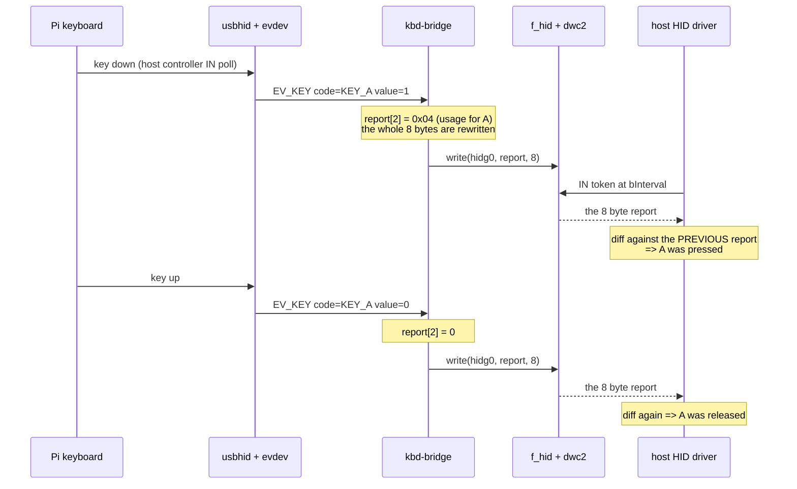
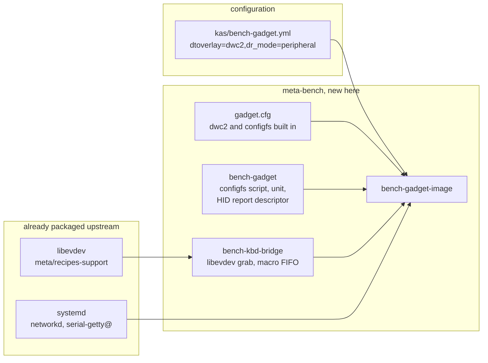

# Project 14: design

The drawings before the code. Every other project on this bench uses the
Pi as a USB **host**. This one turns it around and makes it a **device**,
which exposes the half of USB that host-side work never shows: the
descriptor tree the host reads during enumeration, the endpoint budget of
the controller, and how one cable carries three logical functions at
once.

| View | Question |
|---|---|
| [Two deviations](#two-deviations-from-the-specification) | What this bench has instead, and why |
| [Architecture](#architecture) | Three function drivers, one controller, one cable |
| [The endpoint budget](#the-endpoint-budget) | Why a fourth function does not fit |
| [Ownership](#ownership) | Eight contested things, one of which is the power supply |
| [Schematic](#schematic) | Two cables, and the constraint that shapes the project |
| [Bench layout](#bench-layout) | What is on the desk |
| [Enumeration](#enumeration-as-a-state-machine) | Unbound to Configured, and who drives each step |
| [One key press](#one-key-press) | Physical key to host application, across five processes |

Every drawing is also a TikZ source in [figures/](figures), rendered with
`make` and needed by no part of the build.

## Two deviations from the specification

Both were verified against this bench before anything was written, and
both change what gets built.

### 1. systemd-networkd, not NetworkManager

The specification brings `usb0` up with
`nmcli con add ... ipv4.method shared`, and names the alternative itself:
"On a Yocto image without NetworkManager, a `systemd-networkd`
`.network` file with `DHCPServer=yes` does the same."

This is that image. `bench-image` names neither NetworkManager nor
networkd in its package list, but the layer answers the question: Project
4 ships `10-eth0-netboot.network` into
`${nonarch_libdir}/systemd/network/`, and NetworkManager appears in
exactly one place in the whole layer, Project 15's router image. The
bench runs networkd.

That is also the right answer on the merits here. **The entire project
runs on a 500 mA budget** from a host USB 2.0 port, and adding
NetworkManager and its dependencies to an image whose constraint is
current draw is the wrong trade for a feature networkd already has.

### 2. The gadget stack is built in, not loaded as modules

The specification lists the modules in `/etc/modules-load.d/gadget.conf`:

```
  dwc2
  libcomposite
```

which is correct on Raspberry Pi OS. On this image it would produce a
board with no gadget at all, and the reason is the trap Project 13 was
caught by: `bench-image` is built on `core-image-minimal`, **which
installs no kernel modules**, and in `bcm2711_defconfig`:

```
  CONFIG_USB_GADGET=y          the framework is built in
  CONFIG_USB_DWC2=m            the controller driver is NOT
  CONFIG_USB_CONFIGFS=m        nor is the configfs interface
```

Unlike Project 13, where `DRM_VC4` could not be `=y` because it depends
on a module, **here `=y` is reachable and was checked**:

| Symbol | Kconfig | Reachable at `=y`? |
|---|---|---|
| `USB_DWC2` | `tristate`, `depends on USB \|\| USB_GADGET` | yes, `USB=y` |
| `USB_CONFIGFS` | `tristate`, `selects USB_LIBCOMPOSITE` | yes, `USB_GADGET=y` |
| `USB_DWC2_DUAL_ROLE` | choice member, `depends on (USB=y && USB_GADGET=y)` | yes, and it is **already the default** |

So the project ships a kernel fragment rather than a `modules-load.d`
file, and `/etc/modules-load.d/gadget.conf` is deliberately **not**
written: asking modules-load to load a built-in leaves a warning in the
journal for a module that is doing its job.

**`USB_LIBCOMPOSITE` is promptless** (`tristate` with no prompt string,
selected by `USB_CONFIGFS`). A fragment asking for it directly is the
same silent no-op Project 9 found in four Kconfig symbols, so it is
written in a consequences block as an assertion, never as a request.

## Architecture

```
  Raspberry Pi 4                                            host PC
  +--------------------------------------------------+     +------------------+
  |  USER SPACE                                       |     |                  |
  |   bench-gadget.service   configfs tree, then UDC  |     |  usb core        |
  |   systemd-networkd       usb0, DHCPServer=yes     |     |    |             |
  |   serial-getty@ttyGS0    login on the host's COM  |     |    +-> cdc_ether |
  |   kbd-bridge             libevdev grab -> reports |     |    |    DHCP     |
  +----------|-------|--------|-----------|----------+     |    |    client   |
             v       v        v           v                |    |             |
  +--------------------------------------------------+     |    +-> cdc_acm   |
  |  KERNEL                                           |     |    |    terminal |
  |   libcomposite   builds descriptors from configfs |     |    |             |
  |   f_ecm/f_ncm    -> netdev usb0                   |     |    +-> usbhid    |
  |   f_acm          -> /dev/ttyGS0                   |     |         keyboard |
  |   f_hid          -> /dev/hidg0, 8-byte reports    |     |         events   |
  |          |         |          |                   |     +------------------+
  |          +---------+----------+                   |              ^
  |                    v                              |              |
  |   dwc2  fe980000.usb, PERIPHERAL mode             |              |
  |         EP0 + 7 data endpoints, high speed        |==============+
  |                                                   |   ONE USB-C cable:
  |   xhci + usbhid + evdev  <- Pi keyboard (USB-A)   |   data AND the only
  +--------------------------------------------------+   5 V supply
```

**Two USB controllers, and they are not the same silicon.** The USB-C
port is wired to the SoC's own dual-role `dwc2`; the USB-A ports sit
behind a separate host-only controller. That is why the Pi 4 is the only
board on this bench that can do this on an external connector, and why
the keyboard on a USB-A port and the gadget on USB-C do not contend.

**The host needs no software.** All three functions are standard classes
with in-box drivers on Linux, macOS and Windows. That is the point of
using CDC and boot-protocol HID rather than anything custom.

## The endpoint budget

The specification asks for this to be written **before** the gadget is
built and checked against `lsusb -v` at the end. It is the constraint
that decides what the device can be.

The BCM2711's `dwc2` has **EP0 plus seven data endpoints**, each usable
in either direction.

| Function | Endpoints | What each is for |
|---|---|---|
| `f_ecm` | interrupt IN | link up/down notifications |
| | bulk IN | frames to the host |
| | bulk OUT | frames from the host |
| `f_acm` | interrupt IN | serial state (DCD, DSR) notifications |
| | bulk IN | bytes to the host |
| | bulk OUT | bytes from the host |
| `f_hid` | interrupt IN | the 8-byte keyboard report |
| **total** | **7 of 7** | **none to spare** |

```
  EP0  control        always present, not counted in the seven
  EP1  ecm  int IN    +-- notifications
  EP2  ecm  bulk IN   |
  EP3  ecm  bulk OUT  +-- CDC Ethernet
  EP4  acm  int IN    +-- notifications
  EP5  acm  bulk IN   |
  EP6  acm  bulk OUT  +-- CDC ACM
  EP7  hid  int IN    --- the report
       ^
       +-- a mass storage function needs two more. There are none.
           The stretch goal is to add it, watch the bind fail, and
           then drop ACM to make room. That failure is the lesson.
```

**Five interfaces, not three.** Each CDC function is a *pair*: a control
interface and a data interface, grouped by an Interface Association
Descriptor. So the host sees 2 (ECM) + 2 (ACM) + 1 (HID) = five, which
is what acceptance criterion 1 checks.

## Ownership

Two managers on one resource is the bug this table prevents. This project
has eight candidates, and the first one is unusual: **the contested
resource is the power supply.**

| Resource | Owned by | Never touched by | What breaks otherwise |
|---|---|---|---|
| **The USB-C port** | the host, which supplies **all** the Pi's power through it | the 40-pin 5 V pins, which must have **no** second supply | VBUS and the 5 V rail are joined through a fuse. A second supply back-feeds the host port |
| **The current budget** | 500 mA (USB 2.0) or 900 mA (USB 3) | nothing that assumes 3 A | A Pi 4 idles near 550 mA. No display, no HAT, cap the clock if the journal warns |
| **`/sys/kernel/config/usb_gadget/bench`** | `bench-gadget.service`, built once and torn down in reverse | anything that writes it while bound | A half-built tree bound to the UDC fails with `ENODEV` or `EINVAL` and no explanation |
| **The `UDC` file** | written **last**, exactly once, and emptied first on teardown | every other step | Writing it early binds an incomplete descriptor tree. This is the specification's first pitfall |
| **The physical keyboard** | `kbd-bridge`, which **grabs** it with `EVIOCGRAB` | the Pi's own console, which loses it entirely | Nothing breaks; the Pi simply has no local keyboard. **This is why the USB/TTL console is not optional** |
| **`/dev/hidg0`** | `kbd-bridge`, the only writer | anything else | Interleaved 8-byte reports from two writers are not two keystrokes, they are garbage |
| **`usb0`** | `systemd-networkd`, with `DHCPServer=yes` | NetworkManager, which is not installed | Two DHCP servers on one link, or none |
| **`/dev/ttyGS0`** | `serial-getty@ttyGS0.service` | any other reader | Two readers on one tty split the input stream between them |

### The row that makes this project different

**The host port is the supply.** Every other project on this bench has a
3 A supply and a data cable. Here they are the same cable, and that has
three consequences that appear nowhere else:

1. **The Pi reboots when you move the cable** from its supply to the
   host, because the supply is what moved. Shut down first.
2. **A second supply is dangerous, not redundant.** Feeding 5 V into
   header pin 2 or 4 while the host provides VBUS back-feeds the host's
   port through the board's fuse.
3. **The board revision matters.** A cable with an e-marker chip does not
   power a revision 1.1 Pi 4 at all, because of the shared CC pull-down
   on that revision. Use a plain cable.

## Schematic

```
    host PC                                  Raspberry Pi 4
  +-----------+                            +--------------------------+
  |           |                            |                          |
  |  USB-A/C  o====== plain USB-C cable ===o USB-C                    |
  |   port    |   VBUS 5V  (the ONLY supply)|  dwc2, peripheral mode  |
  |           |   D+ / D-  (high speed)     |                          |
  +-----------+                            |                          |
                                           |  USB-A (top) o===== Pi keyboard
    NOTHING on the 40-pin header except:   |                          |
                                           | pin 8  GPIO14 o--TXD---> USB/TTL white
    no HAT, no display, no second 5V       | pin 10 GPIO15 o--RXD---< USB/TTL green
                                           | pin 6  GND    o---------- USB/TTL black
                                           +--------------------------+
                                                                  ( red lead open )
```

| Signal | Pi connector | Note |
|---|---|---|
| VBUS 5 V | USB-C | 500 mA on USB 2.0, 900 mA on USB 3 |
| D+ / D- | USB-C | `dwc2` in peripheral mode |
| CC pull-downs | USB-C | **plain cable**, no e-marker, on revision 1.1 |
| Keyboard | USB-A | separate host controller, no contention |
| Console TXD / RXD / GND | pins 8 / 10 / 6 | **not optional**, see below |

**The console is not optional here and it is the only project where that
is true for this reason.** The bridge grabs the keyboard, so the Pi has
no local input; and when the gadget is rebuilt the host loses the network
and the serial port at the same moment, because both are functions of the
thing being rebuilt. Without the USB/TTL cable, a failed `bench-gadget.sh
up` leaves a board with no way in at all.

## Bench layout

```
     +--------------------------------------+
     |  host PC                             |
     |   sees: a network adapter            |
     |         a COM port                   |
     |         a keyboard                   |
     +----+--------------------------+------+
          |                          |
   USB-C cable                  USB/TTL cable
   (data + the only power)      (independent console)
          |                          |
          v                          v
     +--------------------------------------+
     |  Raspberry Pi 4                      |
     |   no HAT, no display, no supply      |
     |                                      |
     |   USB-A o===== Pi keyboard           |
     +--------------------------------------+
```

Deliberately sparse. Every milliamp on this desk comes from one host
port, so the bench layout **is** the power budget: no display, no HAT, no
second board.

## Enumeration as a state machine

The left half of the specified UML. Worth reading because only the first
transition is ours; the host drives everything from Powered onward.

```mermaid
stateDiagram-v2
    [*] --> Unbound: tree built in configfs
    Unbound --> Bound: echo fe980000.usb > UDC
    Bound --> Powered: cable plugged, VBUS present
    Powered --> Default: host bus reset, 100 mA budget
    Default --> Addressed: SET_ADDRESS
    Addressed --> Configured: SET_CONFIGURATION 1
    Configured --> Suspended: 3 ms idle, 2.5 mA budget
    Suspended --> Configured: resume
    Configured --> Powered: bus reset
    Powered --> Bound: VBUS lost
    Bound --> Unbound: echo "" > UDC
```

**`usb0`, `/dev/ttyGS0` and `/dev/hidg0` are live only in Configured.**
Writing a report to `hidg0` in any earlier state gets `ESHUTDOWN`, which
the bridge has to survive rather than treat as fatal: unplugging the
cable is a normal event, not a crash.

**The only transition this project owns is the first one**, and it is one
`echo`. Everything else is the host and the hardware.

## One key press



**The daemon never sends a release event**, because boot-protocol HID has
none. It sends *state*, and the host computes presses and releases by
comparing consecutive reports. That is why the whole 8 bytes go out on
every change, and why a dropped report is a stuck key rather than a
missed character.

**`value == 2` is ignored.** That is evdev's autorepeat. The host does
its own repeat from the held state, so forwarding it would produce
double repetition at two different rates.

**Six keys, then silence.** Bytes 2 to 7 hold up to six simultaneous
usages; a seventh press is dropped by the report builder with nothing to
say about it. Fine for typing, wrong for anything else, and written down
so that the limit is a decision rather than a surprise.

## Components



Two recipes are new, plus a kernel fragment. Nothing here needs a layer
this repository does not already have: `libevdev` is in oe-core, and the
`dwc2.dtbo` overlay is already deployed by meta-raspberrypi's
`rpi-base.inc`.

---

Next: the [bring-up notes](BRINGUP.md), or
[descriptors.md](DESCRIPTORS.md), which is the interview document. Back
to the [project README](../README.md).
