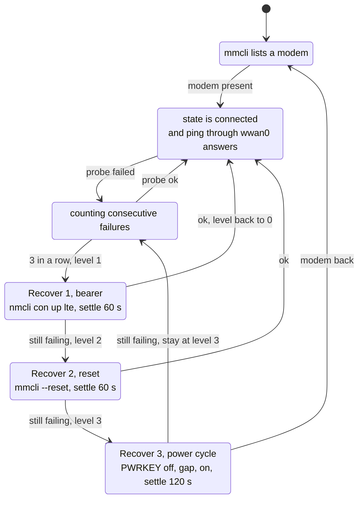
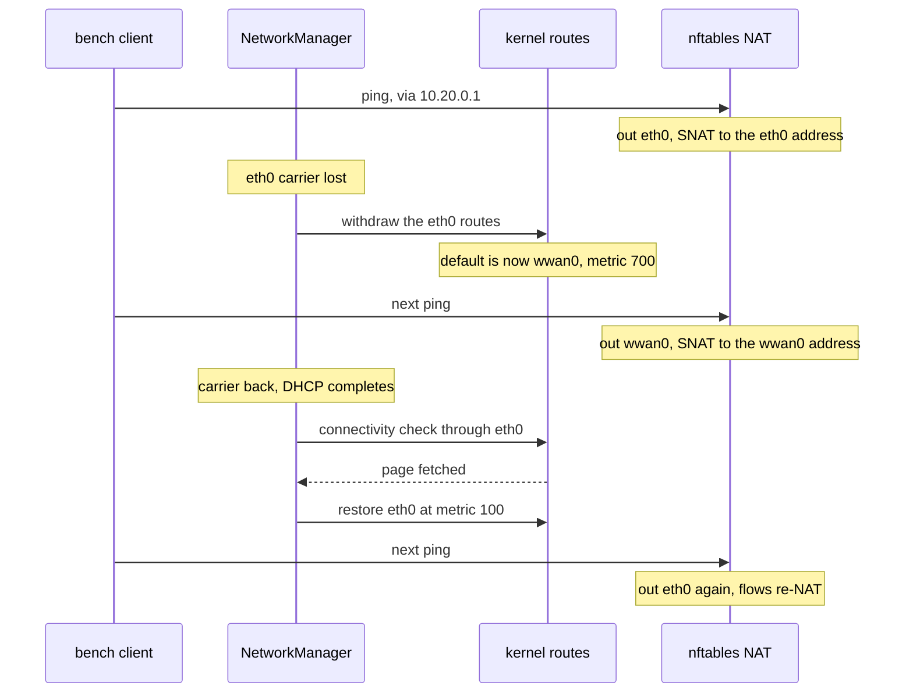

# Design, Project 15

The four figures this project is specified by, plus the software
diagrams behind them. This is the methodology: what the components are,
which of them owns what, and how a packet and a failure each travel through
the system. What happened while building it is the [journal](../JOURNAL.md);
why each choice was made rather than its alternative is
[DECISIONS](../../../walkthrough/DECISIONS.md).

Drawn as text on purpose, the same as Project 1: diagrams here survive a
diff, can be grepped, and need no build step. Everything needed to read them
is in this file.

---

## Figure 1: System architecture

Four layers. The point of the picture is the boundary between them: almost
nothing in this project is code we wrote, and the parts that are, are the
parts no standard component covers.

```
  EXTERNAL
  +----------------+     +----------------+     +---------------------+
  | LTE network    |     | home router    |     | bench clients       |
  | SIM, data plan |     | Internet       |     | phone, Pi 3B+, PC   |
  +-------+--------+     +-------+--------+     +----------+----------+
          | antenna              | cable                   | Wi-Fi
  ========|======================|=========================|===========
  HARDWARE|                      |                         |
  +-------+-----------------+  +-+--------+   +------------+---------+
  | SIM7600E-H 4G HAT       |  | eth0     |   | wlan0 in AP mode     |
  | LTE Cat-4, GNSS         |  | primary  |   | bench LAN            |
  | USB composite + UART    |  | uplink   |   | 10.20.0.0/24         |
  | PWRKEY, FLIGHT          |  +-+--------+   +------------+---------+
  +--+-------------------+--+    |                         |
     | USB               | GPIO  |                         |
  ===|===================|=======|=========================|===========
  KERNEL                 |       |                         |
  +--+------------+  +---+----+  |   +---------------------+--------+
  | option        |  | gpio   |  |   | routing + netfilter          |
  | ttyUSB0..4    |  | pl011  |  +---+ two default routes, metrics  |
  | diag NMEA AT  |  | GPIO6  |      | conntrack, NAT, forward      |
  +---------------+  | GPIO4  |      +---------------------+--------+
  +---------------+  | ttyAMA0|                            |
  | qmi_wwan      |  +---+----+                            |
  | cdc-wdm0      |      |                                 |
  | wwan0 raw IP  |      |                                 |
  +-------+-------+      |                                 |
  ========|==============|=================================|===========
  USER SPACE             |                                 |
  +-------+--------+  +--+--------------+   +--------------+--------+
  | ModemManager   |  | lte-gpio        |   | nft                   |
  | simtech plugin |  | pwrkey, flight  |   | one ruleset file      |
  | bearer, signal |  | libgpiod v2, C  |   | input fwd postrouting |
  | location       |  +--+--------------+   +-----------------------+
  +-------+--------+     ^                  +-----------------------+
          | D-Bus        | runs             | dnsmasq               |
  +-------+--------+     |                  | DHCP and DNS on wlan0 |
  | NetworkManager |  +--+--------------+   +-----------------------+
  | eth0    m 100  |  | lte-watchdog    |
  | lte     m 700  |<-+ probe, escalate |   +-----------------------+
  | bench-ap  AP   |  | Python, policy  |   | lte-exporter + server |
  | connectivity   |  +-----------------+   | lte.prom on :9101     |
  +----------------+                        +-----------------------+
```

What is ours and what is not:

| Component | Who wrote it | Why it is in the picture at all |
|---|---|---|
| ModemManager, NetworkManager | Upstream | The modem abstraction and the routing policy. No code of ours decides which uplink wins |
| nftables, dnsmasq | Upstream | The packet path and the LAN. One ruleset file, one DHCP config |
| `lte-gpio` | This project, C | Nothing upstream owns the HAT's PWRKEY and FLIGHT lines |
| `lte-watchdog` | This project, Python | Nothing upstream recovers a modem that has stopped answering |
| `lte-exporter` | This project, Python | Nothing upstream turns `mmcli` into Prometheus text |
| `bench-router` | This project, config | The profiles, the ruleset, the filter and the udev names |

Three programs and a pile of configuration. If any of them grows past a few
hundred lines, the odds are that it is re-implementing something in the
first two rows.

---

## Figure 2: Wiring and schematic

The HAT stacks on the header and takes 5 V from it. The data path is the
short USB cable, not the header: the header only carries power, ground, the
fallback UART and the two control lines.

```
  Raspberry Pi 4                              SIM7600E-H 4G HAT
  +---------------------------+               +--------------------------+
  |                           |               |                          |
  | pin 2, 4   5V   >---------|===============|--->  5V in (2 A peaks)   |
  | pin 6,9,14 GND  >---------|---------------|--->  GND                 |
  |                           |               |                          |
  | pin 8  GPIO14 TXD >-------|---------------|--->  RXD   \  fallback   |
  | pin 10 GPIO15 RXD <-------|---------------|<---  TXD   /  AT channel |
  |                           |               |                          |
  | pin 31 GPIO6      >- - - -|- - -[jumper]- |--->  PWRKEY              |
  | pin 7  GPIO4      >- - - -|- - -[jumper]- |--->  FLIGHT              |
  |                           |               |                          |
  | USB-A  <==================|===============|===  micro-USB            |
  |          the data path: ttyUSB0..4, cdc-wdm0, wwan0                  |
  +---------------------------+               +------------+-------------+
                                                           |
                                              SMA: MAIN, (AUX), GNSS
                                              GNSS antenna at a window
```

| Signal | Header pin | BCM GPIO | Note |
|---|---|---|---|
| 5 V to the HAT | 2 and 4 | | Peaks near 2 A during registration and at full transmit |
| GND | 6, 9, 14 | | |
| Pi TXD to modem RXD | 8 | GPIO14 | Fallback AT channel, HAT jumper in the Pi UART position |
| Pi RXD from modem TXD | 10 | GPIO15 | The serial console must be off on this UART |
| PWRKEY | 31 | GPIO6 | Through the jumper block. Drive high to press. Confirm on the HAT schematic |
| FLIGHT | 7 | GPIO4 | Through the jumper block. High means RF off. Confirm on the HAT schematic |
| USB data | HAT micro-USB to a Pi USB-A port | | The main data path |
| Antennas | MAIN, AUX, GNSS | | The GNSS one is the active patch with the magnet base |

The dashed lines are the two that are not guaranteed. The GPIO assignments
of PWRKEY and FLIGHT follow the Waveshare demo code and the default jumper
positions, and both are properties of a HAT revision rather than of the
part. That is why they are in `/etc/bench/lte.conf` and not compiled into
`lte-gpio`, and why the watchdog's level 3 recovery must not be enabled
until they have been checked against the schematic. A wrong PWRKEY offset
does not fail safely: it toggles something else on the header.

**Power.** Use the official 3 A supply and nothing else on the USB ports
except the HAT's own cable. Never power the HAT from its micro-USB and the
header at the same time. Watch `journalctl -k` for undervoltage. The PPK2
cannot measure this, at 1 A maximum; the instrument for the current profile
is Project 8's MCC 118 with a low-value shunt.

---

## Figure 3: Bench layout

```
       GNSS antenna                      LTE MAIN antenna
       (at the window)                   (clear of the board)
              \                            /
               \                          /
            +---o--------------------------o---+
            |        SIM7600E-H 4G HAT        |
            |  SIM slot   jumper block   PWRKEY button
            |                          micro-USB [==\
            +----------------+----------------+      \
            |                |                |       \  short USB cable
   USB-C  =>| Raspberry Pi 4 |          USB-A |<=======/
   5V 3A    |                |           ETH  |----------------+
            +----------------+----------------+                |
                                                               |
                  ((  Wi-Fi AP: bench-lte, 10.20.0.1  ))       |
                       |            |           |              |
                    phone        Pi 3B+        PC              |
                   10.20.0.x    (Project 4)  (Prometheus)      |
                                                               |
                                                      +--------+--------+
                                                      |  home router    |
                                                      |  primary uplink |
                                                      +-----------------+
```

The USB cable loops from the HAT back down to a USB-A port on the same
board, which looks wrong the first time and is correct: the HAT's data path
is USB, and the header carries only power and the two control lines.

---

## Figure 4: The watchdog as a state machine

Every probe failure moves one step right. Every success returns to
Connected and resets the escalation level to zero. The three recovery
actions are ordered by cost: seconds, half a minute, a minute with a full
re-registration.



Two properties of this machine are worth stating, because both are easy to
lose in a rewrite and neither is visible from the code at a glance.

**The level never skips a rung.** A failure at level 0 goes to level 1, not
straight to the power cycle, even when the modem is plainly gone. The cost
of being wrong in the cheap direction is one minute; in the expensive
direction it is a minute of downtime every time the cheap action would have
worked, which on a link that flaps is most of the day.

**A success resets to zero, not to one.** Otherwise a box that has one bad
hour spends the rest of the week starting its recovery ladder at level 3.

Both are asserted in [`tests/lte-watchdog-test.sh`](../../../tests/lte-watchdog-test.sh).

---

## Figure 4b: A failover, as a sequence

The cable comes out, and comes back. Nothing in the picture is code of ours.



The masquerade rule names both uplinks, so the firewall is unchanged by any
of this. The one visible cost is that long-lived flows die at the moment of
the switch, because their conntrack entries carry the old source address.
That is what NAT failover is. A flow that has to survive needs a tunnel
above the NAT, which is the WireGuard stretch goal.

---

## Data flow

```
  bench clients (Wi-Fi AP, 10.20.0.0/24)             uplinks
      |                                              +-> eth0  (metric 100)  -> home router
      v  DHCP from dnsmasq on wlan0                  |
  [ Pi 4 router ] --- nftables: forward + masquerade -+-> wwan0 (metric 700)  -> LTE network
      |                                                    ^
      |  NetworkManager: profiles, metrics, connectivity    |
      |  ModemManager:  simtech plugin, bearer, signal --> qmi_wwan (/dev/cdc-wdm0, raw IP)
      |                                    |               option (/dev/ttyUSB0..4)
      |  lte-watchdog: probe, escalate: nmcli up -> mmcli --reset -> lte-gpio pwrkey
      |  lte-exporter: /var/lib/lte/lte.prom, http :9101 <- Prometheus on the PC
      |  GNSS: mmcli --location-get  (or gpsd on /dev/lte-nmea with AT+CGPS=1)
      +--------------------------------------------------------------------------------
```

---

## Who owns what

The commonest way to break this box is to give one resource two owners.
This table is the answer to "why is my interface flapping".

| Resource | Owner | What must not also touch it |
|---|---|---|
| `wlan0` | NetworkManager, as an access point | systemd-networkd, `wpa_supplicant@wlan0`, `bench-net-wifi`. All three are absent from this image, and the first is masked |
| `eth0`, `wwan0` | NetworkManager | A hand-written `.network` file, `dhclient` on `wwan0` |
| `/dev/ttyUSB0..4`, `cdc-wdm0` | ModemManager | `qmicli` and `picocom` while ModemManager runs. Stop it first |
| `/dev/ttyAMA0` | Nothing, or a getty | ModemManager. Kept off by the strict filter and by `ID_MM_PORT_IGNORE` |
| Port 53 on `wlan0` | Our `bench-router-dhcp.service` | The packaged `dnsmasq.service`, which is masked |
| The netfilter ruleset | `bench-router-nft.service` | NetworkManager's `shared` mode, which is why the AP profile uses `manual` |
| GPIO6 (PWRKEY) | `lte-gpio`, briefly | Anything else. The line is requested, pulsed and released |
| GPIO4 (FLIGHT) | `lte-flight.service`, permanently | Anything else. Releasing the line re-asserts flight mode |

Three of these were mistakes before they were a table:
`ModemManager` on the Pi UART, `systemd-networkd` on an access-point
interface, and two dnsmasq instances racing for port 53.

---

## Software components, and the mechanism and policy split

```
                       +---------------------------+
                       |  /etc/bench/lte.conf      |
                       |  offsets, probe, timings  |
                       +----+-----------------+----+
                            | read by         | read by
             +--------------v-----+     +-----v------------------+
             | lte-gpio (C)       |     | lte-watchdog (Python)  |
             | MECHANISM          |<----+ POLICY                 |
             | libgpiod v2        | run | probe, count, escalate |
             | pwrkey, flight-hold|     | never touches a GPIO   |
             +--------------------+     +-----+------------------+
                                              | writes
                                        +-----v------------------+
                                        | /var/lib/lte/          |
                                        |   watchdog.prom        |
                                        |   lte.prom             |
                                        +-----+------------------+
                                              | read by
                                        +-----v------------------+
                                        | python3 -m http.server |
                                        | bound to 10.20.0.1     |
                                        +------------------------+
```

This is the same split Project 1 made between `bench-status` and
`bench-state`, for the same two reasons and with one more.

1. **The policy becomes testable without hardware.** The watchdog reaches
   the world only through commands on `PATH`, so the whole escalation
   ladder runs on a laptop against stubs. That test is
   `tests/lte-watchdog-test.sh` and it exists because of this split.
2. **The C stays short enough to read in one sitting.** `lte-gpio` does one
   thing and has no opinion about when to do it.
3. **The power-cycle path has no Python in it.** The obvious alternative calls
   libgpiod through its Python bindings. Those are a separate package whose
   name and availability differ between Yocto releases, and a recovery path
   that fails on an import is a recovery path that does not exist.

The exporter is split the same way for the same kind of reason: a collector
that runs for a second under a timer, and a server that does nothing but
hand out a directory. Neither has to be right about the other's job.

---

## What the kernel has to provide

Everything the router needs is built in rather than modular, and that is a
decision rather than an oversight. See
[`router.cfg`](../../../meta-bench/recipes-kernel/linux/files/router.cfg).

```
  USB composite modem          netfilter                    radio
  -------------------          ---------                    -----
  USB_SERIAL_OPTION=y          NF_TABLES=y                  CFG80211
  USB_SERIAL_WWAN=y            NF_TABLES_INET=y             brcmfmac
  USB_NET_QMI_WWAN=y           NFT_CT=y NFT_NAT=y           (FullMAC,
  USB_USBNET=y                 NFT_MASQ=y                    AP mode in
  USB_WDM=y                    NFT_CHAIN_NAT=y               firmware)
                               NFT_RT=y NFT_EXTHDR=y
  (CDCETHER, RNDIS_HOST=m:     NF_CONNTRACK=y
   the compositions not used)
```

`NFT_RT` and `NFT_EXTHDR` are there for one line of the ruleset, the MSS
clamp. Without them that line fails to load and takes the whole ruleset
with it, and a box whose input policy is drop with no ruleset loaded is a
box with no ruleset at all, which is the opposite of what was intended.

The reason for `=y` rather than `=m` is Project 1: `core-image-minimal`
installs no kernel modules, so a driver built as a module is a driver
present in the build tree and absent from the image. That cost two rounds
of debugging on `wlan0` before anyone thought to look at what the image
actually contained.

---

Design first, then [bring-up](BRINGUP.md), then the
[USB mode decision](usb-modes.md) and the
[failover measurements](failover-tests.md).
