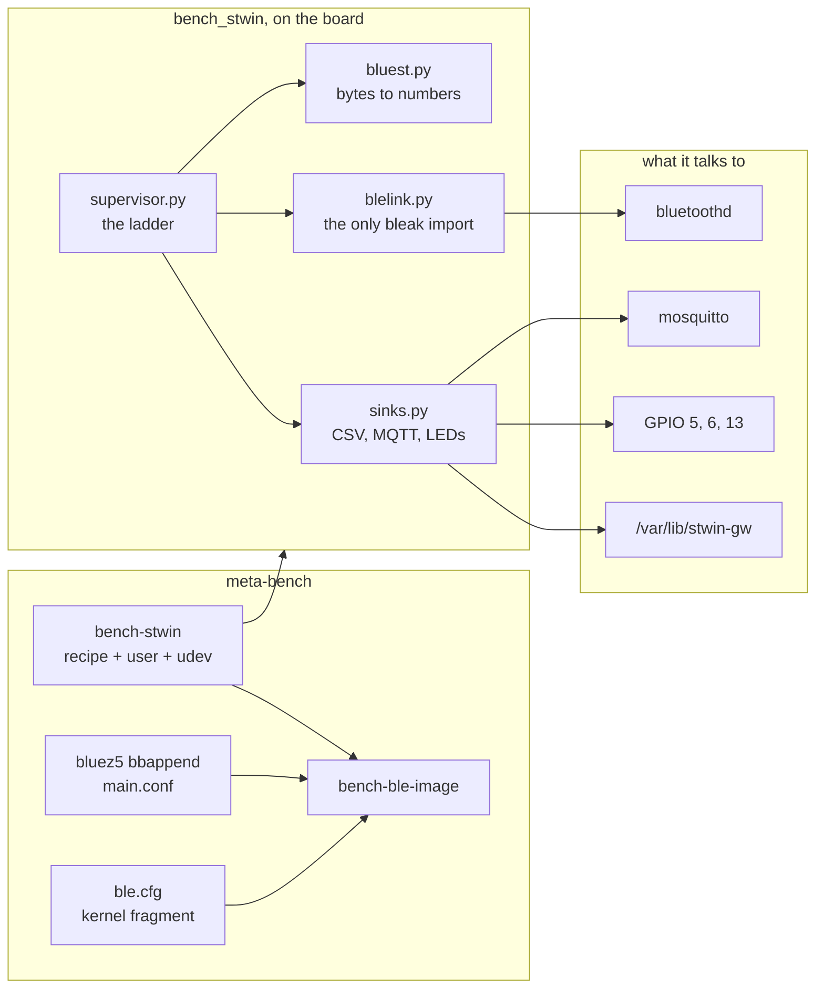
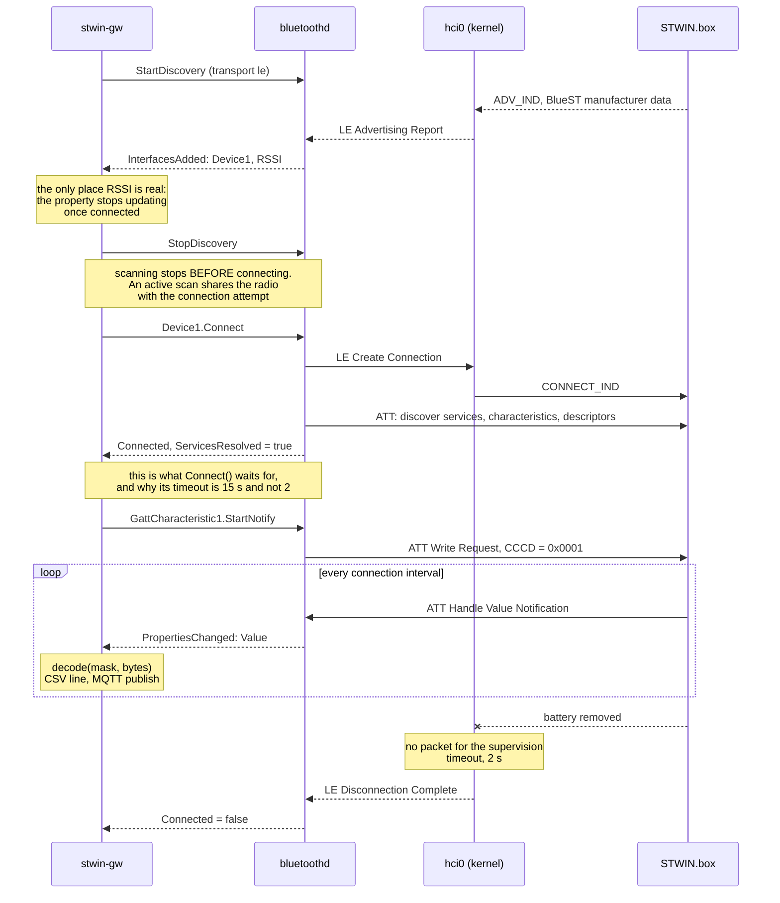
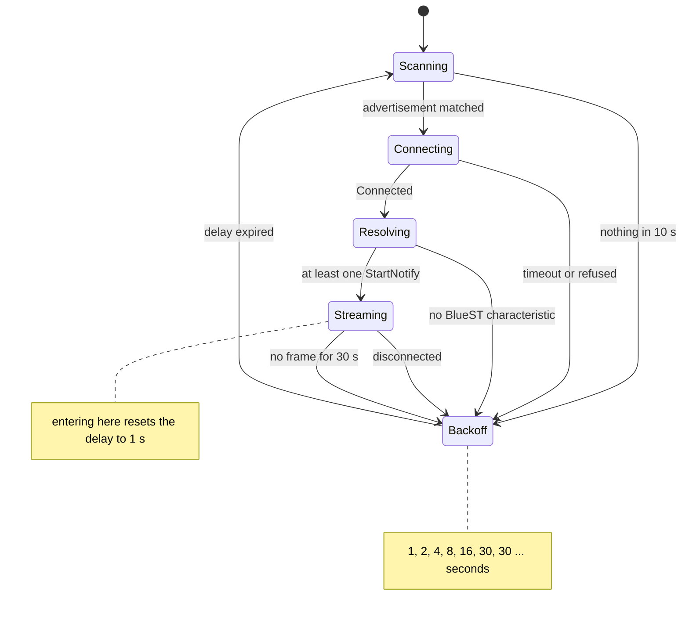

# Project 17: design

The drawings before the code. Five views, each answering a question that
the others cannot.

| View | Question |
|---|---|
| [Architecture](#architecture) | Which layer owns what, and where does a connection actually live |
| [Schematic](#schematic) | What is wired, and what is deliberately not |
| [Bench layout](#bench-layout) | What does it look like on the table |
| [Sequence](#one-connection-as-a-sequence) | What happens between "scan on" and the first frame |
| [State machine](#the-supervisor-as-a-state-machine) | What happens when any of it fails |

## Architecture

The single most useful thing to understand about Bluetooth on Linux is
that **the kernel does not own the connection you care about**. It owns the
transport. Everything above L2CAP, including the ATT client and the GATT
database, lives in `bluetoothd`, and your program never opens a socket to
the peripheral at all: it is a D-Bus client asking a daemon to do things.

```
   STWIN.box (peripheral)                Raspberry Pi 3B+ (central)
  +------------------------+           +-----------------------------------+
  | IIS3DWB  ISM330DHCX    |           | stwin-gw (bleak, asyncio)         |
  | ILPS22QS STTS22H       |           |   decode(mask, bytes) -> dict     |
  |        |               |           |   CSV | MQTT | LEDs               |
  |        v               |           +----------------+------------------+
  | STM32U585 firmware     |           user space        | org.bluez, D-Bus
  |   BlueST GATT server   |           - - - - - - - - - | - - - - - - - - -
  |        |  SPI          |           +----------------v------------------+
  |        v               |           | bluetoothd                        |
  | BlueNRG-M2             |           |   ATT client, GATT database,      |
  |   network coprocessor  |           |   device objects, agent, pairing  |
  +-----------+------------+           +----------------+------------------+
              |                        user space       | HCI socket
              |                        - - - - - - - - -|- - - - - - - - - -
              |   2.4 GHz              +----------------v------------------+
              +~~~~~~~~~~~~~~~~~~~~~~~~| kernel: L2CAP                     |
                  advertising,         |   hci_uart + btbcm  -> hci0       |
                  connection,          |   serdev                          |
                  notifications        +----------------+------------------+
                                                        | UART (PL011)
                                       +----------------v------------------+
                                       | CYW43455 combo radio              |
                                       |   patch RAM loaded at every boot  |
                                       |   from BCM4345C0.hcd              |
                                       +-----------------------------------+
```

Three consequences follow from that picture, and all three shape the code:

**The program cannot "open the radio".** There is no device node for a BLE
peripheral. `stwin-gw` calls methods on D-Bus objects that `bluetoothd`
publishes under `/org/bluez/hci0/dev_XX_XX_XX_XX_XX_XX`, and receives
notifications as `PropertiesChanged` signals on a `Value` property. That is
why the program needs no special privileges and no capabilities: talking to
a daemon over the system bus is an ordinary thing for an ordinary user to
do.

**The radio is not on USB.** On a Pi it hangs off a UART, which means
`serdev` and `hci_uart` have to exist before `hci0` does, and means the
controller has no firmware of its own: the patch RAM is uploaded from the
root filesystem on every boot. A missing `.hcd` file is not a degraded
radio, it is no radio.

**Nothing in this project is a driver.** The only kernel work is
configuration. The peripheral side is ST's firmware and is not touched.

### What the pieces are, and why each is separate



| Module | Why it is on its own | Testable without hardware |
|---|---|---|
| `bluest.py` | A pure function. Frames can be replayed from a trace, and a scale factor can be checked against a known value | yes, 29 assertions |
| `supervisor.py` | The failure behaviour is the product. Reproducing "connected, then dropped" on a board means pulling a battery at the right moment | yes, 28 assertions |
| `sinks.py` | Three destinations with nothing in common except a method name | yes, 30 assertions |
| `blelink.py` | The part that can only be proven on a board, kept as small as it can be | no, and that is the point |

## Schematic

The striking thing about the wiring diagram is how little is in it. The
sensor link is a radio; the only wires are a console and three LEDs.

```
   Raspberry Pi 3B+ (40-pin header)
  +---------------------------------+
  |                                 |
  | pin 29  GPIO5   o---[ 330R ]---->|--+     green: streaming
  |                                 |     |
  | pin 31  GPIO6   o---[ 330R ]---->|--+     yellow: scanning, connecting,
  |                                 |     |            resolving
  | pin 33  GPIO13  o---[ 330R ]---->|--+     red: back-off
  |                                 |     |
  | pin 39  GND     o---------------------+---- ground rail
  |                                 |
  | pin 8   GPIO14  o--- TXD ------------> USB/TTL white (RX)
  | pin 10  GPIO15  o--- RXD <------------ USB/TTL green (TX)
  | pin 6   GND     o-------------------- USB/TTL black
  |                                     ( red lead left open )
  +---------------------------------+

       )))  2.4 GHz, 1 to 3 m, no wires  (((

  +---------------------------------+
  | STWIN.box                       |
  |   STM32U585 + BlueNRG-M2        |
  |   powered by its own Li-Po pack |
  |   or by USB-C                   |
  +---------------------------------+
```

| Signal | Pin | GPIO | Meaning |
|---|---|---|---|
| Green LED via 330 ohm | 29 | GPIO5 | Streaming: notifications are arriving |
| Yellow LED via 330 ohm | 31 | GPIO6 | Scanning, connecting or resolving |
| Red LED via 330 ohm | 33 | GPIO13 | Disconnected, waiting out the back-off |
| LED cathodes | 39 | GND | The common rail |
| Console TXD | 8 | GPIO14 | Mini UART, `ttyS0` |
| Console RXD | 10 | GPIO15 | Mini UART, `ttyS0` |
| Console GND | 6 | GND | |

### The UART that is not free

This is the detail that catches people, and it is specific to the Pi:
**the serial console and the Bluetooth radio want the same hardware.**

The SoC has one good UART (PL011) and one poor one (the mini UART, whose
baud rate follows the core clock). The radio needs the good one. So with
`enable_uart=1` the console runs on the mini UART as `ttyS0`, and
`enable_uart=1` also pins the core clock, which is what stops the console
from changing baud rate underneath you when the CPU scales.

Two overlays exist to change that, and neither is used here:

| Overlay | What it does | Why not |
|---|---|---|
| `dtoverlay=disable-bt` | Gives the console the PL011 and turns the radio off | This project is the radio |
| `dtoverlay=miniuart-bt` | Gives the radio the mini UART and the console the PL011 | The radio's throughput drops, and the numbers in the results table would be about the overlay |

A garbled console after boot is almost always this, and it is the first
thing to check rather than the last.

## Bench layout

```
    breadboard                       Raspberry Pi 3B+
  +-------------------+            +--------------------------+
  |  (G)   (Y)   (R)  |            |  [ 40-pin header ]       |
  |   |     |     |   |<===========|  GPIO5 / 6 / 13 + GND    |
  |  330   330   330  |            |                          |
  |   |_____|_____|___|            |  [SoC]  [radio]   [USB]  |
  |      ground rail  |            |                          |
  +-------------------+            |  [microSD]  [micro-USB]  |
                                   +------------+-------------+
                                                |
                                   USB/TTL: TX, RX, GND
                                                |
                                                v
                                      +--------------------+
                                      |   Host PC          |
                                      |   picocom 115200   |
                                      |   Wireshark        |
                                      |   CubeProgrammer   |
                                      +---------+----------+
                                                |
        STWIN.box                               | STLINK-V3MINI
      +---------------------+                   | (flash and firmware log)
      | STM32U585           |<------------------+
      | BlueNRG-M2          |
      | Li-Po or USB-C      |
      +----------+----------+
                 |
                 |  1 to 3 m
                 v
         ( radio link to the Pi )
```

**One to three metres, not ten centimetres.** A peripheral sitting next to
the receiver can saturate its front end, and the result is more link errors
at 10 cm than at 3 m. That is a counter-intuitive enough failure to be
worth a line in the bench notes: if the link is bad, try moving the board
*away* first.

## One connection as a sequence



Three points in that diagram are places where a gateway goes wrong:

**StopDiscovery before Connect.** An active scan and a connection attempt
compete for the same radio. Leaving the scan running turns a reliable
connect into one that works about half the time, which is the worst kind of
fault to debug because it looks like the peripheral.

**`Connect` returns after `ServicesResolved`.** It is not a connection
call, it is a connect-and-enumerate call, and on a device with many
characteristics it takes seconds. A two-second timeout copied from a TCP
client fails here on a working link.

**The disconnect arrives as a signal, not as an error.** The gateway waits
for it rather than polling, which is also why it needs the stall check
described below: a peripheral that stops sending without disconnecting
produces no signal at all.

## The supervisor as a state machine



| State | LED | What it means |
|---|---|---|
| Scanning | yellow | Listening for advertisements, logging RSSI |
| Connecting | yellow | `Device1.Connect` in flight |
| Resolving | yellow | Enumerating services, subscribing |
| Streaming | green | At least one characteristic is notifying |
| Backoff | red | Waiting before the next attempt |
| off | none | The service is not running |

Two design decisions live in that diagram and neither is in the original
scope.

**The delay resets on data, not on connection.** If a peripheral accepts a
connection and drops it a moment later, resetting the ladder on `Connected`
would retry it as fast as the radio allows for as long as the fault lasts.
Resetting on `Streaming` makes the delay mean "how long since this link
last actually worked".

**A quiet link is a dead link.** The supervision timeout catches a
peripheral that has gone away. It does not catch one that is still
connected and has stopped notifying, which is what a firmware with one
crashed task looks like from here. Without the stall check the gateway sits
in Streaming, green, writing nothing: the worst failure mode of the set,
because it looks exactly like success.

## Data flow

```
  STWIN.box                                 Raspberry Pi 3B+
  +------------------+                      +-----------------------------+
  | BlueST           |   notification       | bluetoothd                  |
  | [ts16][acc][gyro]|~~~~~~~~~~~~~~~~~~~~~>|   PropertiesChanged(Value)  |
  | every 20..100 ms |   2.4 GHz            +--------------+--------------+
  +------------------+                                     |
                                                           v
                                            +-----------------------------+
                                            | blelink.py                  |
                                            |   mask bound per            |
                                            |   characteristic, once      |
                                            +--------------+--------------+
                                                           v
                                            +-----------------------------+
                                            | bluest.decode(mask, bytes)  |
                                            |   walk the mask, high to    |
                                            |   low; stop at an unknown   |
                                            |   bit and say so            |
                                            +--------------+--------------+
                                                           v
                                            +-----------------------------+
                                            | supervisor adds             |
                                            |   mask, mac, host_ts        |
                                            +--+-----------+-----------+--+
                                               |           |           |
                       +-----------------------+           |           +--------+
                       v                                   v                    v
         /var/lib/stwin-gw/                    bench/stwin/<mac>/<mask>    GPIO 5, 6, 13
         YYYYMMDD-<mask>.csv                   one JSON object per frame   one colour
         one file per day per mask             QoS 0                       at a time
```

Two timestamps travel with every record, and the README says which to trust
for what: `dev_ts` is the peripheral's own 16-bit counter, which wraps and
is the only way to see a frame the radio dropped; `host_ts` is the Pi's
wall clock at the moment the notification reached user space, which
includes every delay between the two and is what a human reads.

---

Next: [PROTOCOL.md](PROTOCOL.md) for the frame layout, or
[BRINGUP.md](BRINGUP.md) for the board work in order. Back to the
[project README](../README.md).
