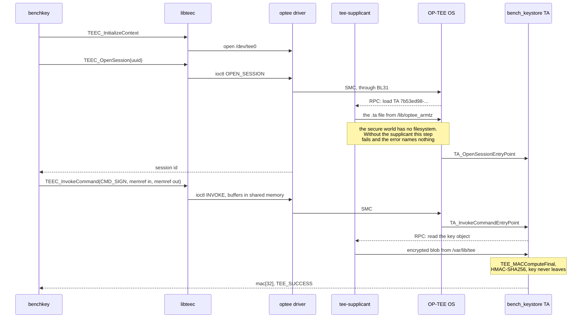
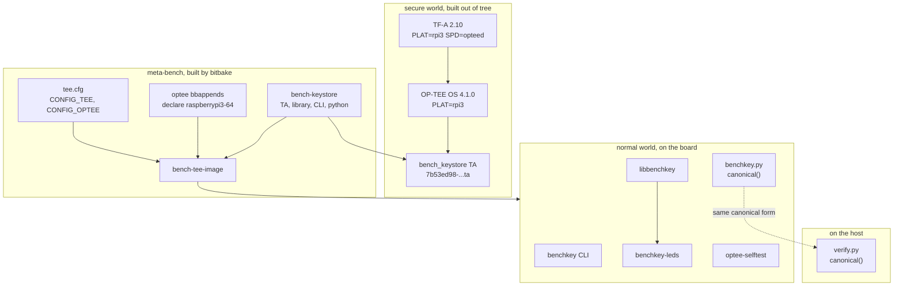

# Project 20: design

The drawings before the code. Six views, each answering a question the
others cannot.

| View | Question |
|---|---|
| [Architecture](#architecture) | What runs in which world, and what crosses between them |
| [Ownership](#ownership) | Which component owns which device, file and key |
| [Schematic](#schematic) | What is wired |
| [Bench layout](#bench-layout) | What is on the table, and what builds what |
| [Sequence](#one-signing-call-as-a-sequence) | What happens between a CLI call and 32 bytes |
| [Boot](#the-boot-chain) | How the secure world gets loaded at all |
| [Failure tree](#where-a-failure-lives) | Which of four layers is the one that broke |

Every drawing here is also a TikZ source in
[figures/](figures), which renders with `make` and needs no part of the
build. The text versions are the ones kept up to date; the TikZ ones are
for printing and for slides.

Read [THREAT-MODEL.md](THREAT-MODEL.md) next, and before quoting any of
this as security. Every claim here is about mechanism, not about
protection.

## Architecture

One core, two worlds, and a monitor at EL3 that switches between them. The
normal world never holds the key: it puts a message in shared memory and
executes an `SMC` instruction, and some time later a 32-byte answer is
there.

```
  NORMAL WORLD (Linux)              |  EL3  |   SECURE WORLD (TrustZone)
                                    |       |
  +-----------------------------+   |       |   +-------------------------+
  | benchkey CLI                |   |       |   | bench_keystore TA       |
  | stwin-gw (Project 17)       |   |       |   |   (S-EL0)               |
  |   record JSON               |   |       |   |   generate | sign       |
  +--------------+--------------+   |       |   |   export-once | status  |
                 | canonical()      |       |   +------------+------------+
                 v                  |       |                ^
  +-----------------------------+   |       |                | TEE Internal
  | libbenchkey                 |   |       |                | Core API
  |   one session, held open    |   |       |                v
  +--------------+--------------+   |       |   +-------------------------+
                 v                  |       |   | OP-TEE OS core (S-EL1)  |
  +-----------------------------+   |       |   |   dispatch by UUID      |
  | libteec                     |   |       |   |   crypto, secure store  |
  |   TEEC_InvokeCommand        |   |       |   +------------+------------+
  +--------------+--------------+   |       |                |
                 v ioctl            |       |                |
  +-----------------------------+   | BL31  |                |
  | kernel: tee core + optee    |   |monitor|                |
  |   /dev/tee0     clients     |===| SMC   |================+
  |   /dev/teepriv0 supplicant  |   |       |
  +--------------+--------------+   |       |
                 ^ RPC              |       |
                 |                  |       |
  +--------------+--------------+   |       |
  | tee-supplicant              |   |       |   the secure world has no
  |   serves what the secure    |<--+-------+-- driver for the SD card, so
  |   world cannot reach        |   |       |   it asks the normal world
  +--------------+--------------+   |       |
                 v                  |       |
  +-----------------------------+   |       |
  | /lib/optee_armtz/<uuid>.ta  |   |       |
  | /var/lib/tee/  (encrypted)  |   |       |
  +-----------------------------+   |       |
```

The inversion at the bottom is the part worth sitting with. **The secure
world is more privileged and less capable.** It has no block driver and no
filesystem, so when the TA opens a persistent object, OP-TEE issues a
remote procedure call *back into the normal world*, and `tee-supplicant`
reads a file for it. The normal world therefore holds the ciphertext of
the secure world's own storage and can delete it at will. It cannot read
it, because the objects are encrypted by OP-TEE before they leave, and on
this board the encryption key is the part the threat model is about.

## Ownership

Two managers on one resource is the bug this table exists to prevent.

| Resource | Owned by | Never touched by | Consequence of getting it wrong |
|---|---|---|---|
| `/dev/tee0` | client processes through `libteec` | `tee-supplicant` | none, they are different nodes on purpose |
| `/dev/teepriv0` | `tee-supplicant` alone | every client | a second supplicant steals RPCs and sessions hang |
| `/lib/optee_armtz/<uuid>.ta` | the image installs it, the supplicant reads it | OP-TEE OS, which has no filesystem | removing it makes `TEEC_OpenSession` fail with `ITEM_NOT_FOUND` and origin `TEE` |
| `/var/lib/tee/` | `tee-supplicant`, on behalf of the secure world | every other program | deleting it destroys the key with no recovery |
| the HMAC key | OP-TEE secure storage | everything in the normal world, always | the whole point |
| `armstub8.bin` | the Raspberry Pi GPU firmware at boot | Linux, which is already running by then | wrong or missing: no secure world, and `dmesg` has no optee line |
| GPIO17, 27, 22 | `benchkey-leds`, a separate process | `libbenchkey`, deliberately | a signature must never fail because an LED daemon is down |
| the device-tree `firmware/optee` node | the kernel, to find the TEE at all | anything at run time | no node, no driver probe, no `/dev/tee0`, and nothing says why |

The last row of the LED line is the one that looks like over-engineering
and is not. The spec puts the signing indicator on a Unix socket so that
the library's signing path can write one byte and not care whether anyone
is listening. A library that opened a GPIO line would make the key
unavailable whenever the LED wiring was wrong.

## Schematic

```
   Raspberry Pi 3 (40-pin header)
  +---------------------------------+
  |                                 |
  | pin 11  GPIO17  o---[ 330R ]---->|--+    green:  TEE present, xtest passed
  |                                 |     |
  | pin 13  GPIO27  o---[ 330R ]---->|--+    yellow: pulse per signature
  |                                 |     |
  | pin 15  GPIO22  o---[ 330R ]---->|--+    red:    the TA returned an error
  |                                 |     |
  | pin 9   GND     o---------------------+---- ground rail
  |                                 |
  | pin 8   GPIO14  o--- TXD ------------> USB/TTL white (RX)
  | pin 10  GPIO15  o--- RXD <------------ USB/TTL green (TX)
  | pin 6   GND     o-------------------- USB/TTL black
  |                                     ( red lead left open )
  +---------------------------------+
```

| Signal | Pin | GPIO | Meaning |
|---|---|---|---|
| Green LED via 330 ohm | 11 | GPIO17 | `/dev/tee0` exists and `xtest` passed at boot |
| Yellow LED via 330 ohm | 13 | GPIO27 | One signature was computed in the TEE |
| Red LED via 330 ohm | 15 | GPIO22 | The TA returned an error, latched |
| LED cathodes | 9 | GND | Common rail |
| Console TXD, RXD, GND | 8, 10, 6 | GPIO14, GPIO15 | Mini UART |

**The console carries three boot stages before Linux says anything**, and
that is the reason it is not optional here. TF-A prints `NOTICE: BL1:`,
OP-TEE prints `I/TC: OP-TEE version:`, U-Boot prints its own banner, and
only then does the kernel start. A board that fails in the secure world
produces no `dmesg`, no network and no LED, because none of those exist
yet. The serial console is the only instrument that sees that region at
all.

Both the secure world and Linux drive the same UART. On the Pi 3 that is
the mini UART, whose baud rate follows the core clock, which is why
`enable_uart=1` matters here more than elsewhere: the secure world prints
before anything has pinned the clock, so a wrong setting shows as garbage
from TF-A and OP-TEE and clean output from Linux.

## Bench layout

```
     breadboard                      Raspberry Pi 3
   +------------------+            +--------------------------+
   |  (G)  (Y)  (R)   |            |  [ 40-pin header ]       |
   |   |    |    |    |<===========|  GPIO17 / 27 / 22 + GND  |
   |  330  330  330   |            |                          |
   |   |____|____|____|            |  [BCM2837]        [USB]  |
   |     ground rail  |            |                          |
   +------------------+            |  [microSD]   [micro-USB] |
                                   +------------+-------------+
                                                |
                                   USB/TTL: TX, RX, GND
                                                |
                                                v
    +------------------------------------------------------------+
    |  Host (WSL2)                                               |
    |                                                            |
    |  OP-TEE build repo  --> armstub8.bin  (TF-A + OP-TEE OS)   |
    |  bitbake            --> kernel, dtb, rootfs, TA, benchkey  |
    |  picocom            --> the three boot banners             |
    |  verify.py          --> checks signatures off the broker   |
    +------------------------------------------------------------+
```

**One card, one board, one machine.** `raspberrypi3-64` is also the machine
Project 17 builds for, and the bench has one Pi 3. The two images cannot be
on the card at once, so a session with this project is a session without
the BLE gateway, and the telemetry-signing step of this project needs both.
That is a bench constraint rather than a design one, and the bring-up notes
sequence around it.

## The boot chain

This is the part that is unlike every other project in this repository,
because the kernel is no longer the first thing the board runs.

```
  GPU firmware (bootcode.bin, start.elf)
        |
        |  reads config.txt, sees armstub=armstub8.bin
        v
  armstub8.bin            <- built by Trusted Firmware-A, PLAT=rpi3
    BL1                      with SPD=opteed and BL32 = OP-TEE
    FIP: BL2, BL31, BL32 (OP-TEE OS), BL33 (U-Boot)
        |
        v
  BL31, the secure monitor, stays resident at EL3 for ever
        |
        +--> BL32: OP-TEE OS initialises at S-EL1
        |
        v
  BL33: U-Boot, in the normal world at EL1
        |
        v
  Linux
        |
        +--> finds /firmware/optee in the device tree
        +--> optee driver probes, registers /dev/tee0 and /dev/teepriv0
```

Three consequences that shape the whole project:

**U-Boot is in the chain and is not optional.** TF-A for the Pi 3 wants a
BL33, and the OP-TEE reference build uses U-Boot. A stock Raspberry Pi
image has the GPU load `kernel8.img` directly, so adding OP-TEE is not a
file added to a boot partition, it is a different boot flow.

**The GPU loads `armstub8.bin` by that name, with no line asking it to.**
In 64-bit mode the firmware looks for exactly that file. An `armstub=`
line in `config.txt` exists for naming a different file and is not part
of this; the whole of the OP-TEE reference `config.txt` is three lines:

```
enable_uart=1
kernel_address=0x02000000
device_tree_address=0x01000000
```

**Two addresses have to agree, and they are not the ones they look like.**
The two in `config.txt` tell the GPU where to place the kernel and the
device tree. U-Boot then loads them from those same addresses, which is
why `uboot.env` carries `kernel_addr_r=0x02000000` and
`fdt_addr_r=0x01000000`. Change one side and the board stops booting with
nothing on the console to say which.

`RPI3_PRELOADED_DTB_BASE`, which the OP-TEE build passes to TF-A as
`0x00010000`, is **not** one of them: TF-A's own documentation makes it an
auxiliary option for `RPI3_DIRECT_LINUX_BOOT=1`, and this build does not
set that, because BL33 is U-Boot rather than a kernel. It is inert here.
This paragraph originally said the opposite at some length; see journal
entry 6.

**Secure memory is a number in a makefile.** `plat-rpi3/conf.mk` sets
`CFG_TZDRAM_START = 0x10100000` and a 15 MB window. On an SoC with a
TrustZone address-space controller that window is enforced by hardware. On
the Pi 3 there is no such controller, so it is enforced by everyone
agreeing not to look. That sentence is the threat model in one line and
[THREAT-MODEL.md](THREAT-MODEL.md) is the long form.

## One signing call as a sequence



Two things in that diagram are the ones that fail in practice.

**The session is opened once and held.** Every `TEEC_OpenSession` costs a
TA load through the supplicant, which is a file read and a signature check.
`libbenchkey` keeps one context and one session for the life of the
process, so the per-signature cost is one SMC round trip rather than a
load.

**A missing supplicant fails at the first session, not at the first
signature**, and the error it gives names neither the supplicant nor the
file. The spec lists it first among the pitfalls, and it is the reason
`optee-selftest.service` waits for the TEE to be usable rather than
ordering itself against a unit name.

## Components, and what each is for



The dotted line is the contract this project is most likely to get wrong,
and it did: the signer and the verifier must serialise a record to exactly
the same bytes, and they are different programs on different machines
written at different times. One function, `canonical()`, in one file,
shipped to both. See the journal entry that found the first version
disagreeing with itself.

## Data flow, from a sensor reading to a verdict

```
  Project 17 gateway                          this project
  +--------------------+                      +--------------------------+
  | decode(mask, bytes)|---- record dict ---->| canonical(record)        |
  | acc, gyro, host_ts |                      |   sort keys, no spaces,  |
  +--------------------+                      |   drop "mac" if present  |
                                              +------------+-------------+
                                                           | bytes
                                                           v
                                              +--------------------------+
                                              | benchkey.sign()          |
                                              |   ctypes -> libbenchkey  |
                                              |   -> libteec -> SMC      |
                                              +------------+-------------+
                                                           | mac[32]
                                                           v
                                              +--------------------------+
                                              | record["mac"] = hex      |
                                              | publish to MQTT          |
                                              +------------+-------------+
                                                           |
                            broker (Project 18, TLS)       |
                                                           v
  +-------------------------------------------------------------------+
  | verify.py on the host                                             |
  |   mac = bytes.fromhex(record.pop("mac"))                          |
  |   expect = hmac(key, canonical(record), sha256)                   |
  |   compare_digest(expect, mac)  ->  OK or BAD                      |
  +-------------------------------------------------------------------+
```

`canonical()` drops the `mac` field before serialising, on both sides, and
that is not symmetry for its own sake: the signer does not have a `mac` yet
and the verifier does, so without the rule the two sign different objects
and every record is BAD.

## Where a failure lives

Four layers can each produce "the TEE does not work", and they look
identical from a shell prompt. The tree below is ordered by what each
question costs to ask, not by how likely each answer is: the first two
need only a serial console, which is also the only instrument that still
works when the answer is "no".

```
  console shows the TF-A banner, NOTICE: BL1: ... ?
  |
  +-- no --> the secure world never ran. armstub8.bin is missing from
  |          the boot partition, or is not called that: in 64-bit mode
  |          the firmware loads that exact name and no config.txt line
  |          asks it to. Nothing below this point can be true yet.
  |
  yes
  |
  v
  OP-TEE banner, I/TC: OP-TEE version: ... , follows?
  |
  +-- no --> TF-A ran without a BL32. Built without SPD=opteed or
  |          NEED_BL32, or the OP-TEE binary was not in the FIP.
  yes
  |
  v
  dmesg | grep optee  says anything at all?
  |
  +-- no --> Linux never looked. Either CONFIG_OPTEE is not in the
  |          kernel, or the device tree has no /firmware/optee node.
  |          Check the fragment first: ./go ksym -f tee is seconds.
  yes
  |
  v
  /dev/tee0 exists?
  |
  +-- no --> the driver probed and refused. Read the whole dmesg line;
  |          a version mismatch between the driver and OP-TEE OS says
  |          so in words.
  yes
  |
  v
  TEEC_OpenSession succeeds?
  |
  +-- no --> almost always the supplicant. It is packaged as a template
  |          unit, tee-supplicant@.service, and a template with no
  |          instance starts nothing. Then: is the .ta file in
  |          /lib/optee_armtz, and is it signed with a key this OP-TEE
  |          was built to trust?
  yes
  |
  v
  The TEE works. A failure past here is the TA or the parameter types,
  and the "origin" field in the return says which side produced it.
```

The `origin` value in the last line is worth knowing before it is needed:

| `TEEC_ORIGIN_*` | Means |
|---|---|
| `API` | libteec rejected the call before it left the process |
| `COMMS` | the driver or the transport, so the SMC path itself |
| `TEE` | OP-TEE OS, so loading, signature checking, dispatching |
| `TRUSTED_APP` | the TA ran and returned this, so it is your code |

A `TEEC_ERROR_ITEM_NOT_FOUND` with origin `TEE` is a missing or unsigned
`.ta` file. The same error with origin `TRUSTED_APP` would be the TA
saying it has no key. Same number, different half of the board.

---

Next: [THREAT-MODEL.md](THREAT-MODEL.md), which is the part to read before
calling any of this secure. Then the
[project README](../README.md) or the [bring-up notes](BRINGUP.md).
