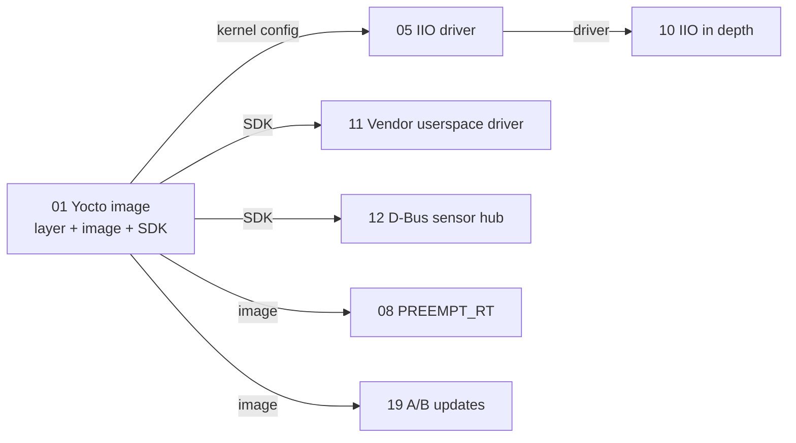

# 01. Context

## The one distinction that matters

On a laptop you install a distribution somebody else built, and you never
ask what is in it. On an embedded device you build the operating system
yourself and you are answerable for every byte in it.

That is the whole subject. Everything else is consequence.

It is a consequence because a product has to make promises a general
purpose distribution cannot:

- boot in a few seconds, not forty
- fit in the flash that is actually soldered to the board
- survive having its power cut in the middle of a write
- accept an update in the field without turning into a brick
- be rebuilt identically in three years, when a customer reports a fault in
  a version that shipped in 2026

You cannot make any of those promises about an image you downloaded.

## The layers of the subject

```
  +---------------------------------------------------------------+
  |  Update and security   OTA, rollback, signing, CVE tracking    |  <- projects 19, 20
  +---------------------------------------------------------------+
  |  Userspace and init    systemd units, services, D-Bus, HMI     |  <- projects 1, 12, 13
  +---------------------------------------------------------------+
  |  Build system          recipes, layers, SDK, reproducibility   |  <- project 1
  +---------------------------------------------------------------+
  |  Kernel and drivers    device tree, IIO, DRM, USB gadget       |  <- projects 5, 6, 7, 14
  +---------------------------------------------------------------+
  |  Boot                  firmware, U-Boot, kernel handover       |  <- projects 2, 3
  +---------------------------------------------------------------+
  |  Hardware              SoC, buses, peripherals, power          |
  +---------------------------------------------------------------+
```

A job interview for an embedded Linux role will wander across all six. The
twenty projects exist so that every band has an artefact behind it rather
than an opinion.

## What the twenty projects are for

The starting point is a drawer of unusually good hardware and one finished
piece of work, `daqring`: a kernel module with a ring buffer, a device tree
overlay, and a bootable image built with Buildroot.

One project demonstrates one band. Twenty projects, chosen so that each
uses hardware already on the bench, cover the surface. Each ends in
something showable: a boot log, a measurement, a driver, a video.

## The bench

| Category | What is on it |
|---|---|
| Application boards | Raspberry Pi 4, Pi 3B+, Pi 3, NanoPi NEO Air |
| Microcontrollers | NUCLEO-H7A3ZI-Q, STEVAL-STWINBX1 |
| Sensor shields | X-NUCLEO-IKS4A1, IKS5A1, X-NUCLEO-53L8A1, ADXL345 breakout |
| Instruments | MCC 118 DAQ HAT, nRF-PPK2 power profiler |
| Radios | SIM7600E-H, SIM7070G, SIM7020E, ESP32, ESP8266 |
| Displays and I/O | 3.5 inch SPI LCD, 7 inch DSI touchscreen, Explorer 700 |
| Bring-up tools | Renkforce USB/TTL console cable, breadboard, LED modules |

Two items deserve more respect than their price suggests.

**The USB/TTL cable** is used in projects 1, 2, 3, 4, 9 and every board
bring-up. It is the only tool that shows you what happens before the network
exists, which is where the interesting failures live.

**The PPK2** turns power from an adjective into a number. "Low power" is a
claim; 4.2 mA average with a 180 mA peak during transmit is evidence.

## Why Project 1 is first

Almost every later project needs three things that do not exist yet:

1. a kernel whose configuration you can change
2. a root filesystem you can add to and strip down
3. a cross compiler whose libraries exactly match what is on the board

Project 1 builds all three, once, from source. The other nineteen inherit
them.



Its hardware is deliberately trivial, three LEDs on a breadboard, so that
every difficulty is a build system difficulty and never a soldering one.
That is a design decision about the project, not an accident of scope: if
the hardware were interesting, a hardware fault would be indistinguishable
from a recipe fault, and you would learn neither.

## Where this sits in a lifecycle

Project 1 produces what a real programme would call the **development
image** and the **SDK**: the things a team builds once at the start so that
everyone else can work. [09. Lifecycle](09-lifecycle.md) walks the rest of
the path, from the first bring-up image to a version still being patched
five years after it shipped.

---

Next: [02. Build systems](02-build-systems.md)
