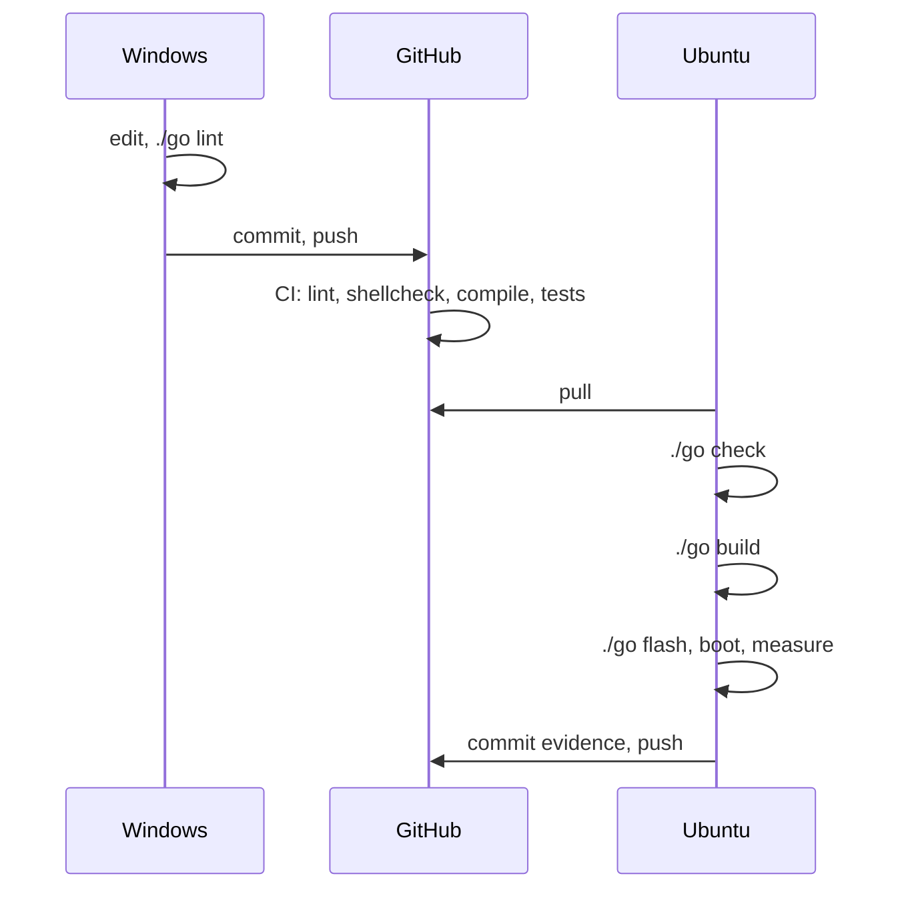

# 03. Workflow

## Three places, one repository

```
Windows laptop                  GitHub                   Ubuntu laptop (WSL2)
MasterCatalog/                  ambrosiobing/            ~/src/embedded-linux-bench
  EmbeddedLinux_Top20/            embedded-linux-bench      the same files
    sections/*.tex   the book                                     |
    embedded-linux-bench/  push --> the shared copy --> pull      | ./go build
       where it is written                                        v
                                                          ~/bench/    about 60 GB
                                                            build/    the image
                                                            downloads/    10 GB
                                                            sstate-cache/
```

**Windows** is where the repository is written, because the book and the
catalogue live there.

**Ubuntu under WSL2** is where anything real happens. It has the compiler,
the case sensitive filesystem and the disk.

**GitHub** is the only channel between them.

## Why a Yocto build cannot run on the Windows side

NTFS is case insensitive: to it, `Makefile` and `makefile` are the same
file. BitBake unpacks source trees that contain files differing only in
case, and on NTFS they silently collapse into one. Nothing errors. The build
produces something subtly wrong, hours later.

The same applies to `/mnt/c` under WSL2, which is NTFS through a translation
layer, and which is additionally slow enough to turn a three hour build into
an overnight one.

So `scripts/common.sh` refuses rather than warns:

```sh
require_case_sensitive() {
        case $dir in
        /mnt/*) die "$dir is a Windows mount. Use a path under HOME instead." ;;
        esac
        : >"$dir/.bench-case-probe"
        if [ -e "$dir/.bench-case-PROBE" ]; then
                die "$dir is case-insensitive; build inside the Linux file system."
        fi
}
```

It creates a probe file and checks whether the uppercase name also exists.
Two lines, and it converts a confusing three hour failure into an immediate
one with a readable message.

**The general principle:** when an environment can be wrong in a way that
fails late and unrecognisably, test for it early and refuse. That pattern
appears throughout this repository: the disk space check, the executable bit
check, the kernel fragment check.

## The three traps that a two machine workflow creates

All three were met during Project 1. None was a bug in the project.

| Symptom | Cause | Fix |
|---|---|---|
| `./go: Permission denied` after a fresh clone | Git on Windows defaults to `core.filemode=false`, so `chmod` never reaches the commit and scripts arrive as mode 644 | `git update-index --chmod=+x`, and a lint rule that checks index modes |
| shellcheck flagging lines already fixed | The Ubuntu copy was one commit behind | `git log --oneline -1` on both sides settles it in seconds |
| `bad interpreter` (avoided) | Windows writes CRLF, which makes a shell script unrunnable on Linux | `.gitattributes` with `* text=auto eol=lf`, checked before the first push |

The executable bit one is worth dwelling on, because the lesson generalises.
The symptom appeared on Linux, on a different machine, days after the cause
on Windows. Nothing in between could have caught it, so the check had to go
where the cause was: a lint rule that reads the git index and asserts that
any file with a shebang is recorded `100755`, and any file without one is
not.

```sh
$ ./go lint
go: has a shebang but is committed as 100644, not 100755
```

## What is not in the repository

`~/bench` holds about 60 GB and is not version controlled:

| Directory | Contents | Cost to lose |
|---|---|---|
| `build/tmp` | Work directories, packages, the image | Minutes, restored from sstate |
| `downloads` | Every source tarball, about 10 GB | An hour of downloading |
| `sstate-cache` | Hashed build artefacts | The full three hours |
| `poky`, `meta-*` | Cloned layers | Minutes |

The caches sit beside the build tree rather than inside it, so `./go clean`
deletes the build and keeps the expensive parts. This is set in one place,
in the kas file:

```
DL_DIR ?= "${TOPDIR}/../downloads"
SSTATE_DIR ?= "${TOPDIR}/../sstate-cache"
```

In a team, `SSTATE_MIRRORS` points at a shared cache on a server, and a
developer's first build takes fifteen minutes instead of three hours because
somebody else already built it. That is the same mechanism scaled up, and it
is what the opt-in CI build job expects from a self-hosted runner.

## The rhythm



Write on Windows, push. Pull on Ubuntu, run, read the output. When output
looks stale, it usually is.

---

Previous: [02. Build systems](02-build-systems.md) | Next: [04. BitBake](04-bitbake.md)
