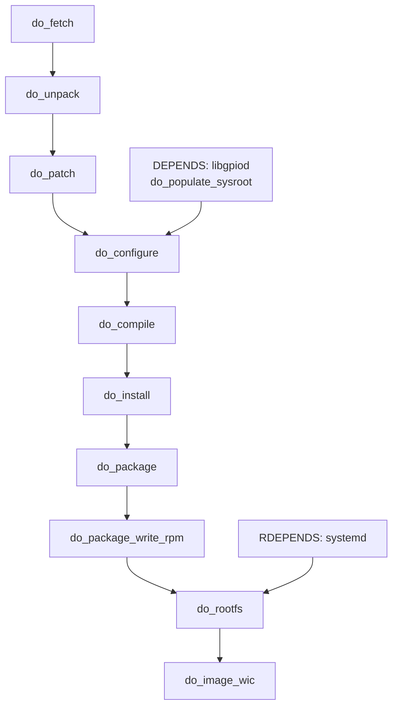

# 04. BitBake

The surprise is how little of a three hour build is spent on your operating
system. Most of it builds the tools that build it.

## Three worlds

BitBake keeps three separate universes of software, and confusing them is
the most common source of early bewilderment.

```
  +--------------------+   runs on host, for host
  |  native            |   pkg-config-native, python3-native, bison-native
  +--------------------+   built from source so the build does not depend
           |               on whatever your distribution happens to ship
           v
  +--------------------+   runs on host, emits aarch64
  |  cross              |  gcc-cross-aarch64, binutils-cross, libgcc
  +--------------------+
           |
           v
  +--------------------+   runs on the Pi
  |  target            |   systemd, openssh, libgpiod, bench-status
  +--------------------+
```

Before one line of your image is compiled, BitBake builds a compiler, uses
it to build a C library, then rebuilds the compiler against that library.
That bootstrap is a large share of the first run, and it is why the build
does not care which distribution the host runs.

**Why not use the host's gcc?** Because then the output would depend on
Ubuntu's gcc version, and the same commit would produce different binaries
on a colleague's Fedora machine. Building the toolchain is what makes the
result a property of the recipes rather than of the developer.

## Everything is a task graph

Each recipe declares tasks in a fixed order:

```
do_fetch -> do_unpack -> do_patch -> do_configure -> do_compile
         -> do_install -> do_package -> do_package_write_rpm -> do_build
```

BitBake parses every recipe, computes dependencies between tasks across all
of them, and runs the graph in parallel. For `core-image-minimal` that is a
few thousand tasks.



The two dependency kinds matter and are often confused:

| | Means | Affects | Example |
|---|---|---|---|
| `DEPENDS` | Build time | `do_configure` can start once the dependency's headers and libraries are staged | `DEPENDS = "libgpiod"` |
| `RDEPENDS` | Run time | The package must be installed alongside on the target | `RDEPENDS:${PN} += "systemd"` |

A recipe that compiles but whose package is missing a runtime dependency
builds cleanly and fails on the board. That is why both lists exist.

## Shared state, and why the second build takes minutes

Before running a task, BitBake hashes everything that could affect its
output: the recipe text, the value of every variable the task reads, the
checksums of its sources, and the hashes of the tasks it depends on. If an
artefact with that hash already exists in `sstate-cache`, the result is
unpacked instead of rebuilt.

```
  task signature = f(recipe text, variable values, source checksums,
                     signatures of all dependencies)

  hit  -> unpack from sstate-cache        seconds
  miss -> run the task, store the result  minutes to hours
```

Consequences worth internalising:

- Delete `build/` and a rebuild restores from sstate in minutes. Delete
  `sstate-cache` and you are back to three hours.
- A change to a widely read variable invalidates thousands of signatures.
  Editing `DISTRO_FEATURES` is expensive; editing one recipe is not.
- A shared sstate mirror is the single biggest lever on a team's build
  times.
- `bitbake -S printdiff <target>` explains why a task you expected to be
  cached was not. It is the first thing to reach for when a build that
  should have been quick is not.

## What you see on screen

```
Parsing recipes: 100% |#####################| Time: 0:00:47
Loaded 3891 entries from dependency cache.
NOTE: Executing Tasks
Currently  8 running tasks (1847 of 4213)  43%
  0: gcc-cross-aarch64-13.2.0-r0 do_compile (pid 12345)
  1: linux-raspberrypi-6.6.22 do_compile (pid 12346)
```

The total moves as the graph is refined. Rough order: native tools, cross
toolchain, kernel, target packages, rootfs, image. The kernel alone is
typically ten to twenty minutes.

## When it fails

```
ERROR: bench-status-0.1-r0 do_compile: Execution of ... failed
ERROR: Logfile of failure stored in:
  ~/bench/build/tmp/work/cortexa72-poky-linux/bench-status/0.1/temp/log.do_compile.12345
```

That file is the actual compiler output. The rest of the screen is noise.

Three commands, all inside `./go shell` so the environment is right:

| Command | Use |
|---|---|
| `bitbake -c compile -f bench-status` | Rerun one task, forced |
| `bitbake -c devshell bench-status` | A shell inside the recipe's build environment, with the cross compiler on PATH |
| `bitbake -e bench-status \| less` | Every variable's final value and which file set it |

`bitbake -e` settles most "why is this path wrong" questions in seconds, and
it is the tool that makes Yocto debuggable rather than mysterious.

## The image at the end

1. Every package is built and packaged individually, as a distribution would.
2. `do_rootfs` installs the chosen packages into a tree, resolving
   dependencies and running postinstall steps.
3. `do_image_wic` writes that tree into a partitioned disk image: a FAT boot
   partition with firmware, kernel and device tree, plus an ext4 root.

```
~/bench/build/tmp/deploy/images/raspberrypi4-64/
  bench-image-raspberrypi4-64.rootfs.wic.bz2     the image
  bench-image-raspberrypi4-64.rootfs.wic.bmap    which blocks are non-empty
  bench-image-raspberrypi4-64.rootfs.manifest    every package and version
```

The manifest is the file that answers "what is actually in this image", and
it is what `./go packages` prints.

---

Previous: [03. Workflow](03-workflow.md) | Next: [05. kas and layers](05-kas-and-layers.md)
