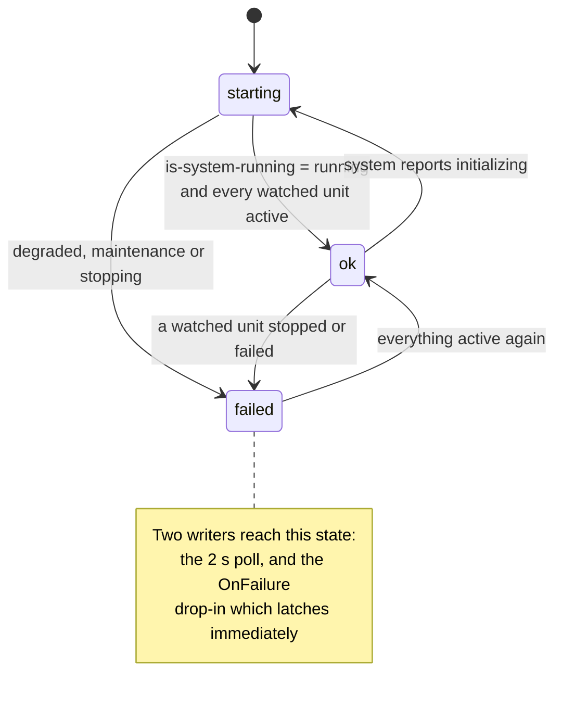
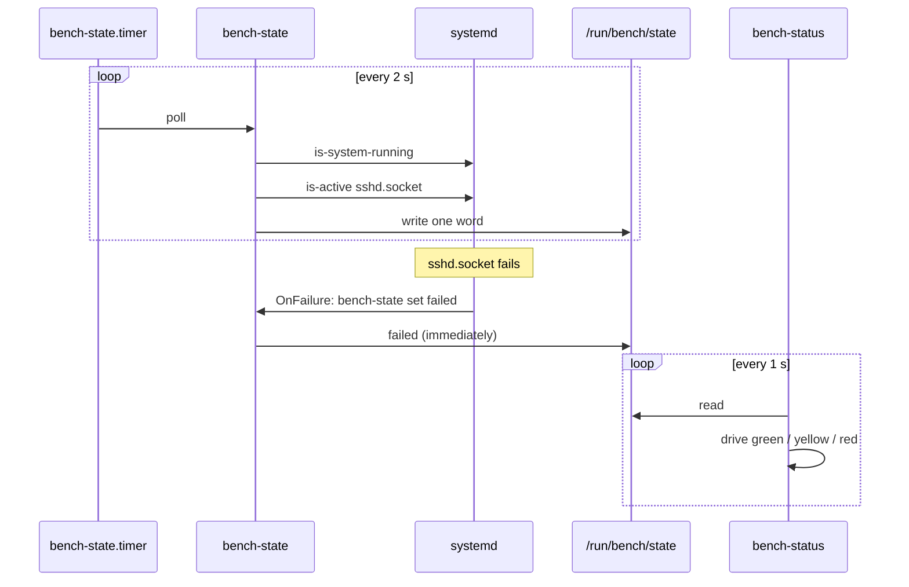

# 06. Mechanism and policy

The requirement is small: green when the system is healthy, yellow while it
is coming up, red when something has failed. How it is built is the part
worth arguing about.

## The obvious design, and why it is wrong

One C program that asks systemd for status and drives the LEDs would work.
It would also be bad:

- Changing which services count as healthy means recompiling and reflashing.
- Testing it needs a board.
- Most of it would be a worse reimplementation of things systemd does
  already: unit state, ordering, restart policy, failure notification.

## The split

```
  systemd  <--asks--  bench-state (shell)  --writes-->  /run/bench/state
                             ^                                 |
                             |                           one word: ok
                       policy lives here                        |
                                                                v
                                                   bench-status (C)
                                                   mechanism lives here
                                                                |
                                                                v
                                                    GPIO 17 / 27 / 22
```

`bench-status` is C and does one thing: read a word, drive three lines. It
has no idea what a service is.

`bench-state` is shell and decides which word. It asks
`systemctl is-system-running`, then checks each unit in
`/etc/bench/watch.conf`. Changing what counts as healthy is editing a text
file on the board.

**The general rule:** put the part that changes often in the place that is
cheap to change, and the part that changes rarely in the place that is fast
and precise. Policy in configuration and shell, mechanism in C.

## What is proven, and what is deferred

Everything below describes a working system, with one link unverified. The
daemon runs on the board, holds lines 17, 22 and 27, and reports state
correctly. What has never been observed is an LED lighting, because the
bench modules are LinkerKit parts with a 2.0 mm socket that standard 2.54 mm
jumper wires cannot mate with.

So the mechanism is verified up to the kernel call and no further. That is
recorded as a deferral with a written reason rather than quietly omitted,
and it changes nothing about the design below, which is the part worth
reading.

## The state machine



## Two writers, one file, and no contradiction



The drop-in latches `failed` at once rather than waiting up to two seconds.
The writers cannot contradict each other, because the next poll reaches the
same verdict independently: the unit that triggered the drop-in is no longer
active.

**Why `sshd.socket` and not `sshd.service`.** openssh in poky is socket
activated. The socket is what should stay up; the service only runs while
someone is logged in. Watching the service would show red whenever nobody
was connected.

## The GPIO side

Linux has had two GPIO interfaces.

| | `/sys/class/gpio` | `/dev/gpiochipN` |
|---|---|---|
| Status | Deprecated, then removed | Current |
| Ownership | None. Two programs could fight over a pin | A line is held by one requester |
| Cleanup on crash | None. Pins stayed exported | Kernel releases on process exit |
| Interface | Text files | ioctl, via libgpiod |

The character device is the only correct choice now, and `libgpiod` v2 is
its userspace library. v2 is a different API from v1, not a revision of it.

Two decisions in the C worth calling out, both of which came from getting
the hardware wrong first.

### The chip is found by label, not by index

`/dev/gpiochip0` is the 40-pin header on a Pi 4, but not on a Pi 5, and the
numbering shifts if an expander probes first. Hard coding the index is the
kind of assumption that works on your desk and fails on someone else's.

```c
matched = !strcmp(gpiod_chip_info_get_label(info), cfg->chip_label);
```

The code walks `/dev/gpiochip*`, matches `pinctrl-bcm2711`, and falls back
to the first chip wide enough to hold the lines.

### Polarity is configuration, not a constant

The LED modules on the bench have four pins: `S1` signal, `S2` unused, `U`
supply, `G` ground. Because they have a supply pin, the LED may sit between
`U` and `S1`, in which case it lights when the line is pulled **low**.
Nothing on the silkscreen says which.

libgpiod has exactly the right abstraction:

```c
gpiod_line_settings_set_active_low(settings, cfg->active_low);
```

The kernel does the inversion. The program asks for `ACTIVE` and never
reasons about volts. `/etc/bench/leds.conf` holds the answer, so rewiring
the breadboard does not mean rebuilding the image.

**This generalises.** Whenever a library offers a concept that matches the
physical fact, use it rather than encoding the fact in your own arithmetic.
The same applies to IIO scale and offset, to input event codes, and to
regulator polarity in a device tree.

### Releasing the request turns the LEDs off

On a clean stop, the lines revert to inputs and go dark, rather than
freezing on the last colour and lying about the state of a system that is no
longer being monitored.

## Why it is testable without a board

The interesting logic is in `bench-state`, and it talks to the world through
exactly one command. So the test puts a fake `systemctl` first on `PATH`
whose answers come from two environment variables:

```sh
cat >"$WORK/bin/systemctl" <<'FAKE'
#!/bin/sh
case "$1" in
is-system-running) echo "${FAKE_SYSTEM:-running}" ;;
is-active) for unit in ${FAKE_ACTIVE:-}; do [ "$unit" = "$3" ] && exit 0; done; exit 3 ;;
esac
FAKE
```

Seven cases, under a second, on any machine:

```
ok       system still coming up is yellow
ok       a degraded system is red
ok       everything active is green
ok       a watched unit stopped is red
ok       an explicit latch is red
ok       an unknown state is refused
ok       show without a state file says starting
```

That is the practical payoff of the split: the part most likely to be wrong
is the part that is cheapest to test, and it needs no hardware, no image and
no build.

**The generalisation for later projects:** find the seam where your code
talks to the system, make it narrow, and put a fake on the other side of it.
Project 5's driver has such a seam at the regmap layer. Project 12's D-Bus
service has one at the bus. Project 15's modem manager has one at the AT
command stream.

---

## The same split, one level up: who is allowed to ask

The status daemon splits mechanism from policy inside one machine. Project
12 splits it across a privilege boundary, and the shape is the same
argument with higher stakes.

`sensorhubd` owns a serial port and a bus name. Two questions follow:

| Question | Answered by | Knows about |
|---|---|---|
| May this connection talk to this name at all | the bus policy, `org.bench.SensorHub1.conf` | connections and names |
| May this user run this particular action | polkit, `org.bench.sensorhub.calibrate` | users, groups, sessions, actions |

Neither is answered in C, and the reason is the same one as before: an
`if (uid == 0)` in a daemon is policy compiled into mechanism. It cannot
express "the bench group", it cannot be changed without a rebuild, and it
lives in the file least likely to be reviewed.

The two are not interchangeable, which is the part worth internalising.
The bus has no notion of an action, so "only the bench group may
calibrate" cannot be written as a bus policy. polkit has no notion of name
ownership, so "only this user may own this name" cannot be written as a
polkit rule. Choosing the wrong one produces something that looks like it
works until the day somebody tests the case it cannot express.

```
   caller --> [ bus policy ]  --> [ vtable flags ] --> [ polkit ] --> handler
              may you talk?      may you call        may you do
                                 without CAP_SYS_ADMIN?   this?
```

The middle box is the one that surprises people. Without
`SD_BUS_VTABLE_UNPRIVILEGED`, sd-bus itself requires `CAP_SYS_ADMIN` from
the caller before the handler runs, so polkit is never consulted and no
rule can fix it. Three layers, and the failure of any one of them presents
as a permission error pointing at the wrong layer.

**The generalisation:** when a decision is about identity rather than
about mechanism, it belongs in something built to know about identity. On
Linux that is the bus policy and polkit for D-Bus, the file mode and group
for a device, and capabilities for a process. It is almost never an if
statement.

---

Previous: [05. kas and layers](05-kas-and-layers.md) | Next: [07. Verification](07-verification.md)
