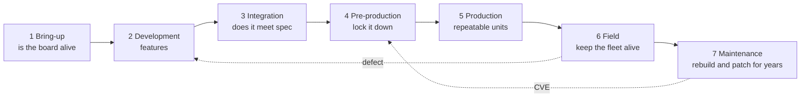
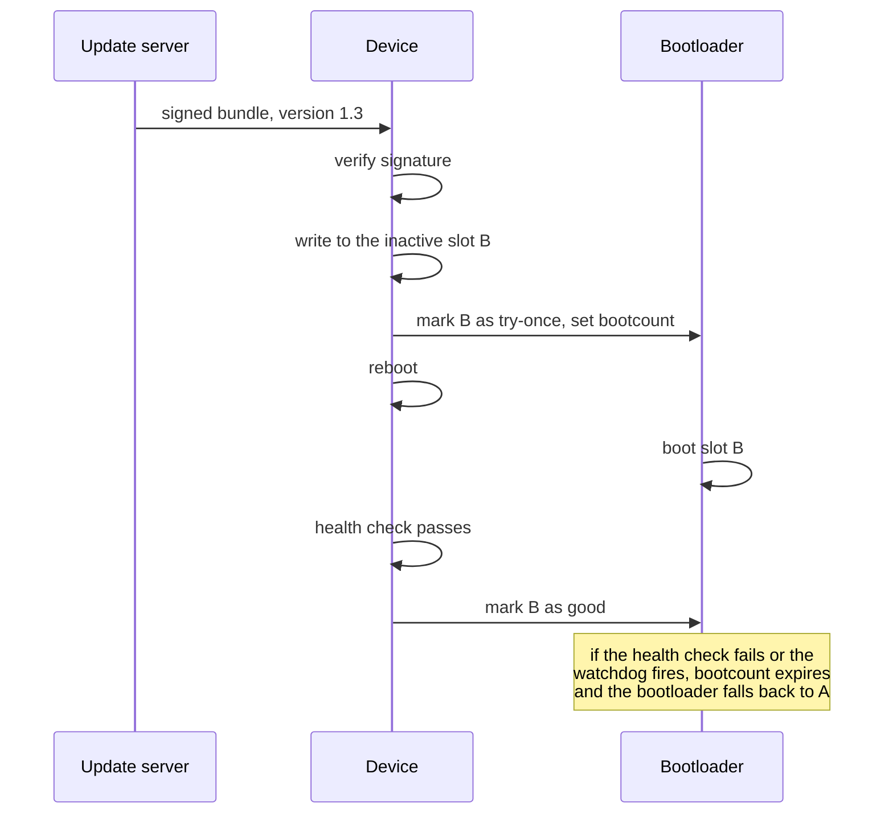

# 09. Lifecycle

Project 1 builds a **development image**. That is one stage of seven, and
the choices that are right here are wrong later. This document walks the
whole path, says what changes at each stage, and points at the project that
covers it.



The dashed arrows are the ones that hurt if the early stages were sloppy. A
defect found in the field has to be reproduced in development, and a
vulnerability found in year four has to be rebuilt, retested and reshipped
from a tree nobody has touched since.

## The stages

| Stage | Question | Image | Evidence it produces |
|---|---|---|---|
| 1 Bring-up | Is this hardware alive | Vendor image, or the simplest thing that boots | Console log, `i2cdetect`, `gpioinfo` |
| 2 Development | Does the feature work | Your own layer, debug tweaks on, SDK | Recipes, unit tests, CI |
| 3 Integration | Does it meet spec | Dev image plus instrumentation | Boot time, latency, power, HIL results |
| 4 Pre-production | Can we defend shipping it | Hardened, locked, signed | Licence manifest, SBOM, reproducibility diff |
| 5 Production | Are the units identical | Manufacturing image plus provisioning | Factory test records, serial and key registry |
| 6 Field | Is the fleet healthy | Signed update bundles | Update success rate, rollback counts, telemetry |
| 7 Maintenance | Can we rebuild version 1.2 today | The tagged tree, rebuilt | Rebuilt artefact matching the original manifest |

## 1. Bring-up

The only question is whether the hardware works. Use the vendor image, or
whatever boots soonest. Do not build a layer yet.

What you need: a serial console, a multimeter, and the confidence that
power, clocks and the boot medium are right. `i2cdetect` finding a device is
worth more than any amount of software at this stage.

The trap is starting the build system too early, then debugging a hardware
fault through three hours of BitBake.

**Projects:** 2, where a NanoPi NEO Air is brought up on mainline U-Boot and
kernel, which is bring-up in its purest form.

## 2. Development

Now the layer exists. This is where Project 1 sits.

The image is deliberately permissive:

- `debug-tweaks`, so root has no password and serial login just works
- an SSH server, so binaries can be copied over
- `tools-debug` in the `bench-image-dev` variant: gdbserver, strace, perf
- writable root filesystem
- the SDK, so the edit cycle is seconds rather than hours

Every one of those is a liability in a shipped product and an asset here.
The mistake is not having them. The mistake is forgetting they are there
when the product ships, which is why `bench-image.bb` carries this comment
next to the line:

```
# debug-tweaks leaves the root account without a password. That is right for
# a bench board on an isolated network and wrong for anything else; drop this
# line and add an EXTRA_USERS_PARAMS entry before the board leaves the bench.
```

A comment at the point of decision survives; a note in a wiki does not.

**Projects:** 1, 5, 6, 7, 10, 11, 12, 13, 14, 15.

## 3. Integration and test

The question becomes whether it meets the specification, which means
numbers rather than opinions.

| Property | How it is measured | Project |
|---|---|---|
| Boot time | `systemd-analyze`, kernel timestamps, a scope on a GPIO | 3 |
| Energy per boot | PPK2 integrating current over the boot | 3 |
| Interrupt latency | `cyclictest` under load, and an independent instrument on the wire, because a kernel measuring itself is one witness | 8 |
| Functional correctness | Automated tests over a serial console, on real boards | 4 |
| Driver behaviour | ptest, IIO buffer integrity, event counts | 5, 10 |
| Failover and recovery | Missed replies during a forced outage, counted from a client | 15 |

This is where the testing ladder from
[07. Verification](07-verification.md) grows its top rung. Project 4 builds
a hardware in the loop lab: one Pi network-boots another, runs the suite,
and reports. Until that exists, the board is tested by hand, which does not
scale and does not catch regressions.

**The lifecycle point:** a measurement is only useful if it can be repeated
on demand. A boot time you measured once is an anecdote. A boot time your CI
measures on every commit is a specification.

**And the measurement needs its own uncertainty stated before the numbers
exist.** Project 8 writes down what its instruments can resolve, and why,
before any row is recorded, because an uncertainty published alongside an
inconvenient result reads as an excuse and the same sentence published
beforehand is a specification. That project also found one of its two
instruments to be an order of magnitude coarser than the received recipe
claims, which is exactly the kind of thing that stays invisible until
somebody writes the limits down.

## 4. Pre-production

The image stops being convenient and starts being defensible. Concretely,
for this repository:

| Change | From | To |
|---|---|---|
| `debug-tweaks` | Present | Removed, with `EXTRA_USERS_PARAMS` setting real accounts |
| Root login on serial | Allowed | Disabled, or the console disabled entirely |
| SSH | Password, root allowed | Keys only, or removed |
| Root filesystem | Writable | Read-only, with overlayfs or tmpfs for state |
| Debug tools | `tools-debug` | Absent from the production image |
| Layer pins | Branch names | Commit hashes from `kas dump --lock` |
| Kernel | Downstream BSP defaults | Reviewed config, unused drivers removed |
| Boot | Unverified | Signed, if the SoC supports it |
| Update | None | A/B with rollback, bundle signing |

Deliverables that are not the image. All four are produced by
`./go release`, which is `kas/bench-release.yml`: the everyday build does not
carry them, because each costs time and none belongs in a 90-second cycle.


- **Licence manifest.** Yocto produces `license.manifest` listing every
  package and its licence. For anything containing GPL code you also need
  the corresponding source, which `ARCHIVER_MODE` can produce. This is a
  legal obligation, not a nicety, and it is far easier to generate at build
  time than to reconstruct afterwards.
- **SBOM.** Yocto can emit SPDX. Increasingly a customer or regulatory
  requirement, and the input to CVE tracking later.
- **The reproducibility check.** `./go reproduce` builds the tagged commit a
  second time and diffs the package lists. See
  the project README's verification section for the precise
  claim being made.
- **The locked kas file**, tagged alongside the release.

**Projects:** 19 for read-only rootfs and A/B updates, 20 for secure key
storage with OP-TEE.

## 5. Production

The questions are about repeatability and identity.

**A manufacturing image is not the production image.** It usually boots into
a test fixture that exercises every peripheral, records the results against
a serial number, provisions per-device secrets, and only then writes the
real image. Devices leaving the line have to be distinguishable and
individually keyed, which means something in the process generates and
records a key per device.

What the build system must give you here:

- a bit-for-bit identical image from a tagged commit, on a machine that is
  not a developer's laptop
- an artefact that can be archived and re-flashed years later
- a record connecting a serial number to an image version and a key

The temptation is to flash whatever a developer built that morning. The
whole pre-production stage exists to make that unnecessary.

## 6. Field, or post-production



The properties that matter:

| Property | Mechanism |
|---|---|
| An interrupted update never bricks | Two slots, atomic switch |
| A bad update recovers itself | Bootcount plus watchdog, rollback in the bootloader |
| Only your updates install | Bundle signature verified before writing |
| State survives updates | A separate data partition, never overwritten |
| You can tell what is deployed | Version reporting, and a fleet inventory |

**Projects:** 19 covers exactly this with RAUC, U-Boot bootcount, a hardware
watchdog and a read-only rootfs.

The other field concern is vulnerabilities. Yocto has `cve-check`, which
compares the packages in your image against the published database. It is
noisy and it is still the difference between knowing and not knowing. This
is where the SBOM from stage 4 earns its place.

## 7. Maintenance, and end of life

A customer reports a fault in version 1.2, which shipped three years ago.
You have to rebuild it, reproduce the fault, fix it, and ship 1.2.1 without
dragging in three years of unrelated change.

Everything needed for that was decided in stages 4 and 5:

```
git checkout v1.2
kas build kas/bench-rpi4.lock.yml     every layer at the exact commit
diff buildhistory against the archived manifest
```

This is the scenario that justifies work which otherwise looks like
ceremony:

| Practice from earlier | What it buys you here |
|---|---|
| Commit hashes, not branches | The same tree, three years later |
| `DL_DIR` archived | Sources still exist after an upstream disappears |
| buildhistory committed | A diff showing exactly what changed between versions |
| Licence manifest archived | The compliance answer without an archaeology project |
| Reproducibility checked once | Confidence that the rebuild is the same product |

An LTS release was chosen for the same reason: four years of upstream
security fixes on a branch that does not move under you.

**The end of life decision** is a business one with a technical deadline:
when the Yocto LTS goes out of support, you either migrate the product to a
newer release or stop claiming it is patched. Knowing that date in advance
is part of choosing the release.

## The one picture

```
  stage        image                              you can afford to
  --------------------------------------------------------------------------
  bring-up     vendor, whatever boots             break anything
  development  yours, debug-tweaks, SDK           break anything
  integration  yours, plus instrumentation        break things loudly
  pre-prod     hardened, locked, signed           break nothing quietly
  production   archived artefact, provisioned     break nothing
  field        signed bundles, A/B, rollback      break one device, once
  maintenance  the tagged tree, rebuilt           break nothing, years later
```

Each stage constrains the one before it. The reason Project 1 pins layers,
records buildhistory and refuses to overstate reproducibility is not that
any of it matters on a bench. It is that stage 7 is impossible unless stage
2 was disciplined, and by stage 7 it is far too late to start.

---

Previous: [08. Board bring-up](08-board-bringup.md) | Next: [10. Generalising](10-generalising.md)
