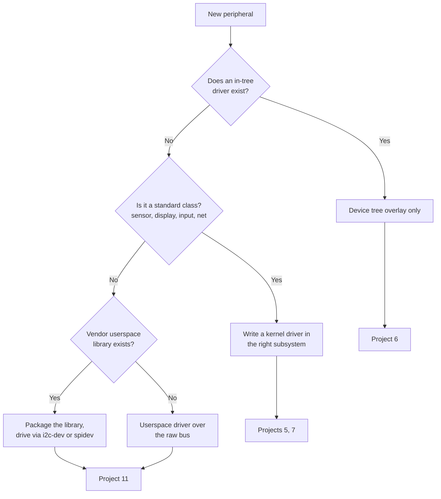

# 10. Generalising

Project 1 is one board, one peripheral and one build system. This document
is about what transfers.

## Changing the board

```
                      changes                      does not change
  +--------------------------------+  +----------------------------------+
  |  MACHINE                       |  |  your recipes                    |
  |  the BSP layer (meta-*)        |  |  your application source         |
  |  bootloader and its config     |  |  systemd units                   |
  |  device tree and overlays      |  |  the image recipe, mostly        |
  |  kernel config fragments       |  |  how the SDK is used             |
  |  pin numbers and chip labels   |  |  the testing ladder              |
  +--------------------------------+  +----------------------------------+
```

The whole point of the layer arrangement is that the right column survives.
`kas/bench-rpi3.yml` demonstrates it in three lines:

```yaml
header:
  version: 14
  includes:
    - bench-rpi4.yml
machine: raspberrypi3-64
```

Same layer, same recipes, same application, different silicon.

### What a BSP actually provides

| Piece | Raspberry Pi | NanoPi NEO Air (Allwinner H3) |
|---|---|---|
| First stage boot | Closed firmware on the GPU, reads `config.txt` | BROM, then U-Boot SPL |
| Bootloader | Usually none, firmware loads the kernel | U-Boot, mainline |
| Kernel | Raspberry Pi downstream fork | Mainline, sunxi support |
| Device tree | Shipped by the firmware, plus overlays | Built with the kernel |
| BSP layer | `meta-raspberrypi` | `meta-sunxi`, or your own |

Project 2 exists precisely because of that second column. The Raspberry Pi
hides the bootloader, which makes it a poor teacher for the most common real
situation: a board where you configure U-Boot, understand the device tree,
and boot from eMMC. Doing both is what lets you say which parts of your
Raspberry Pi knowledge were about Linux and which were about Broadcom.

**The practical warning**, recorded in the project README: the
`meta-raspberrypi` kernel is a downstream fork, not mainline. A driver that
exists in mainline may be absent or different there, and a mainline
discussion may not apply.

### Porting to a board with no layer

The path is always the same:

1. Find a vendor or community BSP layer. Judge it by whether it is
   maintained against current Yocto releases.
2. Failing that, find the closest supported SoC and write a machine
   configuration: `MACHINE`, the kernel recipe, the bootloader recipe, the
   device tree and the `WKS` file describing the partitions.
3. Get a serial console before anything else.
4. Boot a minimal image with an initramfs and a shell. Prove the kernel
   runs before worrying about the rootfs.

## Changing the peripheral

This is the decision most later projects turn on.



| Route | When | Cost | Project |
|---|---|---|---|
| Device tree overlay | An in-tree driver already exists | Hours | 6, every peripheral on the Explorer 700 |
| Kernel driver in a subsystem | Standard class, no driver yet | Days to weeks | 5 (IIO, ADXL345), 7 (DRM panel) |
| Vendor userspace library | Complex device, vendor ships code | Days, plus packaging | 11 (VL53L8CX) |
| Raw userspace over i2c-dev or spidev | Prototype, or a device nobody else has | Hours | 11, 12 |

**Prefer the leftmost route that works.** A device tree overlay is twenty
lines and no maintenance. A kernel driver is the right answer when the
device is a standard class, because then every existing userspace tool works
with it for free: an IIO driver gets `iio_readdev`, buffering, triggers and
libiio without you writing any of it.

A userspace driver is the right answer when the device is unusual, the
vendor library is the only realistic source of correctness, or you are
prototyping. Its costs are real: no kernel-side buffering, worse latency,
and every consumer has to link your library.

### The subsystem is the thing worth learning

| Subsystem | Devices | What it gives you free |
|---|---|---|
| IIO | Sensors of every kind | sysfs attributes, buffers, triggers, scale and offset, libiio, network access via iiod |
| Input | Buttons, touch, keyboards | evdev, libinput, an existing event model |
| DRM/KMS | Displays | Modesetting, Wayland, fbcon |
| hwmon | Temperature, voltage, fans | `sensors`, standard units |
| RTC, watchdog, w1 | Time, health, one-wire | Standard device nodes and tooling |
| USB gadget | Device-side USB | configfs composition, existing function drivers |
| Networking | Modems, Wi-Fi | NetworkManager, ModemManager, standard tooling |

Choosing the right subsystem is most of the work. Project 5 writes an IIO
driver rather than a character device precisely so that Project 10 can use
the whole IIO ecosystem against it without further work.

## What transfers from Project 1 to all the others

| Practice | Where it recurs |
|---|---|
| Pin every dependency in one file | Every project, every kas file |
| Kernel changes as fragments, and verify they landed | 5, 6, 7, 8, 14, 19, 20 |
| Extend other layers with `.bbappend`, never edit them | Every project touching a BSP |
| Policy in configuration, mechanism in compiled code | 12, 13, 15, 16, 18 |
| Find the seam, put a fake behind it, test without hardware | 5, 12, 15, 16 |
| Serial console before anything else | 2, 3, 4, 9, and every bring-up |
| Refuse early rather than fail late | Every script in this repository |
| Measure rather than claim | 3, 8, 16 |
| State the narrow claim you can defend | Every README |

## The twenty projects by lifecycle stage

| Stage | Projects |
|---|---|
| Bring-up | 2 |
| Development | 1, 5, 6, 7, 10, 11, 12, 13, 14 |
| Integration and test | 3, 4, 8, 9 |
| Pre-production | 19, 20 |
| Field and maintenance | 15, 16, 17, 18, 19 |

The distribution is deliberate. Most published embedded Linux material stops
at development, because that is where the visible progress is. The
interesting professional questions are in the other four columns, which is
where a portfolio can distinguish itself.

## The reusable shape of a project in this repository

```
  meta-bench/recipes-*/           anything Yocto must build
  kas/<project>.yml               if it needs a different image or kernel
  projects/NN-slug/README.md      what it adds, how to run it, acceptance criteria
  projects/NN-slug/docs/          wiring, bring-up, measurement method
  projects/NN-slug/docs/evidence/ produced by commands, never written from expectation
  tests/                          whatever can be checked without the board
```

Recipes live in the shared layer because Yocto requires it. Everything else
lives with the project, so each one reads as a unit while the build stays a
single coherent tree.

---

Previous: [09. Lifecycle](09-lifecycle.md) | Next: [Decisions](DECISIONS.md)
